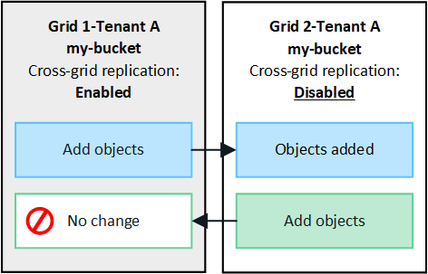
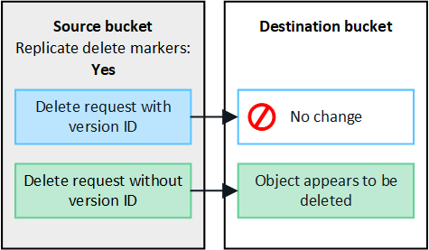

//shared section for the tenant manager and the grid manager

== What is cross-grid replication?

Cross-grid replication is the automatic replication of objects between selected S3 buckets in two StorageGRID systems that are connected in a xref:../admin/grid-federation-overview.adoc[grid federation connection].

=== Requirements for cross-grid replication

If a tenant account has the *Use grid federation connection* permission, a tenant user with Root Access permission can create identical buckets in the corresponding tenant accounts on each grid. These buckets:

* Must have the same name and region

* Must have versioning enabled

* Must have S3 Object Lock disabled

* Must be empty

* Must not use bucket-level encryption

After both buckets have been created, cross-grid replication can be configured to occur in one direction or in both directions.

==== [[replication-one-direction]]Replication in one direction

If you enable cross-grid replication for a bucket on only one grid, objects added to that bucket are replicated to the other grid, but objects added to the other bucket are not. In the figure, cross-grid replication is enabled for `my-bucket` from Grid 1 to Grid 2, but it is not enabled in the other direction. 

==== [[replication-both-directions]]Replication in both directions
If you enable cross-grid replication for the same bucket on both grids, objects added to either bucket are replicated to the other grid. In the figure, cross-grid replication is enabled for `my-bucket` in both directions. 

image:../media/grid-federation-cross-grid-replication.png[image showing replication in one direction vs replication in both directions]

=== [[client-deletes]]What happens when objects are deleted?

To understand what happens when an S3 client deletes objects from a bucket that has cross-grid replication enabled, start by reviewing how S3 clients delete objects from buckets that have versioning enabled, as follows:

* If an S3 client issues a delete request that includes a version ID, that version of the object is permanently removed. No delete marker is added the bucket. 

* If an S3 client issues a delete request that does not include a version ID, StorageGRID does not delete any object versions. Instead, it adds a delete marker to the bucket. The delete marker causes StorageGRID to behave as if the object was deleted:

** A GET request without a version ID will fail with `404 No Object Found`
** A GET request with a valid version ID will succeed and return the requested object version.

When you enable cross-grid replication for a bucket, you can specify what happens when S3 clients issue a delete request that does not include a version ID:

* If you choose to replicate delete markers, a delete marker is added to the source bucket and replicated to the destination bucket. In effect, the objects appear to be deleted on both grids.

*  If you choose not to replicate delete markers, a delete marker is added to the source bucket, but it is not replicated to the destination bucket. In effect, objects that the client deletes on the source grid are not deleted on the destination grid.

IMPORTANT: The option to replicate client delete markers does not affect delete object requests that include a version ID. When you include a version ID, objects are permanently removed from the source grid. However, these requests are never replicated to the destination grid because they do not add delete markers to the bucket. 

In the figure, the grids are configured for cross-grid replication in both directions, but delete markers are not replicated from `my-bucket` on Grid 1 to `my-bucket` on Grid 2.

