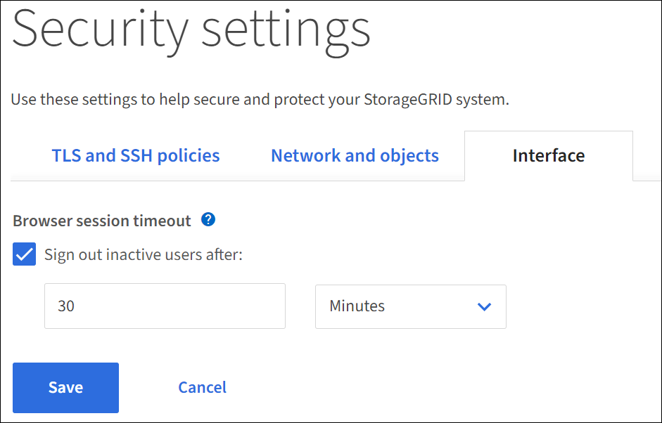

= Change the browser inactivity timeout
:icons: font
:imagesdir: ../media/

[.lead]
You can control whether Grid Manager and Tenant Manager users are signed out if they are inactive for more than a certain amount of time.

.What you'll need

* You are signed in to the Grid Manager using a xref:../admin/web-browser-requirements.adoc[supported web browser].
* You have Root access permission.

.About this task

The browser inactivity timeout defaults to 15 minutes. If a user's browser session is not active for this amount of time, the session times out.

As required, you can increase or decrease the timeout period by setting the *Sign out inactive users after* option.

[NOTE]
====
Browser inactivity timeout is controlled by the following:

* A separate, non-configurable StorageGRID timer, which is included for system security. By default, each user's authentication token expires 16 hours after the user signs in. When a user's authentication expires, that user is automatically signed out, even if the value for the browser session timeout has not been reached. To renew the token, the user must sign back in.
* Timeout settings for the identity provider, assuming SSO is enabled for StorageGRID.
* If single sign-on (SSO) is enabled and a user's browser times out, the Grid Manager signs out the user's browser session. The user must reenter their SSO credentials to access StorageGRID again. See xref:configuring-sso.adoc[Configure single sign-on]. 

====

.Steps
. Select *CONFIGURATION* > *Security settings* > *Interface*.
. Select a browser timeout period between 60 seconds and 7 days in the *Sign out inactive users after* field.
You can select the browser timeout period in either seconds, minutes, hours, or days. 
+
//Set this field to 0 if you do not want to use this functionality. Users are signed out 16 hours after they sign in, when their authentication tokens expire.
+
//image::../media/configuration_display_options.gif[Display Options page]

. Select *Save*. If a browser session is inactive for the specified amount of time, the user is signed out of the Grid Manager or Tenant Manager.

+
The new setting does not affect currently signed in users. Users must sign in again or refresh their browsers for the new timeout setting to take effect.