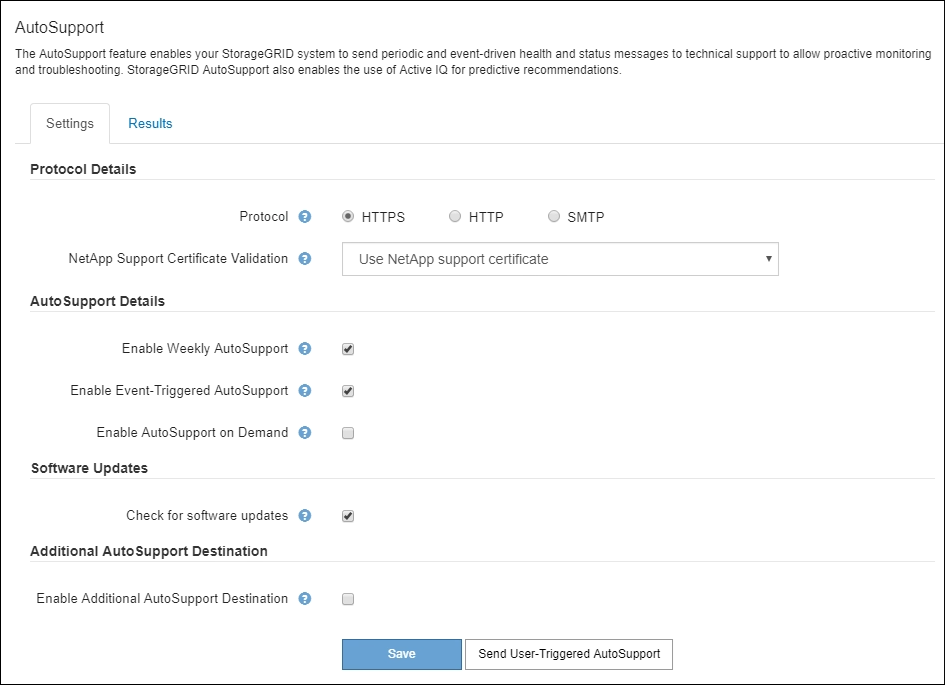
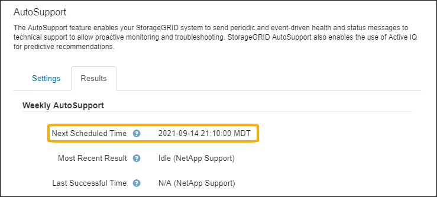

= Configure AutoSupport
:icons: font
:imagesdir: ../media/

[.lead]
You can enable the AutoSupport feature and the individual AutoSupport options when you first install StorageGRID, or you can enable them later.

.What you'll need

* You are signed in to the Grid Manager using a link:../admin/web-browser-requirements.html[supported web browser].
* You have the Root access or Other grid configuration permission.
* If you will use HTTPS for sending AutoSupport messages, you have provided outbound internet access to the primary Admin Node, either directly or link:configuring-admin-proxy-settings.html[using a proxy server] (inbound connections not required).
* If HTTP is selected on the StorageGRID AutoSupport page, you have configured a proxy server to forward AutoSupport messages as HTTPS. NetApp's AutoSupport servers will reject messages sent using HTTP.

* If you will use SMTP as the protocol for AutoSupport messages, you have configured an SMTP mail server. The same mail server configuration is used for alarm email notifications (legacy system).

== Specify the protocol for AutoSupport messages

You can use any of the following protocols for sending AutoSupport messages:

* *HTTPS*: This is the default and recommended setting for new installations. This protocol uses port 443. If you want to <<Enable AutoSupport on Demand,enable the AutoSupport on Demand feature>>, you must use HTTPS.
* *HTTP*: If you select HTTP, you must configure a proxy server to forward AutoSupport messages as HTTPS. NetApp's AutoSupport servers reject messages sent using HTTP. This protocol uses port 80. 
* *SMTP*: Use this option if you want AutoSupport messages to be emailed. If you use SMTP as the protocol for AutoSupport messages, you must configure an SMTP mail server on the Legacy Email Setup page (*SUPPORT* > *Alarms (legacy)* > *Legacy email setup*).
+
NOTE: SMTP was the only protocol available for AutoSupport messages before the StorageGRID 11.2 release. If you installed an earlier version of StorageGRID initially, SMTP might be the selected protocol.

The protocol you set is used for sending all types of AutoSupport messages.

.Steps

. Select *SUPPORT* > *Tools* > *AutoSupport*.
+
The AutoSupport page appears, and the *Settings* tab is selected.
+

. Select the protocol you want to use to send AutoSupport messages.

. If you selected *HTTPS*, select whether to use a TLS certificate to secure the connection to the NetApp Support server.
 ** *Use NetApp support certificate* (default): Certificate validation ensures that the transmission of AutoSupport messages is secure. The NetApp support certificate is already installed with the StorageGRID software.
 ** *Do not verify certificate*: Select this option only when you have a good reason not to use certificate validation, such as when there is a temporary problem with a certificate.

. Select *Save*.
+
All weekly, user-triggered, and event-triggered messages are sent using the selected protocol.

== Disable weekly AutoSupport messages

By default, the StorageGRID system is configured to send an AutoSupport message to NetApp Support once a week.

To determine when the weekly AutoSupport message will be sent, go to the *AutoSupport* > *Results* tab. In *Weekly AutoSupport* section, look at the value for *Next Scheduled Time*. 

You can disable the automatic sending of weekly AutoSupport messages at any time.

.Steps

. Select *SUPPORT* > *Tools* > *AutoSupport*.
. Unselect the *Enable Weekly AutoSupport* check box.
. Select *Save*.

== Disable event-triggered AutoSupport messages

By default, the StorageGRID system is configured to send an AutoSupport message to NetApp Support when an important alert or other significant system event occurs.

You can disable event-triggered AutoSupport messages at any time.

.Steps

. Select *SUPPORT* > *Tools* > *AutoSupport*.
. Unselect the *Enable Event-Triggered AutoSupport* check box.
. Select *Save*.

== Enable AutoSupport on Demand

AutoSupport on Demand can assist in solving issues that technical support is actively working on. 

By default, AutoSupport on Demand is disabled. Enabling this feature allows technical support to request that your StorageGRID system send AutoSupport messages automatically. Technical support can also set the polling time interval for AutoSupport on Demand queries.

Technical support can't enable or disable AutoSupport on Demand.

.Steps

. Select *SUPPORT* > *Tools* > *AutoSupport*.
. Select the *HTTPS* for the protocol.
. Select the *Enable Weekly AutoSupport* check box.
. Select the *Enable AutoSupport on Demand* check box.
. Select *Save*.
+
AutoSupport on Demand is enabled, and technical support can send AutoSupport on Demand requests to StorageGRID.

== Disable checks for software updates

By default, StorageGRID contacts NetApp to determine if software updates are available for your system. If a StorageGRID hotfix or new version is available, the new version is shown on the StorageGRID Upgrade page. 

As required, you can optionally disable the check for software updates. For example, if your system does not have WAN access, you should disable the check to avoid download errors.

.Steps

. Select *SUPPORT* > *Tools* > *AutoSupport*.
. Unselect the *Check for software updates* check box.
. Select *Save*.

== Add an additional AutoSupport destination

When you enable AutoSupport, heath and status messages are sent to NetApp Support. You can specify one additional destinations for all AutoSupport messages.

To verify or change the protocol used to send AutoSupport messages, see the instructions to <<Specify the protocol for AutoSupport messages>>.

NOTE: You can't use the SMTP protocol to send AutoSupport messages to an additional destination.

.Steps

. Select *SUPPORT* > *Tools* > *AutoSupport*.

. Select *Enable Additional AutoSupport Destination*.

. Specify the following: 
+
[cols="1a,2a" options="header"]
|===
| Field
| Description

| Hostname
| The server hostname or IP address of an additional AutoSupport destination server.

*Note*: You can enter only one additional destination.

| Port
| The port used to connect to an additional AutoSupport destination server. The default is port 80 for HTTP or port 443 for HTTPS.

| Certification Validation
| Whether a TLS certificate is used to secure the connection to the additional destination.

* Select *Do not verify certificate* to send your AutoSupport messages without certificate validation.
+
Select this choice only when you have a good reason not to use certificate validation, such as when there is a temporary problem with a certificate.

* Select *Use custom CA bundle* to use certificate validation.

|===

. If you selected *Use custom CA bundle*, do one of the following:

** Select *Browse*, navigate to the file containing the certificates, and then select *Open* to upload the file.

** Use an editing tool to copy and paste all the contents of each of the PEM-encoded CA certificate files into the *CA Bundle* field, concatenated in certificate chain order.
+ 
You must include `----BEGIN CERTIFICATE----` and `----END CERTIFICATE----` in your selection.
+
image::../media/autosupport_certificate.png[AutoSupport certificate]

. Select *Save*.
+
All future weekly, event-triggered, and user-triggered AutoSupport messages will be sent to the additional destination.

