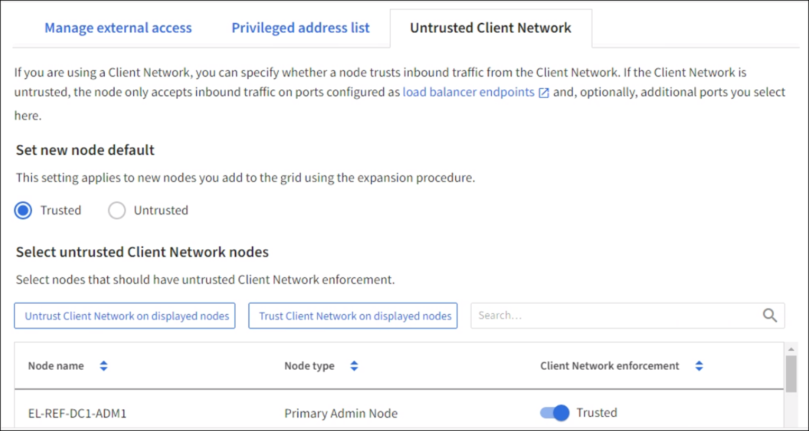

= Configure firewall
:icons: font
:imagesdir: ../media/

[.lead]
You can configure the StorageGRID firewall to control network access for specific ports of your StorageGRID nodes. 

.What you'll need

* You are signed in to the Grid Manager using a xref:../admin/web-browser-requirements.adoc[supported web browser].
* You have Maintenance or Root access permissions.
* You have reviewed the information in xref:../admin/manage-firewall-controls.adoc[Manage firewall controls] and xref:../network/index.adoc[Networking guidelines]

* If you want an Admin Node or Gateway Node to accept inbound traffic only on explicitly configured endpoints, you have defined the load balancer endpoints.
+
NOTE: When changing the configuration of the client network, existing client connections might fail if load balancer endpoints have not been configured.

.About this task

StorageGRID includes a firewall on each node that enables you to open or close ports on the Grid Network, Admin Network, and Client Network. You can also create a list of privileged IP addresses that can access grid ports that would otherwise be blocked. If you are using a Client Network, you can specify whether a node trusts inbound traffic from the Client Network, and you can configure the access of specific ports. 

There are three tabs on the *Firewall control* page: 
* Manage external access
* Add privileged IP list
* Untrusted client networks

You can use these tabs in any order. The configurations you set on one tab do not limit what you can do on the other tabs; however, configuration changes you make on one tab might change the behavior of ports configured on other tabs. 

Limiting the number of ports open to IP addresses outside of your grid to only those that are absolutely necessary enhances the security of your grid. 
For more information on using firewall controls, including examples, see xref:../admin/manage-firewall-controls.adoc[Manage firewall controls]. 

[#Access-firewall-controls]
== Access firewall controls

.Steps
. Select *CONFIGURATION* > *Security* > *Firewall control*.
+
image::../media/firewall-control-main.png[Firewall control main page]
The Firewall control page opens with the Manage External access tab displayed. 

There are three tabs on this page:
* Manage external access <<manage-external access,Manage external access>>
* Privileged address list <<privileged-address-list,Privileged address list>>
* Untrusted client network <<untrusted-client-network,Untrusted Client network>>

You should check the settings on each tab to ensure only those ports that are necessary for your grid configuration are open. 

[#manage-external access]
=== Manage external access
Use this tab to open or close ports on the Grid Network, Admin Network, and Client Network. When a port is closed in the Manage external access list, it can't be accessed by any non-grid IP address, including VLAN interfaces, unless you add the IP address to the privileged address list. You can only close ports that are open by default, and you can only open ports that you have closed.

NOTE: The configuration changes you make on *Manage external access* tab might conflict with the settings on the *Privileged address list* tab and the *Untrusted client network* tab. Be sure to check the settings on all of the firewall control tabs to ensure your grid functions as expected. 

. Select *Manage external access*
The tab displays a table with all of the configurable ports. You can sort the list by:
* Port - largest/smallest
* Status - open/closed
* Protocol - TCP/UDP

. Configure the ports you want open and closed using the following options: 
.. Select xxxxx to open all ports
.. Select xxxx to close all ports
.. use the toggle beside each port to open or close the selected port. 
+ For example, you could use the xxxx to close all ports, and then use the toggle besides an individual port to open only the selected port. 
.. use the search field to find the settings for any configurable port by entering a port number. You can enter a partial port number. For example, if you enter a '2," all ports that start with a "2" are displayed. 
. Select Save

+
[#privileged-address-list]
=== Privileged address list

image::../media/xxxxxxx.png[Manage sxxxxxyslog content]

NOTE: The configuration changes you make on the *Privileged address list* tab might conflict with the settings on the *Manage external access* tab or the *Untrusted client network* tab. Be sure to check the settings on all of the firewall control tabs to ensure your grid functions as expected. 

+
[cols="1a,3a" options="header"]
|===
| Severity| Description
|0
|Emergency: System is unusable

|1
|Alert: Action must be taken immediately

|2
|Critical: Critical conditions

|3
|Error: Error conditions

|4
|Warning: Warning conditions

|5
|Notice: Normal but significant condition

|6
|Informational: Informational messages

|7
|Debug: Debug-level messages
|===

[start=3]
. Select *Continue*.

[#untrusted-client-network]
=== Untrusted Client Network

NOTE: The configuration changes you make on the *Untrusted Client Network* tab might override the settings on the *Manage external access* tab and the *Privileged address list*. Be sure to check the settings on all of the firewall control tabs to ensure your grid functions as expected. 

If you are using a Client Network, you can specify whether each node's Client Network is trusted or untrusted. You can also specify the default setting for new nodes added in an expansion.

+
NOTE: Existing client connections might fail if load balancer endpoints have not been configured.

.Steps

. Select *CONFIGURATION* > *Security* > *Firewall control*.
+
. Select the Untrusted Client Network tab.
+ 

The Untrusted Client Network tab lists all nodes in your StorageGRID system. You can use this listing to select whether Client Network enforcement is used. You can also use this tab to configure whether new nodes added during an expansion will be part of the trusted or untrusted Client network. 

The Unavailable Reason column includes an entry if the Client Network on the node must be trusted.

. In the *Set New Node Default* section, specify what the default setting should be when new nodes are added to the grid in an expansion procedure.
 ** *Trusted* (default): When a node is added in an expansion, its Client Network is trusted.
 ** *Untrusted*: When a node is added in an expansion, its Client Network is untrusted.
As required, you can return to this tab to change the setting for a specific new node.

+
NOTE: This setting does not affect the existing nodes in your StorageGRID system.
. In the *Select Untrusted Client Network Nodes* section, select the nodes that should allow client connections only on explicitly configured load balancer endpoints.
+
You can select or unselect the check box in the title to select or unselect all nodes.

xxxx additional section xxxxxx

. Select *Save*.
+
The new firewall rules are immediately added and enforced. Existing client connections might fail if load balancer endpoints have not been configured.

.Related information

xref:../admin/index.adoc[Administer StorageGRID]