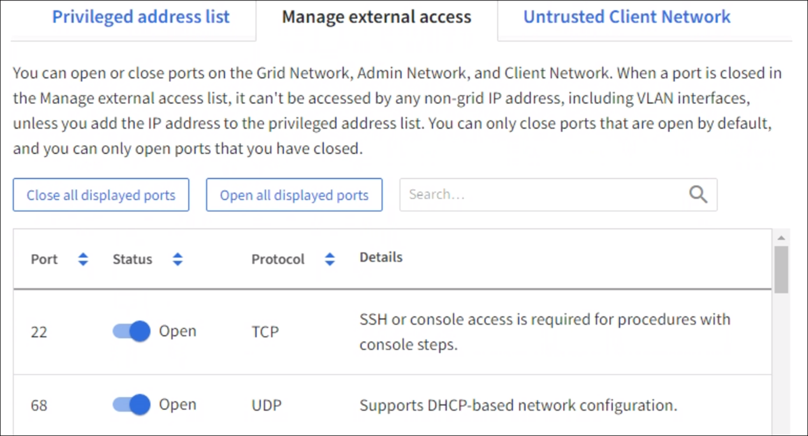
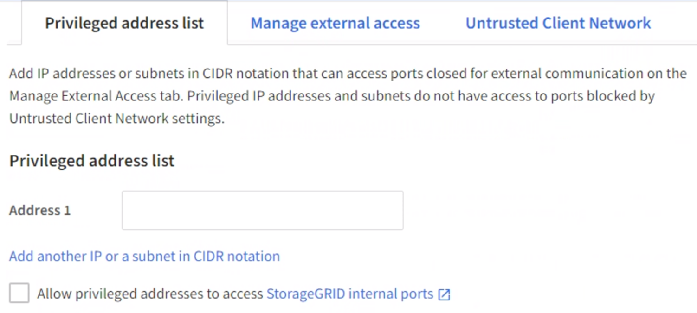

= Configure firewall
:icons: font
:imagesdir: ../media/

[.lead]
You can configure the StorageGRID firewall to control network access for specific ports of your StorageGRID nodes. 

.What you'll need

* You are signed in to the Grid Manager using a xref:../admin/web-browser-requirements.adoc[supported web browser].
* You have Maintenance or Root access permissions.
* You have reviewed the information in xref:../admin/manage-firewall-controls.adoc[Manage firewall controls] and xref:../network/index.adoc[Networking guidelines]

* If you want an Admin Node or Gateway Node to accept inbound traffic only on explicitly configured endpoints, you have defined the load balancer endpoints.
+
NOTE: When changing the configuration of the client network, existing client connections might fail if load balancer endpoints have not been configured.

.About this task

StorageGRID includes a firewall on each node that enables you to open or close ports on the Grid Network, Admin Network, and Client Network. You can also create a list of privileged IP addresses that can access grid ports that would otherwise be blocked. If you are using a Client Network, you can specify whether a node trusts inbound traffic from the Client Network, and you can configure the access of specific ports on the Client Network.

Limiting the number of ports open to IP addresses outside of your grid to only those that are absolutely necessary enhances the security of your grid. 

For more information on using firewall controls, including examples, see xref:../admin/manage-firewall-controls.adoc[Manage firewall controls]. 

[#Access-firewall-controls]
== Access firewall controls

Select *CONFIGURATION* > *Security* > *Firewall control*.

There are three tabs on this page:

* Manage external access <<manage-external access,Manage external access>>
* Privileged address list <<privileged-address-list,Privileged address list>>
* Untrusted client Network <<untrusted-client-network,Untrusted Client Network>>

You can use these tabs in any order. The configurations you set on one tab do not limit what you can do on the other tabs; however, configuration changes you make on one tab might change the behavior of ports configured on other tabs. 

You should check the settings on each of the firewall control tabs to ensure only those ports that are necessary for your grid configuration are open. 

[#manage-external access]
=== Manage external access
Use this tab to open or close ports on the Grid Network, Admin Network, and Client Network. When a port is closed in the Manage external access list, it can't be accessed by any non-grid IP address, including VLAN interfaces, unless you add the IP address to the privileged address list. You can only close ports that are open by default, and you can only open ports that you have closed.

NOTE: The configuration changes you make on *Manage external access* tab might conflict with the settings on the *Privileged address list* tab and the *Untrusted client network* tab. Be sure to check the settings on all of the firewall control tabs to ensure your grid functions as expected. 

NOTE: Settings on the Manage external access tab can not override settings on the Untrusted Client Network tab. For example, if a node is untrusted, SSH/22 is blocked on the client network even if it was opened on the Manage external access tab. Settings on the Untrusted Client Network tab override blocked ports (such as 443, 8443, 9443) on the client network.

. Select *Manage external access*
The tab displays a table with all of the configurable ports for the nodes in your grid. 

+

+
You can sort the list by:

* Port - largest/smallest
* Status - open/closed
* Protocol - TCP/UDP

. Configure the ports you want open and closed using the following options: 
* Select *Open all displayed ports* to open all ports listed in the table. 
* Select *Close all displayed ports* to close all ports listed in the table.
+
IMPORTANT: If you close ports 443, 8443, and 9443, you will not be able to access the Grid Manager and Tenant Manager. 

* Use the toggle beside each port to open or close the selected port. 
+
For example, you could select *Close all displayed ports* to close all ports, and then use the toggle besides an individual port to open only the selected port.

+
NOTE: Use the scroll bar on the right side of the table to be sure you have viewed all available ports. You can also use the search field to find the settings for any configurable port by entering a port number. You can enter a partial port number. For example, if you enter a '2," all ports that start with a "2" are displayed. 

[start=3]
. Select *Save*

[#privileged-address-list]
=== Privileged address list
Add IP addresses or subnets in CIDR notation that can access ports closed for external communication on the Manage External Access tab. Privileged IP addresses and subnets do not have access to ports blocked by Untrusted Client Network settings.

NOTE: Settings on the Privileged address list tab can not override settings on the Untrusted Client Network tab. 

. Select *Privileged address list*
The tab displays a field where you can enter addresses you want to have privileged network access. 

+

NOTE: The configuration changes you make on the *Privileged address list* tab might conflict with the settings on the *Manage external access* tab or the *Untrusted client network* tab. Be sure to check the settings on all of the firewall control tabs to ensure your grid functions as expected. 

. In the Address 1 field, enter the address of a client or subnet you want to provide privileged network access. 
. Optionally, select *Add another IP address or subnet in CIDR notation* to add additional privileged clients. 
. Optionally, select the check box if you want to allow privileged addresses to access StorageGRID internal ports. Select *StorageGRID internal ports* to see documentation on the internal ports. 
+
IMPORTANT: This option removes some protections for internal services. Leave it disabled if possible, and use as small of a privileged IP list/range as possible.

. Select *Save*.

[#untrusted-client-network]
=== Untrusted Client Network

If you are using a Client Network, use the Untrusted Client Network tab to specify whether a node trusts inbound traffic from the Client Network. If the Client Network for a node is untrusted, the node only accepts inbound traffic on ports configured as load balancer endpoints and, optionally, additional ports you select on this tab. You can also use this tab to specify the default setting for new nodes added in an expansion. 

NOTE: The configuration changes you make on the *Untrusted Client Network* tab might override or conflict with the settings on the *Manage external access* tab and the *Privileged address list* tab. Be sure to check the settings on all of the firewall control tabs to ensure your grid functions as expected. 

NOTE: Existing client connections might fail if load balancer endpoints have not been configured.

.Steps

. Select *Untrusted Client Network*.

image::../media/untrusted_client_networks_page.png[Untrusted Client Networks]

. In the *Set New Node Default* section, specify what the default setting should be when new nodes are added to the grid in an expansion procedure.
 ** *Trusted* (default): When a node is added in an expansion, its Client Network is trusted.
 ** *Untrusted*: When a node is added in an expansion, its Client Network is untrusted.
As required, you can return to this tab to change the setting for a specific new node.

+
NOTE: This setting does not affect the existing nodes in your StorageGRID system.

. In the *Select Untrusted Client Network Nodes* section, use the following options to select the nodes that should allow client connections only on explicitly configured load balancer endpoints: 
* Select *Untrust Client Network on displayed nodes* to add all nodes listed in the table to the Untrusted Client Network.  
* Select *Trust Client Network on displayed nodes* to remove all nodes listed in the table from the Untrusted Client Network.
 
* Use the toggle beside each port to set the Client Network as Trusted or Untrusted for the selected node. 
+
For example, you could select *Untrust Client Network on displayed nodes* to make all nodes part of the Untrusted Client Network and then use the toggle besides an individual node to make that single node part of the Trusted Client Network.

NOTE: Use the scroll bar on the right side of the table to be sure you have viewed all available nodes. You can also use the search field to find the settings for any configurable node by entering the node name. You can enter a partial name. For example, if you enter a 'GW," all nodes that have the string "GW" as part of their name are displayed. 

[start=3]
. Optionally, select any additional ports you want open on the untrusted Client Network. These ports can provide access to the Grid Manager, the Tenant Manager, or both. 

+ 
For example, you might want to use this option to ensure that the Grid Manager can be accessed for maintenance purposes by a node even if the node is not on the untrusted Client Network. 

. Select *Save*.
+
The new firewall rules are immediately added and enforced. Existing client connections might fail if load balancer endpoints have not been configured.

.Related information

xref:../admin/index.adoc[Administer StorageGRID]