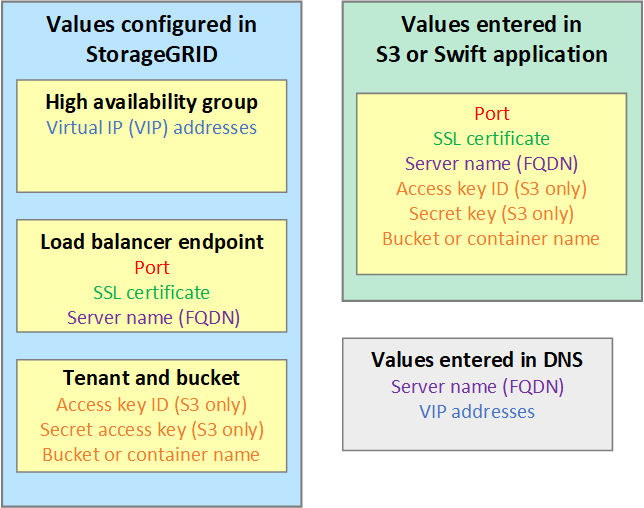

= Configure S3 and Swift client connections: Overview
:icons: font
:imagesdir: ../media/

[.lead]
As a grid administrator, you manage the configuration options that control how S3 and Swift client applications can connect to your StorageGRID system to store and retrieve data. There are a number of different options to meet different application requirements.

== Configuration workflow

== Information needed to attach StorageGRID to a client application

Before you can attach StorageGRID to an S3 or Swift client application, you must perform configuration steps in StorageGRID and obtain certain value.

=== What values do I need?

The following figure shows the values you must configure in StorageGRID and where those values are used by the S3 or Swift application and the DNS server. 

=== How do I get these values?
Depending on your requirements, you can do either of the following to obtain the information you need:

* Recommended for S3. Use the xref:use-s3-setup-wizard.adoc[S3 setup wizard] to quickly configure all required values and to create a file that you can use in the S3 application. The wizard guides you through the required steps and helps to make sure your settings conform to StorageGRID best practices.

* Configure each item manually in StorageGRID and manually enter the values into the S3 or Swift application. 

If you are configuring an S3 application, use the S3 setup wizard unless you know you have special requirements or your implementation will require significant customization. 

