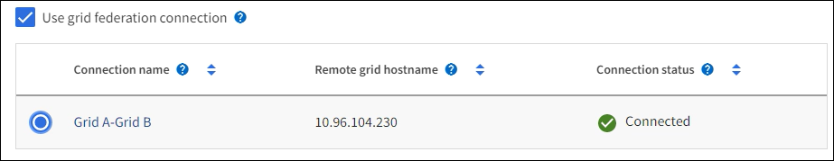

= Create a tenant account
:icons: font
:imagesdir: ../media/

[.lead]
You must create at least one tenant account to control access to the storage in your StorageGRID system.

The steps for creating a tenant account vary based on whether xref:using-identity-federation.adoc[identity federation] and xref:configuring-sso.adoc[single sign-on] are configured and whether the Grid Manager account you use to create the tenant account belongs to an admin group with the Root access permission.

.What you'll need

* You are signed in to the Grid Manager using a xref:../admin/web-browser-requirements.adoc[supported web browser].
* You have the Root access or Tenant accounts permission.
* If the tenant account will use the identity source that was configured for the Grid Manager, and you want to grant Root access permission for the tenant account to a federated group, you have imported that federated group into the Grid Manager. You do not need to assign any Grid Manager permissions to this admin group. See  xref:managing-admin-groups.adoc[Manage admin groups].
* If you want to allow an S3 tenant to clone account data and replicate bucket objects to another grid using a grid federation connection:

** You have xref:grid-federation-manage-connection.adoc[configured the grid federation connection].
** The status of the connection is *Connected*.
** You have Root access permission.
** You have reviewed the considerations for xref:grid-federation-manage-tenants.adoc[managing the permitted tenants for a grid federation connection].

== Access the wizard

. Select *TENANTS*.

. Select *Create*.

== Enter details

. Enter details for the tenant.
+
[cols="1a,3a" options="header"]
|===
| Field | Description

|Name
|A name for the tenant account. Tenant names do not need to be unique. When the tenant account is created, it receives a unique, 20-digit account ID.

|Description (optional)
|A description to help identify the tenant.

|Client type
|The type of client protocol this tenant will use, either *S3* or *Swift*.

|Storage quota (optional)
|If you want this tenant to have a storage quota, a numerical value for the quota and the units.

|===

. Select *Continue*.

== Select permissions

. Optionally, select any permissions you want this tenant to have.
+
[NOTE]
Some of these permissions have additional requirements. For details, select the help icon for each permission.
+
[cols="1a,3a" options="header"]
|===
| Permission | If selected...

|Allow platform services (S3 only)
|The tenant can use platform services such as CloudMirror. See xref:manage-platform-services-for-tenants.adoc[Manage platform services for S3 tenant accounts].

|Use own identity source 
|The tenant can configure and manage its own identity source for federated groups and users. This option is disabled if you have xref:configuring-sso.adoc[configured SSO] for your StorageGRID system.

|Allow S3 Select (S3 only)
|The tenant can issue S3 SelectObjectContent API requests to filter and retrieve object data. See xref:manage-s3-select-for-tenant-accounts.adoc[Manage S3 Select for tenant accounts].

*Important*: SelectObjectContent requests can decrease load-balancer performance for all S3 clients and all tenants. Enable this feature only when required and only for trusted tenants.

|Use grid federation connection (S3 only)
|The tenant can use a grid federation connection and enable account clone and cross-grid replication from the Tenant Manager. See xref:grid-federation-overview.adoc[What is grid federation].

*Note*: You can only select *Use grid federation connection* when you are creating a new S3 tenant; you can't select this permission for an existing tenant.

|===

. If you selected *Use grid federation connection*, select one of the available grid federation connections.
+

. Select *Continue*.

== Define root access and create tenant

. Define root access for the tenant account, based on whether your StorageGRID system uses identity federation, single sign-on (SSO), or both.
+
[cols="1a,2a" options="header"]
|===

| Option 
| Do this

|If identity federation is not enabled 
|Specify the password to use when signing into the tenant as the local root user.

|If identity federation is enabled
|Select an existing federated group to have Root access permission for the tenant.

Optionally specify the password to use when signing in to the tenant as the local root user.

|If both identity federation and single sign-on (SSO) are enabled
|Select an existing federated group to have Root access permission for the tenant. No local users can sign in.

|===

. Select *Create tenant*.
+
A success message appears, and the new tenant is listed on the Tenants page.

. If you selected the *Use grid federation connection* permission for the tenant, follow these additional steps:

.. Confirm that an identical tenant was created on the other grid in the connection.
+
The tenants on both grids will have the same 20-digit account ID, name, description, quota, and permissions. 

.. If you provided a local root user password when defining root access, xref:changing-password-for-tenant-local-root-user.adoc[change the password for the local root user] for the tenant on the other grid. 
+
For security reasons, this password is not copied to the automatically generated tenant on the other grid.   

== Sign in to tenant
As required, you can sign in to the new tenant now to complete the configuration, or you can sign in to the tenant later. The sign-in steps depend on whether you are signed in to the Grid Manager using the default port (443) or a restricted port. See xref:controlling-access-through-firewalls.adoc[Control access through firewalls].

=== Sign in now

[cols="1a,3a" options="header"]
|===

| If you are using...| Do this...

|Port 443 and you set a password for the local root user
|
. Select *Sign in as root*.
+
When you sign in, links appear for configuring buckets, identity federation, groups, and users.

. Select the links to configure the tenant account.
+
Each link opens the corresponding page in the Tenant Manager. To complete the page, see the xref:../tenant/index.adoc[instructions for using tenant accounts].

|Port 443 and you did not set a password for the local root user
|Select *Sign in*, and enter the credentials for a user in the Root access federated group.

|A restricted port
|
. Select *Finish*
. Select *Restricted* in the Tenant table to learn more about accessing this tenant account.
+
The URL for the Tenant Manager has this format:
+
`https://_FQDN_or_Admin_Node_IP:port_/?accountId=_20-digit-account-id_/`
+
** `_FQDN_or_Admin_Node_IP_` is a fully qualified domain name or the IP address of an Admin Node
** `_port_` is the tenant-only port
** `_20-digit-account-id_` is the tenant's unique account ID
|===

=== Sign in later

[cols="1a,3a" options="header"]
|===
| If you are using...| Do one of these...

|Port 443
|
* From the Grid Manager, select *TENANTS*, and select *Sign in* to the right of the tenant name.
* Enter the tenant's URL in a web browser:
+
`https://_FQDN_or_Admin_Node_IP_/?accountId=_20-digit-account-id_/`
+
** `_FQDN_or_Admin_Node_IP_` is a fully qualified domain name or the IP address of an Admin Node
** `_20-digit-account-id_` is the tenant's unique account ID

|A restricted port
|
* From the Grid Manager, select *TENANTS*, and select *Restricted*.
* Enter the tenant's URL in a web browser:
+
`https://_FQDN_or_Admin_Node_IP:port_/?accountId=_20-digit-account-id_`
+
** `_FQDN_or_Admin_Node_IP_` is a fully qualified domain name or the IP address of an Admin Node
** `_port_` is the tenant-only restricted port
** `_20-digit-account-id_` is the tenant's unique account ID

|===

