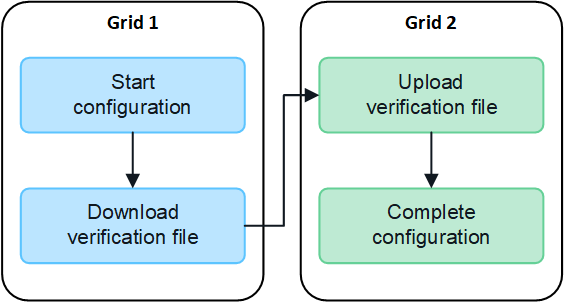

= Create grid federation connections
:icons: font
:imagesdir: ../media/

[.lead]
You can create a grid federation connection between two StorageGRID systems if you want to clone tenant account details and replicate object data between the grids.

As shown in the figure, creating a grid federation connection includes steps on both grids. You add the connection on one grid and complete it on the other grid. You can start from either grid.

.What you'll need

* You have reviewed the xref:grid-federation-overview.adoc[considerations and requirements] for configuring grid federation connections. 
* If you plan to use fully qualified domain names (FQDNs) for each grid instead of IP or VIP addresses, you know which names to use and you have confirmed that the DNS server for each grid has the appropriate entries.
* You are using a xref:../admin/web-browser-requirements.adoc[supported web browser].
* Whoever adds the configuration has Root access permission and the provisioning passphrase for the first grid.
* Whoever completes the configuration has Root access permission and the provisioning passphrase for the second grid. 

== Add connection

Perform these steps on either of the two StorageGRID systems.

. Sign in to the Grid Manager from the primary Admin Node on either grid.

. Select *CONFIGURATION* > *System* > *Grid federation*.

. Select *Add connection*.

. Enter details for the connection.
+
[cols="1a,2a" options="header"]
|===
| Field| Description

|Connection name
|A unique name to help you recognize this connection, for example, "`Grid 1-Grid 2.`"

|FQDN or IP for this grid
|One of the following:

* The FQDN of the grid you are currently signed into
* A VIP address of an HA group on this grid
* An IP address of an Admin Node or Gateway Node on this grid

|Port
|The port you want to use for this connection. You can enter any unused port number from 23000 to 23999.

Both grids in this connection will use the same port. You must ensure that no node in either grid uses this port for other connections.

|Certificate valid days for this grid
|The number of days you want the security certificates for this grid in the connection to be valid. The default value is 730 days (2 years), but you can enter any value from 1 to 762 days.

StorageGRID automatically generates client and server certificates for each grid when you save the connection.

|Provisioning passphrase for this grid
|The provisioning passphrase for the grid you are signed in to.

|FQDN or IP for the other grid
|One of the following:

* The FQDN of the grid you want to connect to
* A VIP address of an HA group on the other grid
* An IP address of an Admin Node or Gateway Node on the other grid. The IP can be on any network that the source grid can reach.

|===

. Select *Save and continue*.

. For the Download verification file step, select *Download verification file*.
+
After the connection is successfully completed on the other grid, you can no longer download the verification file from this grid.

. Locate the downloaded file (`_connection-name_.grid-federation`), and save it to a safe location.
+
[IMPORTANT]
This file contains secrets (masked as `****`) and other sensitive details and must be securely stored and transmitted.

. Select *Close* to return to the Grid federation page. 

. Confirm that the new connection is shown and that its *Connection status* is *Waiting to connect*.

. Provide the `_connection-name_.grid-federation` file to the grid admin for the other grid.

== Complete configuration

Perform these steps on the StorageGRID system you are connecting to (the other grid).

. Sign in to the Grid Manager from the primary Admin Node.

. Select *CONFIGURATION* > *System* > *Grid federation*.

. Select *Upload verification file* to access the Upload page. 

. Select *Upload verification file*. Then, browse to and select the file that was downloaded from the first grid (`_connection-name_.grid-federation`).
+
The details for the connection are shown.

. Optionally, enter a different number of valid days for the security certificates for this grid. The *Certificate valid days* entry defaults to the value you entered on the first grid, but each grid can use different expiration dates.
+
In general, use the same number of days for the certificates on both sides of the connection. If the certificates on either end of the connection expire, the connection will stop working and data will no longer be replicated between grids. 

. Enter the provisioning passphrase for the grid you are currently signed in to.

. Select *Save and test*.
+
The certificates are generated and the connection is tested. If the connection is valid, a success message appears and the new connection is listed on the Grid federation page. The *Connection status* will be *Connected*.
+
If an error message appears, address any issues. See xref:grid-federation-troubleshoot.adoc[Troubleshoot grid federation errors].

. Go to the Grid federation page on the first grid and refresh the browser. Confirm that the *Connection status* is now *Connected*.

. After the connection has been established, securely delete all copies of the verification file.
+
If you edit this connection, a new verification file will be created. The original file cannot be reused.

.After you finish

Review the considerations for xref:grid-federation-manage-tenants.adoc[managing permitted tenants]. Then, create one or more new tenant accounts, assign the *Use grid federation connection* permission, and select the new connection. 

