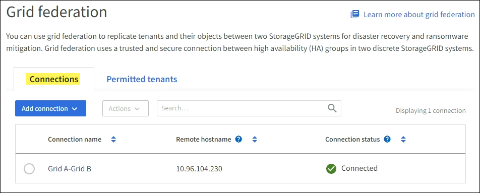
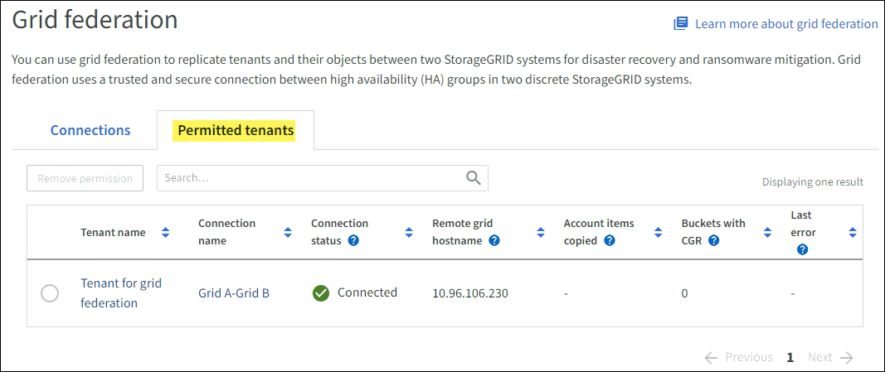
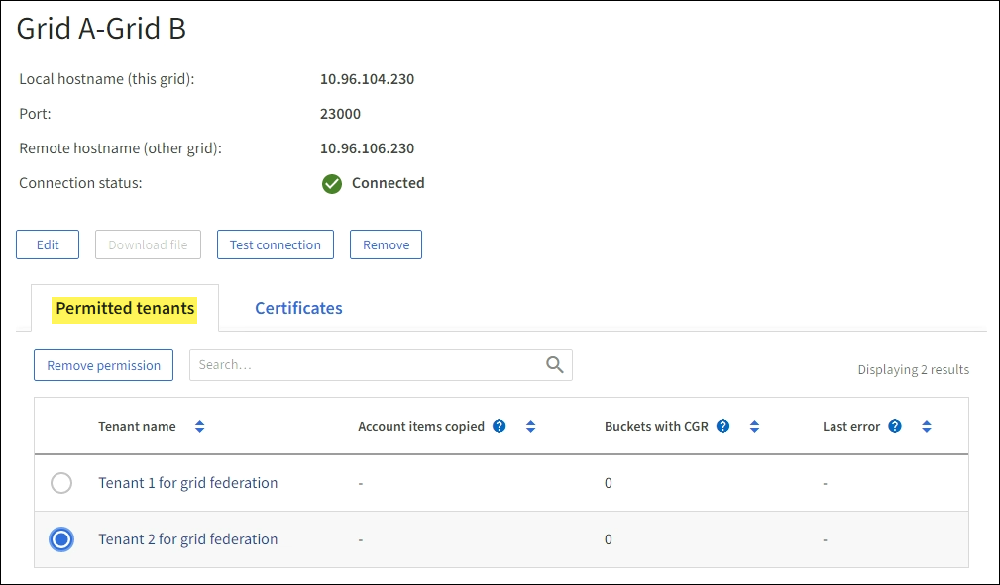
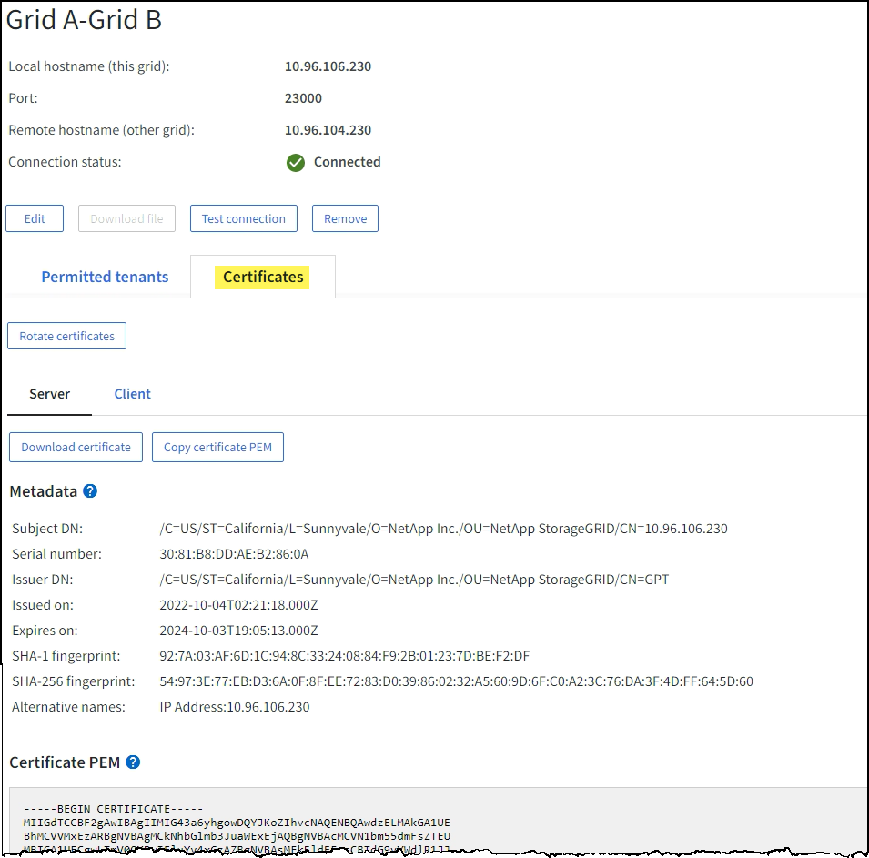
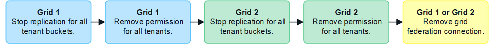

= Manage grid federation connections
:icons: font
:imagesdir: ../media/

[.lead]
Managing grid federation connections between StorageGRID systems includes viewing and editing connection details, viewing and rotating the certificates, removing tenant permissions, and removing unused connections.

.What you'll need

* You are signed in to the Grid Manager on either grid using a xref:../admin/web-browser-requirements.adoc[supported web browser].
* You have the Root access permission for the grid you are signed in to. 

== View a grid federation connection

You can view details for an existing grid federation connection from either grid in the connection. 

. Select *CONFIGURATION* > *System* > *Grid federation*.
+
The Grid federation page appears. 

* The *Connections* tab lists basic information for all connections on this grid. From this tab, you can xref:grid-federation-create-connection.adoc[add a connection], <<edit_grid_fed_connection,edit a connection>>, or <<test_grid_fed_connection,test a connection>>. 
+

* The *Permitted tenants* tab lists basic information for all tenant accounts on this grid that have the *Use grid federation connection* permission. From this tab, you can xref:../monitor/monitoring-tenant-activity.adoc[view the details page for each permitted tenant] or xref:grid-federation-manage-tenants.adoc[remove a tenant's permission] to use a connection.
+

. To view details for a specific connection, select either tab from the Grid federation page and select the connection name from the table.
+
The details page for the connection appears. From this page, you can <<edit_grid_fed_connection,edit>>, <<test_grid_fed_connection,test>>, or <<remove_grid_fed_connection,remove>> the selected connection.

* The *Permitted tenants* tab shows which tenant accounts on this grid have permission to use this connection. From this tab, you can you can xref:../monitor/monitoring-tenant-activity.adoc[view the details page for each permitted tenant] or xref:grid-federation-manage-tenants.adoc[remove a tenant's permission] to use the connection. 
+

* The *Certificates* tab shows the system-generated server and client certificates for this connection. From this tab, you can <<rotate_grid_fed_certificates, rotate connection certificates>> or select *Server* or *Client* to download the associated certificate or copy the certificate PEM.
+

== [[edit_grid_fed_connection]]Edit a grid federation connection

You can edit a grid federation connection by signing in to the primary Admin Node on either grid in the connection. After you make changes to the first grid, you must download a new verification file and upload it to the other grid.

=== Start editing the connection

. Sign in to the Grid Manager from the primary Admin Node on either grid.

. Select *CONFIGURATION* > *System* > *Grid federation*.

. Edit the connection details using the *Actions* menu on the Grid federation page or the details page for a specific connection. See xref:grid-federation-create-connection.adoc[Create grid federation connections] for details about what to enter.

+
[role="tabbed-block"]
====

.Actions menu
--
.. Select the radio button for the connection. 
.. Select *Actions* > *Edit*.
.. Enter the new information.

--

.Details page
--
.. Select a connection name to display its details.
.. Select *Edit*.
.. Enter the new information.

--

====

. Enter the provisioning passphrase for the grid you are signed in to.
. Select *Save and continue*.
+
The new values are saved, but they will not be applied to the connection until you have uploaded the new verification file on the other grid. 

. Select *Download verification file*.
+
To download this file at a later time, go to the details page for the connection.

. When the green checkmark appears, locate the downloaded file (`_connection-name_.grid-federation`), and save it to a safe location.
+
[IMPORTANT]
The verification file contains secrets and must be securely stored and transmitted.

. Select *Close* to return to the Grid federation page. 

. Confirm that the *Connection status* is *Pending edit*.
+
NOTE: If the status of the connection wasn't *Connected* when you started editing it, the status will not change to *Pending edit*.

. Provide the `_connection-name_.grid-federation` file to the grid admin for the other grid.

=== Finish editing the connection

Finish ending the connection by uploading the verification file on the other grid.

. Sign in to the Grid Manager from the primary Admin Node.

. Select *CONFIGURATION* > *System* > *Grid federation*.

. Select *Add connection* > *Upload verification file*. 

. Select *Upload verification file*. Then, browse to and select the file that was downloaded from the first grid.

. Enter the provisioning passphrase for the grid you are currently signed in to.

. Select *Save and test*.
+
If the connection can be established using the edited values, a success message appears. Otherwise, an error message appears. Review the message and address any issues.

. Close the wizard to return to the Grid federation page.

. Confirm that the *Connection status* is *Connected*.

. Securely delete all copies of the verification file.

== [[test_grid_fed_connection]]Test a grid federation connection

. Sign in to the Grid Manager from the primary Admin Node.

. Select *CONFIGURATION* > *System* > *Grid federation*.

. Test the connection using the *Actions* menu on the Grid federation page or the details page for a specific connection.
+
[role="tabbed-block"]
====

.Actions menu
--
.. Select the radio button for the connection. 
.. Select *Actions* > *Test*.

--

.Details page
--
.. Select a connection name to display its details.
.. Select *Test connection*.

--

====

. Review the connection status:
+
[cols="1a,2a" options="header"]
|===
|Connection status| Description

|Connected
|Both grids are connected and communicating normally.

|Error
|The connection is in an error state. For example, a certificate has expired or a configuration value is no longer valid.

|Pending edit
|You have edited the connection on this grid, but the connection is still using the existing configuration. To complete the edit, upload the new verification file to the other grid.

|Waiting to connect
|You have configured the connection on this grid, but the connection hasn't been completed on the other grid. Download the verification file from this grid and upload it to the other grid.

|Unknown
|The connection is in an unknown state, possibly because a networking issue or an offline node.

|===

== [[rotate_grid_fed_certificates]]Rotate connection certificates

Each grid federation connection uses four automatically-generated SSL certificates to secure the connection. When the two certificates for each grid near their expiration date, the *Expiration of grid federation certificate* alert reminds you to rotate the certificates.

[IMPORTANT]
If the certificates on either end of the connection expire, the connection will stop working and data will no longer be replicated between grids. 

. Sign in to the Grid Manager from the primary Admin Node on either grid.
. Select *CONFIGURATION* > *System* > *Grid federation*.
. From either tab on the Grid federation page, select the connection name to display its details.
. Select the *Certificates* tab.
. Select *Rotate certificates*.
. Specify how long the new certificates should be valid for, in days.
. Enter the provisioning passphrase for the grid you are signed in to.
. Select *Rotate certificates*.
. As required, repeat these steps on the other grid in the connection.
+
In general, use the same number of days for the certificates on both sides of the connection.

== [[remove_grid_fed_connection]]Remove a grid federation connection

You can remove a grid federation connection from either grid in the connection. As shown in the figure, you must perform steps on both grids to  confirm that the connection is not being used by any tenant on either grid.

IMPORTANT: After you remove a connection, you can no longer replicate data between grids. However, any data that was previously replicated between grids is not deleted. If you want to delete this information from either grid, you must delete it manually.

Start these steps from either grid in the grid federation connection.

. Sign in to the Grid Manager from the primary Admin Node.
. Select *CONFIGURATION* > *System* > *Grid federation*.
. Select the connection name to display its details.
. On the *Permitted tenants* tab, determine if the connection is in use by any tenants.
. If any tenants are using the connection:

.. Confirm that the connection is not being used for cross-grid replication.
+
You can't remove a tenant's permission until you have stopped replication for each of the tenant's buckets.

.. From the first grid, xref:grid-federation-manage-tenants.adoc[remove the permission] for each tenant.

.. From the second grid, remove the permission for the same tenant accounts. 

. When no tenants on either grid are using the connection, select *Remove*.
. Review the confirmation message, and select *Yes*.

* If the connection can be removed, you are returned to the details page and a success message is shown. The grid federation connection is now removed from both grids.

* If the connection can't be removed (for example, it is still in use or there is a connection error), an error message is displayed. You can do either of the following:

** (Recommended.) Resolve the error (see xref:grid-federation-troubleshoot.adoc[Troubleshoot grid federation]).
** Remove the connection by force. See the next section.

== [[force-remove_grid_fed_connection]]Remove a grid federation connection by force

If necessary, you can force the removal of a connection that is unhealthy.

. From the confirmation dialog box, select *Force remove*.
+
A success message appears. This grid federation connection can no longer be used. However, tenant buckets might still have cross-grid replication enabled and some object copies might have already been replicated between the grids in the connection. 

. From the other grid in the connection, sign in to the Grid Manager from the primary Admin Node.

. Select *CONFIGURATION* > *System* > *Grid federation*.
. Select the connection name to display its details.
. Select *Remove* and *Yes*.
. Select *Force remove* to remove the other end of the connection.

