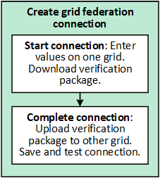

= Manage grid federation connections
:icons: font
:imagesdir: ../media/

[.lead]
You can use a grid federation connection between two StorageGRID systems to replicate the object data in selected tenant buckets between grids (_cross-grid replication_). Follow these instructions to create and manage these connections.

== Create a grid federation connection

Creating a grid federation connection is a two-step process.

. To start a new connection, a grid admin signs in to either grid to enter connection details and download a verification package. The grid where a new connection is started is referred to as the _local grid_.
. To complete a new connection, a grid admin signs in to the other grid to upload the verification package and save and test the connection. The grid where a new connection is completed is referred to as the _remote grid_.

.What you'll need

* You are using a xref:../admin/web-browser-requirements.adoc[supported web browser].
* To start a connection, you have Root access permission and the provisioning passphrase for the local grid.
* To complete a connection, you have Root access permission and the provisioning passphrase for the remote grid.
* High availability (HA) groups exist on both grids.
* If you plan to use fully qualified domain names (FQDNs) instead of IP addresses, the DNS server for each grid has the following entries:
** *Local grid DNS*: Remote grid FQDN mapped to remote grid IP addresses.
** *Remote grid DNS*: Local grid FQDN mapped to local grid IP addresses.  

=== Start the connection on the local grid

To start a grid federation connection, enter connection details on the local grid and download the verification package.

Perform these steps on either StorageGRID system.

. Sign in to the Grid Manager.

. Select *CONFIGURATION* > *System* > *Grid federation*.

. Select *Add connection* > *Start a connection*.

. Enter details for the connection.
+
[cols="1a,3a" options="header"]
|===
| Field| Description

|Connection name
|A unique name to help you recognize this connection, for example, Grid East-Grid West connection.

|FQDN or IP for _local grid_ (Local)
|The FQDN of the grid you are currently signed into or a VIP address of an HA group on this grid.

|Port
|The port you want to use for this connection. You can enter any unused port number between 1 and 65,535.

Both grids in this grid federation connection will use the same port. You must ensure that no node in either grid uses this port for other connections.

|Certificate valid days
|The number of days you want the security certificate for this grid federation connection to be valid. This value defaults to 730 days (2 years), but you can enter any value between 1 and 762 days.

StorageGRID automatically generates this security certificate when you save the connection.

|Local grid provisioning passphrase 
|The provisioning passphrase for the grid you are signed in to.

|FQDN or IP for remote grid
|The FQDN of the grid you want to connect to or a VIP address of an HA group on the other grid.

|===

. Select *Save and continue*.

. For the Download verification package step, select *Download verification package*.
+
After the connection is successfully completed on the remote grid, you can no longer download the verification package.

. When the green checkmark appears, locate the downloaded file (`_connection-name_.grid-federation`) and save it to a safe location.

[IMPORTANT]
The verification package contains secrets. Be sure to securely delete this file after you have successfully created the grid federation connection.

. Select *Close* return to the Grid federation page. 

. Confirm that the new connection is shown and that its *Connection status* is *Waiting to connect*.

=== Complete the connection on the other grid

Perform these steps on the StorageGRID system you are connecting to.

. Sign in to the Grid Manager.

. Select *CONFIGURATION* > *System* > *Grid federation*.

. Select *Add connection* > *Upload verification package*. 

. Select *Upload verification package*.

. Browse to and select the file you downloaded from the other grid (`_connection-name_.grid-federation`) 
+
The details you entered are shown.

. Enter the provisioning passphrase for the grid you are currently signed in to.

. Select *Save and test*.
+
If the connection can be established, a success message appears. Otherwise, an error message appears. Review the message and address any issues.

. Close the wizard to return to the Grid federation page.

. Confirm that the new connection is shown and that the *Connection status* is *Connected*.

. After the connection has been established, delete all copies of the verification package.
+
This file contains secrets and is not needed after the connection is established. If you edit this connection, you will use a new file.

== View grid federation connections

You can view details for existing grid federation connections. 

* To view basic information for all grid federation connections, review the table on the Grid federation page. 

* To view all details about a specific connection, select the connections's name in the table to show the details page.

== Edit grid federation connection

You can change the connection's name and rotate the associated certificate on both grids before it expires. When you edit a grid federation connection, you must download a new verification package on the first grid and then upload the new verification package on the second grid.

To edit a grid federation connection, use the *Actions* menu on the Grid federation page or the details page for a specific connection.

IMPORTANT: After editing an connection, you might need to wait up to 15 minutes for your changes to be applied.

=== Edit connection details

//tabbed blocks start here

[role="tabbed-block"]
====

.Actions menu
--
. Select the check box for the connection. 
. Select *Actions* > *Edit*.
. Enter the new details.
. Select *Save*.
--

.Details page
--
. Select the connection name to display the details.
. Select *Edit*.
. Enter the new details.
. Select *Save*.
--

====
//end tabbed blocks

=== Rotate connection certificate

//tabbed blocks start here

[role="tabbed-block"]
====

.Actions menu
--
. Select the check box for the connection. 
. Select *Actions* > *Rotate certificate*.
. Upload or generate a new custom certificate.
. Select *Save changes*.
--

.Details page
--
. Select the connection name to display the details.
. Select the *Certificate* tab.
. Select *Rotate certificate*.
. Upload or generate a new custom certificate.
. Select *Save changes*.
--

====
//end tabbed blocks

=== Remove permission for tenant to use grid connection

//tabbed blocks start here

[role="tabbed-block"]
====

.Actions menu
--
. Select the check box for the connection. 
. Select *Actions* > *Rotate certificate*.
. Upload or generate a new custom certificate.
. Select *Save changes*.
--

.Details page
--
. Select the connection name to display the details.
. Select the Federation features tab.
. For Account synchronization, select *View more*.
. Select a tenant who is using a grid federation connection on this grid. 
. Select *Remove relationship*.
. Select *Yes*.
--

====
//end tabbed blocks

== Remove a grid federation connection

You can remove a grid federation connection at any time, and you can remove a connection from either grid.

After you remove a connection, you can no longer replicate object data between grids. However, any object data that was previously replicated between grids is not deleted. If you want to delete this information from either grid, you must delete it manually.

Perform these steps from either grid in the grid federation connection.

//tabbed blocks start here

[role="tabbed-block"]
====

.Grid federation page
--
. Sign in to the Grid Manager.
. Select *CONFIGURATION* > *System* > *Grid federation*.
. Select the check box for each connection you want to remove. To remove all connections, select the check box in the table header.
. Select *Remove*.
. Review the confirmation message, and select *Yes*.
--

.Details page
--
. Sign in to the Grid Manager.
. Select *CONFIGURATION* > *System* > *Grid federation*.
. Select the connection name to display the details.
. Select *Remove*.
. Review the confirmation message, and select *Yes*.
--

====
//end tabbed blocks

