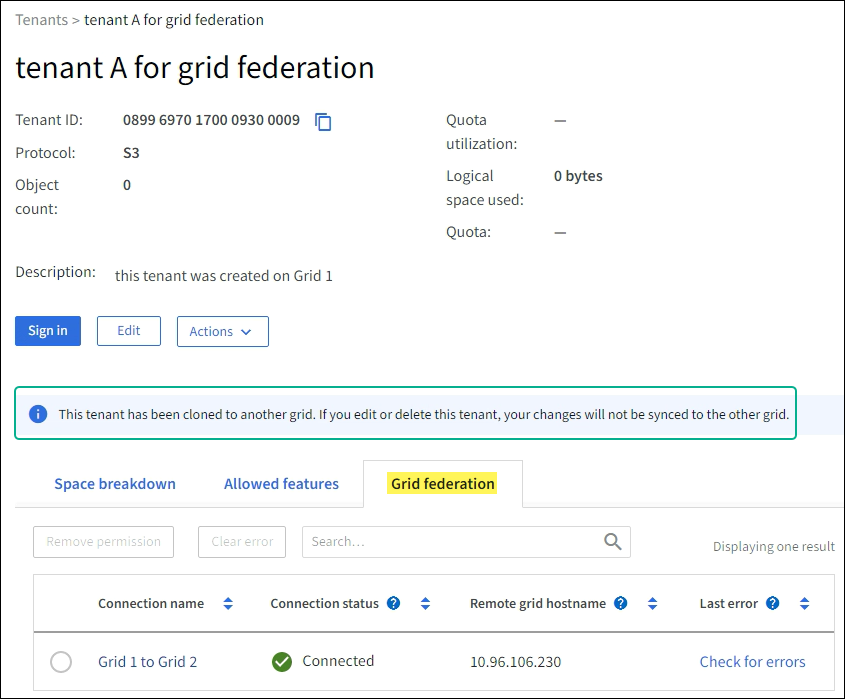
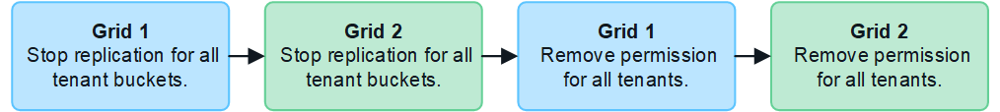
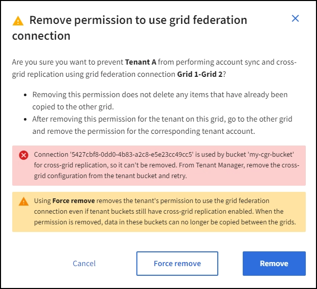

= Manage the permitted tenants for grid federation
:icons: font
:imagesdir: ../media/

[.lead]
You can allow new S3 tenant accounts to use a grid federation connection between two StorageGRID systems. When tenants are allowed to use a connection, special steps are required to edit tenant details or to permanently remove a tenant's permission to use the connection.

.What you'll need

* You are signed in to the Grid Manager on either grid using a link:../admin/web-browser-requirements.html[supported web browser].
* You have the Root access permission for the grid you are signed in to. 
* You have link:grid-federation-create-connection.html[created a grid federation connection] between two grids.
* You have reviewed the workflows and considerations for link:grid-federation-what-is-account-clone.html[account clone] and link:grid-federation-what-is-cross-grid-replication.html[cross-grid replication].

== Create a permitted tenant
If you want to allow a tenant account to use a grid federation connection for account clone and cross-grid replication, follow the general instructions to link:creating-tenant-account.html[create a new S3 tenant] and note the following:

* You can create the tenant from either grid in the connection. The grid where a tenant is created is the _tenant's source grid_.

* The status of the connection must be *Connected*.

* You can only select the *Use grid federation connection* permission when you are creating a new S3 tenant; you can't enable this permission when you edit an existing tenant.

* When the new tenant is saved on the first grid, an identical tenant is automatically replicated to the other grid. The grid where the tenant is replicated to is the _tenant's destination grid_.

* The tenants on both grids will have the same 20-digit account ID, name, description, quota, and permissions. Optionally, you can use the *Description* field to help identify which is the source tenant and which is the destination tenant. For example, this description for a tenant created on Grid 1 will also appear for the tenant replicated to Grid 2: "`This tenant was created on Grid 1.`"

* For security reasons, the password for a local root user is not copied to the destination grid.
+
TIP: Before a local root user can sign in to the replicated tenant on the destination grid, a grid administrator for that grid must link:changing-password-for-tenant-local-root-user.html[change the password for the local root user].

* After the new tenant is available on both grids, tenant users can perform these operations:

** From the tenant's source grid, create tenant group and users, which are automatically cloned to the tenant's destination grid. See link:../tenant/grid-federation-account-clone.html[Clone account information].
** From the tenant's source grid, create new S3 access keys, which can be optionally cloned to the tenant's destination grid. See link:../tenant/grid-federation-clone-keys-with-api.html[Clone S3 access keys using the API].
** Create identical buckets on both grids in the connection and enable cross-grid replication in one direction or in both directions. See link:../tenant/grid-federation-manage-cross-grid-replication.html[Manage cross-grid replication].

== View a permitted tenant

. Select *TENANTS*.

. From the Tenants page, select the tenant name to view the tenant details page.
+ 
If this is the source grid for the tenant (that is, if the tenant was created on this grid), a banner appears to remind you that the tenant was cloned to another grid. If you edit or delete this tenant, your changes will not be synced to the other grid.
+

. Optionally select the *Grid federation* tab to link:../monitor/grid-federation-monitor-connections.html[monitor the grid federation connection].

== Edit a permitted tenant

If you need to edit a tenant that has the *Use grid federation connection* permission, follow the general instructions for link:editing-tenant-account.html[editing a tenant account] and note the following:

* If a tenant has the *Use grid federation connection* permission, you can edit tenant details from either grid in the connection. However, any changes you make will not be copied to the other grid. If you want to keep the tenant details exactly in sync between grids, you must make the same edits on both grids.

* You can't select the *Use grid federation connection* permission when you are editing a tenant.

* You can't select a different grid federation connection when you are editing a tenant.

== Delete a permitted tenant

If you need to remove a tenant that has the *Use grid federation connection* permission, follow the general instructions for link:deleting-tenant-account.html[deleting a tenant account] and note the following:

* Before you can remove the original tenant on the source grid, you must remove all buckets for the account on the source grid.

* Before you can remove the cloned tenant on the destination grid, you must remove all buckets for the account on the destination grid.

* If you remove either the original or the cloned tenant, the account can no longer be used for cross-grid replication. 

* If you are removing the original tenant on the source grid, any tenant groups, users, or keys that were cloned to the destination grid will be unaffected. You can either delete the cloned tenant or allow it to manage its own groups, users, access keys, and buckets.

* If you are removing the cloned tenant on the destination grid, clone errors will occur if new groups, users, or keys are added to the original tenant.
+
To avoid these errors,  remove the tenant's permission to use the grid federation connection before deleting the tenant from this grid.

== [[remove-grid-federation-permission]]Remove Use grid federation connection permission

To prevent a tenant from using a grid federation connection, you must remove the *Use grid federation connection* permission. As shown in the figure, you can perform these steps on one or both grids in the connection, depending on your requirements. For example, you would perform these steps on only one grid if you wanted to prevent the tenant on grid 1 from replicating objects to grid 2 while still allowing the same tenant on grid 2 to replicate objects back to grid 1.

Before removing a tenant's permission to use a grid federation connection, note the following:

* Removing the *Use grid federation connection* permission from a tenant is a permanent action. You cannot re-enable the permission for this tenant.

* You can't remove the *Use grid federation connection* permission if any of the tenant's buckets have cross-grid replication enabled. The tenant account must stop cross-grid replication for all of their buckets first. 

* Removing the *Use grid federation connection* permission does not delete any items that have already been copied between grids. For example, any tenant users, groups, and objects that exist on both grids are not deleted from either grid when the tenant's permission is removed. If you want to delete these items, you must manually delete them from both grids.

* When you remove the *Use grid federation connection* permission from a tenant account on one grid, the permission is not removed from the corresponding tenant on the other grid. Depending on your requirements, you might need to perform this procedure on both grids.

* You must remove the *Use grid connection* permission from all tenants on both sides of the connection before you can remove the grid federation connection itself. See link:grid-federation-manage-connection.html[Manage grid federation connections] for details.

.What you'll need

* You are using a link:../admin/web-browser-requirements.html[supported web browser].
* You have the Root access permission for both grids. 
* You have confirmed that cross-grid replication is stopped for all tenant buckets.

.Steps

. Sign in to the Grid Manager from the primary Admin Node.
. Remove the permission from the Grid federation page or the Tenants page.
+
[role="tabbed-block"]
====

.Grid federation page
--
.. Select *CONFIGURATION* > *System* > *Grid federation*.
.. Select the connection name to display its details page.
.. On the *Permitted tenants* tab, select radio button for the tenant. 
.. Select *Remove permission*.

--
.Tenants page
--
.. Select *TENANTS*.
.. Select the tenant's name to display the details page.
.. On the *Permitted tenants* tab, select radio button for the connection. 
.. Select *Remove permission*.

--

====

. Review the warnings in the confirmation dialog box, and select *Remove*.

* If the permission can be removed, you are returned to the details page and a success message is shown. This tenant can no longer use the grid federation connection. Optionally, go to the other grid and repeat these steps to remove the permission for the same tenant on the other grid.

* If one or more tenant buckets still have cross-grid replication enabled, an error is displayed.
+

+
You can do either of the following:

** (Recommended.) Sign in to the Tenant Manager and disable replication for each of the tenant's buckets. See link:../tenant/grid-federation-manage-cross-grid-replication.html[Manage cross-grid replication]. Then, repeat the steps to remove the *Use grid connection* permission.
** Remove the permission by force. See the next section.

== [[force_remove_permission]]Remove the permission by force

If necessary, you can force the removal of a tenant's permission to use a grid federation connection even if tenant buckets have cross-grid replication enabled. Before removing a tenant's permission by force, note the general considerations for <<remove-grid-federation-permission,removing the permission>> as well as these additional considerations:

* If you remove the *Use grid federation connection* permission by force, any objects that are already in the process of being replicated to the other grid will continue to be replicated. To prevent these in-process objects from reaching the destination bucket, you must remove the tenant's permission on the other grid as well.

* Any objects ingested into the source bucket after you remove the *Use grid federation connection* permission will never be replicated to the destination bucket.

.Steps
. Sign in to the Grid Manager from the primary Admin Node.
. Select *CONFIGURATION* > *System* > *Grid federation*.
. Select the connection name to display its details page.
. On the *Permitted tenants* tab, select radio button for the tenant. 
. Select *Remove permission*.
. Review the warnings in the confirmation dialog box, and select  *Force remove*.
+
A success message appears. This tenant can no longer use the grid federation connection.

. As required, go to the other grid and repeat these steps to force-remove the permission for the same tenant account on the other grid. For example, you should repeat these steps on the other grid to prevent in-process objects from reaching the destination bucket.

