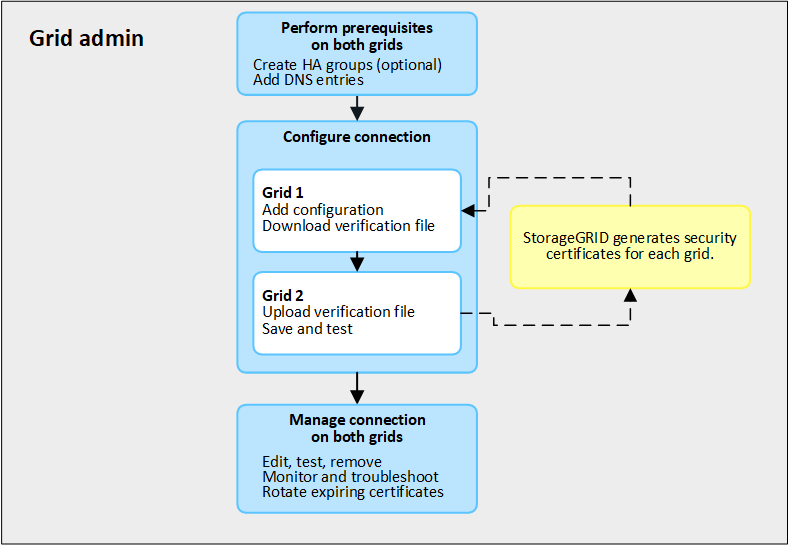
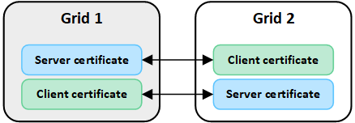

= What is grid federation?
:icons: font
:imagesdir: ../media/

[.lead]
You can use grid federation to clone tenants and replicate their objects between two StorageGRID systems for disaster recovery.

== What is a grid federation connection?

A grid federation connection is a bidirectional, trusted, and secure connection between Admin and Gateway Nodes in two StorageGRID systems.

== Workflow for grid federation

The workflow diagram summarize the steps for configuring a grid federation connection between two grids. 

== Considerations and requirements for grid federation connections

* Both grids used for grid federation must be running StorageGRID 11.7.

* A grid can have one or more grid federation connections to other grids. Each grid federation connection is independent of any other connections. That is, if grid 1 has one connection with grid 2 and a second connection with grid 3, there is no implied connection between grid 2 and grid 3.

* Grid federation connections are bidirectional. After the connection is established, you can monitor and manage the connection from either grid. 

* At least one grid federation connection must exist before you can use link:grid-federation-what-is-account-clone.html[account clone] or link:grid-federation-what-is-cross-grid-replication.html[cross-grid replication].

=== Networking, IP address, and DNS requirements

* A grid federation connection connects Admin Nodes or Gateway Nodes in one grid to Admin Nodes or Gateway Nodes in another grid. For example, you can configure a connection between the Admin Nodes on each grid or between the Gateway Nodes on one grid and the Admin Nodes on the other.

* The best practice is to connect high availability (HA) groups of Gateway and Admin Nodes on each grid. Using HA groups helps ensure that grid federation connections will remain online if nodes become unavailable. If the active interface in either HA group fails, the connection can use a backup interface. For details, see xref:managing-high-availability-groups.adoc[Manage high availability (HA) groups].

* Cross-grid replication requires that the Storage Nodes on each grid be able to access the configured Admin and Gateway Nodes on the other grid. For each grid, confirm that all Storage Nodes are on the same StorageGRID network as the Admin Nodes or Gateway Nodes used for the connection.

* If you plan to use fully qualified domain names (FQDN) to identify each grid in the connection (recommended), you must create the appropriate DNS entries, as follows:

** *Grid 1 DNS*: The FQDN for Grid 2 mapped to one or more IP address or virtual IP (VIP) addresses for Grid 1. 
** *Grid 2 DNS*: The FQDN for Grid 1 mapped to one or more IP addresses or VIP addresses for Grid 2. 

* If the DNS entries for a FQDN map to the IP address of more than one Admin Node or Gateway Node or to the VIP addresses of more than one HA group, the requests to use the connection will be load balanced between the nodes or between the active nodes in the HA groups.

* Creating a grid federation connection that uses the IP address of a single Admin Node or Gateway Node is not recommended. If the node becomes unavailable, the grid federation connection will also become unavailable.

=== Port requirements

When creating a grid federation connection, you can specify any unused port number from 23000 to 23999. Both grids in this connection will use the same port. You must ensure that no node in either grid uses this port for other connections.

=== Certificate requirements

When you configure a grid federation connection, StorageGRID automatically generates four SSL certificates:

* Server and client certificates to authenticate and encrypt the connection between grid 1 and grid 2
* Server and client certificates to authenticate and encrypt the connection between grid 2 and grid 1

By default, the certificates are valid for 730 days (2 years). When these certificates near their expiration date, 
the *Expiration of grid federation certificate* alert reminds you to rotate the certificates, which you can do using the Grid Manager. 

[IMPORTANT]
If the certificates on either end of the connection expire, the connection will stop working and data will no longer be replicated between grids. 

.Learn more
* xref:grid-federation-create-connection.adoc[Create grid federation connections]
* xref:grid-federation-manage-connection.adoc[Manage grid federation connections]
* xref:grid-federation-troubleshoot.adoc[Troubleshoot grid federation errors]

