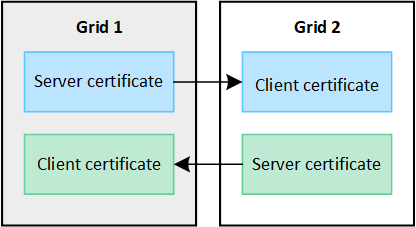

= Use grid federation: Overview
:icons: font
:imagesdir: ../media/

[.lead]
You can use grid federation to replicate tenants and their objects between two StorageGRID systems for disaster recovery.

== What is a grid federation connection?

A grid federation connection is a bidirectional, trusted, and secure connection between Admin and Gateway Nodes in two StorageGRID systems. A grid federation connection must exist before you can use account clone or cross-grid replication.

=== What are account clone and cross-grid replication?

Account clone is the replication of S3 tenant accounts and account details between two StorageGRID systems. Account clone is required for cross-grid replication.

Cross-grid replication is the replication of all object operations between selected S3 buckets in two StorageGRID systems.

After the grid administrator establishes a grid federation connection between two grids and creates a new S3 tenant with permission to use that connection, the tenant can create new S3 buckets and optionally enable cross-grid replication for those buckets. 

=== How do I enable account clone and cross-grid replication?

. *Create tenant and assign "`Use grid federation`" permission*: A grid administrator must create a new S3 tenant account and assign the *Use grid federation* permission before that tenant can enable account clone for account details.The grid admin can create the S3 tenant account on either grid in the connection.
+
When creating the tenant, the admin selects one existing grid federation connection. When a tenant with this permission is saved, the tenant and the tenant's root user are created on both grids in the connection.

. *Clone tenant details*: If a new tenant has permission to use a grid federation connection for account clone, they can specify that each new S3 access key, group, or user created on the source grid be created on the corresponding tenant on the destination grid. However, subsequent changes made to these items on the tenant's source grid are not synchronized.
+
Note that any S3 access keys, groups, or users that are created or modified on the tenant's destination grid are not replicated back to the tenant's source grid.

== Considerations and requirements

* Each grid can have one or more grid federation connections to other grids. Each grid federation connection is independent of any other connections. That is, if grid A has one connection with grid B and a second connection with grid C, there is no implied connection between grid B and grid C.

* Grid federation connections are bidirectional. After the connection is established, you can monitor and manage the connection from either grid. 

* At least one grid federation connection is required for account clone and cross-grid replication.

* Account clone and cross-grid replication apply only to S3 tenant accounts. These features are not available for Swift tenant accounts.

* After you configure a grid federation connection, you can create new S3 tenant accounts and select the *Use grid federation connection* permission to use the connection.
+
NOTE: You can only enable *Use grid federation connection* when you are creating a new S3 tenant; you can't enable this permission for an existing tenant.

* Tenant creation is bidirectional. You can create a tenant on either grid, and the same tenant and its root user will be automatically created on the other grid.

* Account clone and cross-grid replication are unidirectional. Either grid in the connection can be the tenant's source grid (the grid where you initially create the tenant). If you change account details or buckets on the tenant's source grid, the changes are automatically replicated to the other grid (known as the tenant's destination grid). However, if you change account details or buckets on the tenant's destination grid, the changes are not replicated back to the source grid. 

=== IP address and DNS requirements

* A grid federation connection can connect any two nodes that run the nginx-gw service. All Admin Nodes and all Gateway Nodes include this service, so you can configure a connection between the primary Admin Nodes on each grid or between a Gateway Node on one grid and an Admin Node on the other. However, the best practice is to connect high availability (HA) groups of Gateway and Admin Nodes on each grid.
+
Using HA groups helps ensure that grid federation connections will remain online if nodes become unavailable. If the active interface in either HA group fails, the connection can use a backup interface.
+ 
See xref:managing-high-availability-groups.adoc[Manage high availability (HA) groups].

* If you plan to use fully qualified domain names (FQDN) to identify each grid in the connection (recommended), you must create the appropriate DNS entries, as follows:

** *Grid 1 DNS*: The FQDN for Grid 2 mapped to one or more IP address or virtual IP (VIP) addresses for Grid 1. 
** *Grid 2 DNS*: The FQDN for Grid 1 mapped to one or more IP addresses or VIP addresses for Grid 2. 

* If the DNS entries for a FQDN map to the IP address of more than one Admin Node or Gateway Node or to the VIP addresses of more than one HA group, the requests to use the connection will be load balanced between the nodes or between the active nodes in the HA groups.

=== Port requirements

When creating a grid federation connection, you can specify any unused port number from 23000 to 23999. Both grids in this connection will use the same port. You must ensure that no node in either grid uses this port for other connections.

=== Certificate requirements

When you configure a grid federation connection, StorageGRID automatically generates four SSL certificates:

* Server and client certificates to authenticate and encrypt the connection between grid 1 and grid 2
* Server and client certificates to authenticate and encrypt the connection between grid 2 and grid 1

By default, the certificates are valid for 730 days (2 years). When these certificates near their expiration date, 
the *Expiration of grid federation certificate* alert reminds you to rotate the certificates, which you can do using the Grid Manager. 

[IMPORTANT]
If the certificates on either end of the connection expire, the connection will stop working and data will no longer be replicated between grids. 

== How are objects are replicated between grids?

* The source grid's maximum segment size applies to objects replicated to the destination grid. When objects are replicated to another grid, the *Maximum Segment Size* setting (*Configuration* > *System* > *Storage options*) of the source grid will be used on both grids. For example, suppose the maximum segment size for the source grid is 1 GB, while the maximum segment size of the destination grid is 50 MB. If you ingest a 2-GB object on the source grid, that object is saved as two 1-GB segments. It will also be replicated to the destination grid as two 1-GB segments, even though that grid's maximum segment size is 50 MB. 

