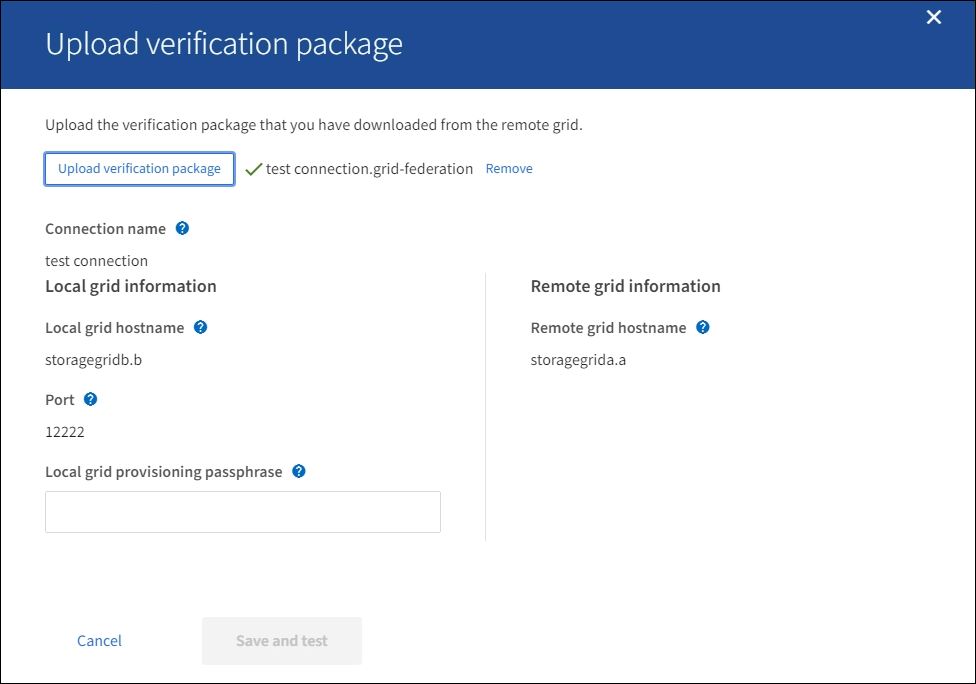

= Grid federation: Start a connection
:icons: font
:imagesdir: ../media/

[.lead]
You can create a connection between two StorageGRID systems.

.What you'll need

* You are using a xref:../admin/web-browser-requirements.adoc[supported web browser].
* You have the Root access permission for both the local grid and the remote grid.
* You have the provisioning passphrase for both the local grid and the remote grid.

== Enter connection details and download verification package

Perform these steps on the StorageGRID system you want to start the connection from (the _local grid_).

. Sign in to the Grid Manager.

. Select *CONFIGURATION* > *System* > *Grid federation*.

. Select *Add connection* > *Start a connection*.

. Provide a unique display name for this grid federation connection.

. Enter the following information for the local grid (the StorageGRID system you are currently signed in to).

** *Local grid hostname*. Enter a fully qualified domain name (FQDN) or IP address.
** *Port*
** *Local grid provisioning passphrase*

. Enter the hostname of the remote grid (the StorageGRID system you want to connect to).

. Select *Save and continue*.

. Select *Download verification package*.

. When the green check mark appears, select *Close*.

== Upload connection details

Perform these steps on the StorageGRID system you want to connect to (the _remote grid_).

. Sign in to the Grid Manager.

. Select *CONFIGURATION* > *System* > *Grid federation*.

. Select *Add connection* > *Upload verification package*. 

. Select *Upload verification package*.

. Select the file you downloaded from the local grid. 
+
The details you entered using the local grid are shown.
+

. Re-enter the provisioning passphrase for the local grid.

. Select *Save and test*.

