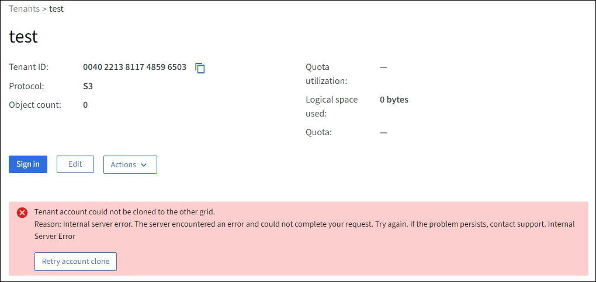
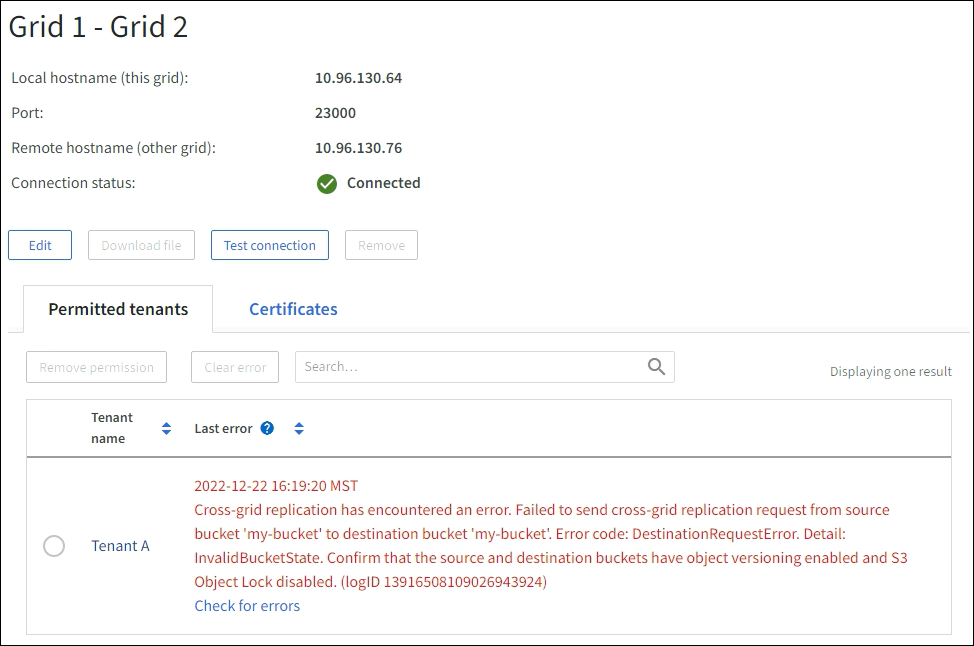

= Troubleshoot grid federation errors
:icons: font
:imagesdir: ../media/

[.lead]
You might need to troubleshoot alerts and errors related to grid federation connections, account clone, and cross-grid replication.

== [[grid-federation-errors]]Grid federation connection alerts and errors

You might receive alerts or experience errors with your grid federation connections.

After making any changes to resolve a connection issue, test the connection to ensure that the connection status returns to *Connected*. For instructions, see link:grid-federation-manage-connection.html[Manage grid federation connections].

=== Grid federation connection failure alert

.Issue
The *Grid federation connection failure* alert was triggered.

.Details
This alert indicates that the grid federation connection between the grids is not working.

.Recommended actions
. Review the settings on the Grid Federation page for both grids. Confirm that all values are correct. See link:grid-federation-manage-connection.html[Manage grid federation connections].

. Review the certificates used for the connection. Make sure there are no alerts for expired grid federation certificates and that the details for each certificate are valid. See the instructions for rotating connection certificates in link:grid-federation-manage-connection.html[Manage grid federation connections].

. Confirm that all Admin and Gateway Nodes in both grids are online and available. Resolve any alerts that might be affecting these nodes and try again.

. If you provided a fully qualified domain name (FQDN) for the local or remote grid, confirm the DNS server is online and available. See link:grid-federation-overview.html[What is grid federation?] for networking, IP address, and DNS requirements.

=== Expiration of grid federation certificate alert

.Issue
The *Expiration of grid federation certificate* alert was triggered.

.Details
This alert indicates that one or more grid federation certificates are about to expire. 

.Recommended actions
See the instructions for rotating connection certificates in link:grid-federation-manage-connection.html[Manage grid federation connections].

=== Error editing a grid federation connection

.Issue
When editing a grid federation connection, you see the following warning message when you select *Save and test*: “Failed to create a candidate configuration file on one or more nodes.”

.Details
When you edit a grid federation connection, StorageGRID attempts to save a “candidate configuration” file on all Admin Nodes on the first grid. A warning message appears if this file can't be saved to all Admin Nodes, for example, because an Admin Node is offline.

.Recommended actions

. From the grid you are using to edit the connection, select *NODES*.
. Confirm that all Admin Nodes for that grid are online.
. If any nodes are offline, bring them back online and try editing the connection again.

== Account clone errors

=== Can't sign in to a cloned tenant account

.Issue
You can't sign in to a cloned tenant account. The error message on the Tenant Manager sign-in page is "`Your credentials for this account were invalid. Please try again.`"

.Details
For security reasons, when a tenant account is cloned from the tenant's source grid to the tenant's destination grid, the password you set for the tenant's local root user is not cloned. Similarly, when a tenant creates local users on its source grid, the local user passwords aren't cloned to the destination grid.

.Recommended actions
Before the root user can sign in to the tenant's destination grid, a grid administrator must first link:changing-password-for-tenant-local-root-user.html[change the password for the local root user] on the destination grid.

Before a cloned local user can sign in to the tenant's destination grid, the root user for the cloned tenant must add a password for the user on the destination grid. For instructions, see link:../tenant/managing-local-users.html[Manage local users] in the instructions for using the Tenant Manager.

=== Tenant created without a clone

.Issue
You see the message "`Tenant created without a clone`" after creating a new tenant with the *Use grid federation connection* permission. 

.Details
This issue can occur if updates to the Connection status are delayed, which might cause an unhealthy connection to be listed as *Connected*.
 
.Recommended actions

. Review the reason listed in the error message and resolve any networking or other issues that might be preventing the connection from working. See <<grid-federation-errors,Grid federation connection alerts and errors>>.

. Follow the instructions to test a grid federation connection in link:grid-federation-manage-connection.html[Manage grid federation connections] to confirm the issue has been fixed.

. From the tenant's source grid, select *TENANTS*.

. Locate the tenant account that failed to be cloned.

. Select the tenant name to display the details page.

. Select *Retry account clone*.
+

If the error has been resolved, the tenant account will now be cloned to the other grid.

== Cross-grid replication alerts and errors

=== Last error shown for connection or tenant

.Issue
When link:../monitor/grid-federation-monitor-connections.html[viewing a grid federation connection] (or when link:grid-federation-manage-tenants.html[managing the permitted tenants] for a connection), you notice an error in the *Last error* column on the connection details page. For example:

.Details
For each grid federation connection, the *Last error* column shows the most recent error to occur, if any, when a tenant's data was being replicated to the other grid. This column only shows the last cross-grid replication error to occur; previous errors that might have occurred will not be shown.
An error in this column might occur for one of these reasons:

* The source object version was not found.
* The source bucket was not found.
* The destination bucket was deleted.
* The destination bucket was re-created by a different account.	
* The destination bucket has versioning suspended.
* The destination bucket was re-created by the same account but is now unversioned.

.Recommended actions
If an error message appears in the *Last error* column, follow these steps:

. Review the message text.
. Perform any recommended actions. For example, if versioning was suspended on the destination bucket for cross-grid replication, reenable versioning for that bucket.
. Select the connection or tenant account from the table.
. Select *Clear error*.
. Select *Yes* to clear the message and update the system's status.
. Wait 5-6 minutes and then ingest a new object into the bucket. Confirm that the error message does not reappear.
+
NOTE: To ensure the error message is cleared, wait at least 5 minutes after the timestamp in the message before ingesting a new object.
+
TIP: After you clear the error, a new *Last error* might appear if objects are ingested in a different bucket that also has an error. 

. To determine if any objects failed to be replicated because of the bucket error, see link:../admin/grid-federation-retry-failed-replication.html[Identify and retry failed replication operations]. 

=== Cross-grid replication permanent failure alert

.Issue
The *Cross-grid replication permanent failure* alert was triggered.

.Details
This alert indicates that tenant objects can't be replicated between the buckets on two grids for a reason that requires user intervention to resolve. This alert is typically caused by a change to either the source or the destination bucket. 

.Recommended actions

. Sign in to the grid where the alert was triggered.
. Go to *CONFIGURATION* > *System* > *Grid federation*, and locate the connection name listed in the alert.

. On the Permitted tenants tab, look at the *Last error* column to determine which tenant accounts have errors.

. To learn more about the failure, see the instructions in link:../monitor/grid-federation-monitor-connections.html[Monitor grid federation connections] to review the cross-grid replication metrics.

. For each affected tenant account:

.. See the instructions in link:../monitor/monitoring-tenant-activity.html[Monitor tenant activity] to confirm that the tenant has not exceeded its quota on the destination grid for cross-grid replication.

.. As required, increase the tenant's quota on the destination grid to allow new objects to be saved.
	
. For each affected tenant, sign in to Tenant Manager on both grids, so you can compare the list of buckets.

. For each bucket that has cross-grid replication enabled, confirm the following:

* There is a corresponding bucket for the same tenant on the other grid (must use the exact name). 
* Both buckets have object versioning enabled (versioning can't be suspended on either grid).
* Both buckets have S3 Object Lock disabled. 
* Neither bucket is in the *Deleting objects: read-only* state.

. To confirm that the issue was resolved, see the instructions in link:../monitor/grid-federation-monitor-connections.html[Monitor grid federation connections] to review the cross-grid replication metrics, or perform these steps:

.. Go back to the Grid federation page.
.. Select the affected tenant, and select *Clear Error* in the *Last error* column.

.. Select *Yes* to clear the message and update the system's status.

.. Wait 5-6 minutes and then ingest a new object into the bucket. Confirm that the error message does not reappear.
+
NOTE: To ensure the error message is cleared, wait at least 5 minutes after the timestamp in the message before ingesting a new object.
+
NOTE: It might take up to a day for the alert to clear after it is resolved.

.. Go to link:grid-federation-retry-failed-replication.html[Identify and retry failed replication operations] to identify any objects or delete markers that failed to be replicated to the other grid and to retry replication as needed.

=== Cross-grid replication resource unavailable alert

.Issue
The *Cross-grid replication resource unavailable* alert was triggered.

.Details
This alert indicates that cross-grid replication requests are pending because a resource is unavailable. For example, there might be a network error.

.Recommended actions

. Monitor the alert to see if the issue resolves on its own.

. If the issue persists, determine if either grid has a *Grid federation connection failure* alert for the same connection or an *Unable to communicate with node* alert for a node. This alert might be resolved when you resolve those alerts.

. To learn more about the failure, see the instructions in link:../monitor/grid-federation-monitor-connections.html[Monitor grid federation connections] to review the cross-grid replication metrics. 

. If you can't resolve the alert, contact technical support.

Cross-grid replication will proceed as normal after the issue is resolved.

