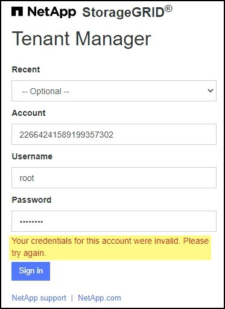

= Troubleshoot grid federation errors
:icons: font
:imagesdir: ../media/

[.lead]
You might need to troubleshoot alerts and errors related to grid federation connections, account clone, and cross-grid replication.

== [[grid-federation-errors]]Grid federation connection alerts and errors

You might receive alerts or experience errors with your grid federation connections.

After making any changes to resolve a connection issue, test the connection to ensure that the connection status returns to *Connected*. For instructions, see link:grid-federation-manage-connection.html[Manage grid federation connections].

=== Grid federation connection failure alert

.Issue
The *Grid federation connection failure* alert was triggered.

.Recommended actions
This alert indicates that the grid federation connection between the grids is not working. Follow these steps:

. Review the settings on the Grid Federation page for both grids. Confirm that all values are correct. See link:grid-federation-manage-connection.html[Manage grid federation connections].

. Review the certificates used for the connection. Make sure that certificates have not expired and that the details are valid. See the instructions for rotating connection certificates in link:grid-federation-manage-connection.html[Manage grid federation connections].

. Confirm that all Admin and Gateway Nodes in both grids are online and available. Resolve any alerts that might be affecting these nodes and try again.

. If you provided a fully qualified domain name (FQDN) for the local or remote grid, confirm the DNS server is online and available. See link:grid-federation-overview.html[What is grid federation] for networking, IP address, and DNS requirements.

=== Expiration of grid federation certificate alert

.Issue
The *Expiration of grid federation certificate* alert was triggered.

.Recommended actions
This alert indicates that one or more grid federation certificates are about to expire. See the instructions for rotating connection certificates in link:grid-federation-manage-connection.html[Manage grid federation connections].

== Account clone errors

=== Can't sign in to a cloned tenant account

.Issue
You can't sign in to a cloned tenant account. The error message is "`Your credentials for this account were invalid. Please try again.`"

.Recommended actions
For security reasons, when a tenant account is cloned from the tenant's source grid to the tenant's destination grid, the password you set for the tenant's local root user is not cloned. Similarly, when a tenant creates local users on its source grid, the local user passwords are not cloned to the destination grid.

Before the root user can sign in to the tenant's destination grid, a grid administrator must first link:changing-password-for-tenant-local-root-user.html[change the password for the local root user] on the destination grid.

Before a cloned local user can sign in to the tenant's destination grid, the root user for the cloned tenant must add a password for the user on the destination grid. For instructions, see link:../tenant/managing-local-users.html[Manage local users].

=== Tenant created without a clone

.Issue
You see the message "`Tenant created without a clone`" after creating a new tenant with the *Use grid federation connection* permission. 

.Recommended actions
 This issue can occur if updates to the Connection status are delayed, which might cause an unhealthy connection to be listed as *Connected*.
 
Try to clone the account again:

. Review the reason listed in the error message and resolve any networking or other issues that might be preventing the connection from working. See <<grid-federation-errors,Grid federation connection alerts and errors>>.

. Follow the instructions to test a grid federation connection in link:grid-federation-manage-connection.html[Manage grid federation connections] to confirm the issue has been fixed.

. From the tenant's source grid, select *TENANTS*.

. Locate the tenant account that failed to be cloned.

. Select the tenant name to display the details page.

. Select *Retry account clone*.
+
image::../media/grid-federation-retry-account-clone.png[screenshot showing an error message and the Retry account clone button]
If the error has been resolved, the tenant account will now be cloned to the other grid.

== Cross-grid replication alerts and errors

=== Cross-grid replication permanent failure alert

.Issue
The *Cross-grid replication permanent failure* alert was triggered.

.Recommended actions
This alert indicates that tenant objects can't be replicated between the buckets on two grids for a reason that requires user intervention to resolve. This alert is typically caused by a change to either the source or the destination bucket. 

Follow these steps:

. Sign in to the grid where the alert was triggered.
. Go to *CONFIGURATION* > *System* > *Grid federation*, and locate the connection name listed in the alert.

. On the Permitted tenants tab, look at the *Last error* column to determine which tenant accounts have errors.

. To learn more about the failure, review the <<cross-grid-metrics,cross-grid replication metrics>>.

. For each affected tenant account:

.. Select the tenant name to display the tenant details page.
.. Confirm that the tenant has not exceeded its quota for this grid.
.. As required, increase the quota to allow new objects to be saved.

.. Repeat these steps for the corresponding tenant account on the other grid in the connection.
	
. For each affected tenant, sign in to Tenant Manager on both grids, so you can compare the list of buckets.

. For each bucket that has cross-grid replication enabled, confirm the following:

* There is a corresponding bucket for the same tenant on the other grid (must use the exact name). 
* Both buckets have object versioning enabled (versioning cannot be suspended on either grid).
* Both buckets have S3 Object Lock disabled. 
* Neither bucket is in the *Deleting objects: read-only* state.

. Confirm that the issue was resolved, you can review the cross-grid replication metrics or perform these steps:

.. Go back to the Grid Federation page.
.. Select the affected tenant, and select *Clear Error* in the *Last error* column.
+
The error message no longer appears. However, if the issue was not resolved (or if a different error is encountered), the error message will be shown in the *Last error* column after new objects are saved to one of the tenant's buckets.

.. Ingest new objects in to the bucket, and confirm that the error does not reappear. 
+
NOTE: It might take up to a day for the alert to clear after it is resolved.

.. Go xref:grid-federation-retry-failed-replication.adoc[Identify and retry failed replication operations] to identify any objects or delete markers that failed to be replicated to the other grid and to retry replication as needed.

=== Cross-grid replication resource unavailable alert

.Issue
The *Cross-grid replication resource unavailable* alert was triggered.

.Recommended actions
This alert indicates that cross-grid replication requests are pending because a resource is unavailable. For example, there might be a network error.

Follow these steps:

. Monitor the alert to see if the issue resolves on its own.

. If the issue persists, determine if either grid has a *Grid federation connection failure* alert for the same connection or an *Unable to communicate with node* alert for a node. This alert might be resolved when you resolve those alerts.

. To learn more about the failure, review the <<cross-grid-metrics,cross-grid replication metrics>>. 

. If you cannot resolve the alert, contact technical support.

Cross-grid replication will proceed as normal once the issue is resolved.

== [[cross-grid-metrics]]Use cross-grid replication metrics

You can use the Cross-Grid Replication dashboard in Grafana to view metrics about cross-grid replication operations on your grid.

. From the Grid Manager, go to *SUPPORT* > *Tools* > *Metrics*.
+
NOTE: The tools available on the Metrics page are intended for use by technical support. Some features and menu items within these tools are intentionally non-functional and are subject to change. See the list of xref:../monitor/commonly-used-prometheus-metrics.adoc[commonly used Prometheus metrics].

. In the Grafana section of the page, select *Cross Grid Replication*. 
+
For detailed instructions, see xref:../monitor/reviewing-support-metrics.adoc[Review support metrics].

. To retry replication of objects that failed to replicate, see xref:grid-federation-retry-failed-replication.adoc[Identify and retry failed replication operations].  

