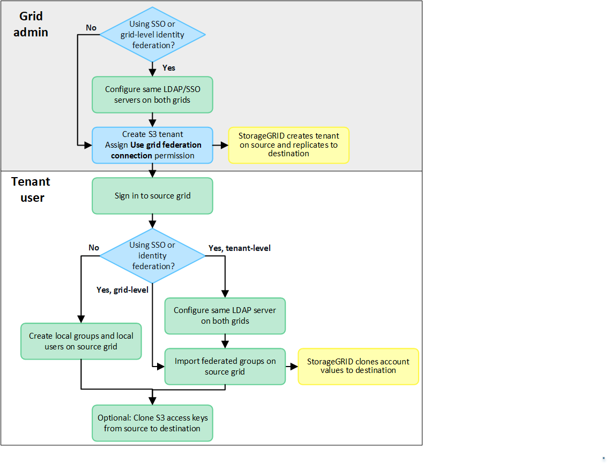
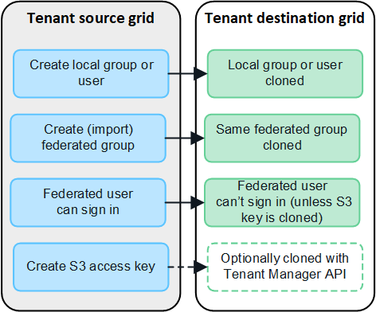
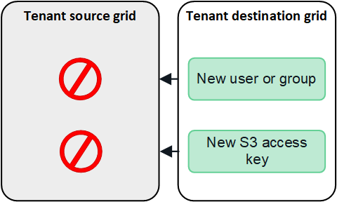

= What is account clone?
:icons: font
:imagesdir: ../media/

[.lead]
Account clone is the replication of tenant accounts, tenant groups, tenant users, and, optionally, S3 access keys between a source StorageGRID system and a destination StorageGRID system. Account clone is required for cross-grid replication. Cloning account information from a source grid to a destination grid ensures that tenant users and groups can access the corresponding buckets and objects on either grid.

== Workflow for account clone

The workflow diagram shows the steps that grid administrators and permitted tenants will perform to set up account clone. These steps can only be performed after the grid federation connection is configured.

== How are tenant accounts cloned?

After creating a link:grid-federation-overview.html[grid federation connection], a grid admin can create new S3 tenant accounts on either grid. Tenants that have the *Use grid federation connection* permission can be allowed to use one or more grid federation connections. When the new tenant is saved, StorageGRID automatically creates a replica of that tenant on the other grid.

The grid where the tenant is originally created is known as the tenant's _source grid_. The grid where the tenant is replicated to is known as the tenant's _destination grid_. Both tenant accounts have the same account ID, name, storage quota, and assigned permissions, but the tenant replicated to the destination grid has fewer capabilities and does not initially have a root user password.

NOTE: You can only add the *Use grid federation connection* when you are creating a new S3 tenant; you can't add this permission to an existing tenant.

.Learn more
xref:grid-federation-manage-tenants.adoc[Manage permitted tenants for grid federation]

== How are groups, users, and S3 access keys cloned?

After tenants have been created and replicated, new groups and users are automatically cloned from the tenant's source grid to the tenant's destination grid.

As shown in the figure:

* Local tenant groups and users created on the source grid are automatically cloned to the destination grid. The group permissions and S3 policy are the same.

* Assuming the <<account-clone-identity-federation,requirements for identity federation>> have been met, federated groups imported to the tenant on the source grid are automatically cloned to the tenant on the destination grid. Both groups have the same access mode, group permissions and S3 group policy.

* If a federated group has been imported to the source grid, federated users will be allowed to access the source grid. However, federated user can't sign in to the destination grid unless their S3 access keys are manually cloned to the destination grid.

* Optionally, S3 access keys created on the source grid can be manually cloned to the destination grid.
+ 
For security reasons, StorageGRID does not automatically clone S3 access keys from the tenant's source grid to the destination grid. If tenant users need to access the buckets on both grids, you must use the Tenant Manager API to manually copy the keys from the source grid to the destination grid. See xref:../tenant/grid-federation-clone-keys-with-api.adoc[Clone S3 access keys using the API].

Note that account cloning occurs in one direction only. If you import or create groups, users, and S3 access keys on the tenant's destination grid, these items are not cloned back to the source grid. 

Also note that any edits made to the tenant, users, groups, or access keys on either grid are not cloned to the other grid. 

== [[account-clone-identity-federation]]Considerations and requirements for SSO and identity federation

* If either StorageGRID system in the connection uses single sign-on (SSO), a grid administrator must configure the same identity source and the same SSO identity provider (IdP) for both grids.

* If either StorageGRID system in the connection uses identity federation (but not SSO), either or both of the following must be true:

** A grid admin must configure the same identity source for both grids.
** A tenant account that has the *Use own identity source* permission must configure the same identity source for both the source and destination tenant accounts. 

.Learn more

xref:../tenant/grid-federation-account-clone.adoc[Clone account information]

