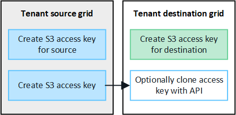

= What is account clone?
:icons: font
:imagesdir: ../media/

[.lead]
Account clone is the replication of tenant account information, tenant groups, tenant users, and, optionally, S3 access keys between a source StorageGRID system and a destination StorageGRID system. 

Account clone is required for cross-grid replication. Cloning account information from a source grid to a destination grid ensures that tenant users and groups can access the corresponding buckets and objects on either grid.

== Workflow for account clone

The workflow diagram shows the steps that grid administrators and permitted tenants will perform to set up account clone. These steps can only be performed after the grid federation connection is configured.

image:../media/grid-federation-account-clone-workflow.png[workflow for cross-grid replication]

== How are tenant accounts cloned?

After creating a link:grid-federation-overview.html[grid federation connection], a grid admin can create new S3 tenant accounts on either grid. Tenants that are created with the *Use grid federation connection* permission can be allowed to use that connection. When the new tenant is saved, StorageGRID automatically creates a replica of the new tenant on the other grid.

The grid where the tenant is originally created is known as the tenant's _source grid_. The grid where the tenant is replicated is known as the tenant's _destination grid_. Both tenant accounts have the same account ID, name, storage quota, and assigned permissions, but the tenant replicated to the destination grid does not initially have a root user password.

.Learn more
link:grid-federation-manage-tenants.html[Manage permitted tenants for grid federation]

== How are groups, users, and S3 access keys cloned?

This section describes how groups, users, and S3 access keys are cloned between the tenant source grid and the tenant destination grid.

=== Groups and local users added to the source grid are cloned

After a tenant account is created and replicated to the destination grid, any new groups and local users added to the tenant's source grid are automatically cloned to the tenant's destination grid.

image:../media/grid-federation-account-clone.png[image showing that tenant details are cloned from source grid to destination grid]

As shown in the figure:

* Local tenant groups created on the source grid are automatically cloned to the destination grid. Both groups have the same access mode, group permissions, and S3 policy.

* Local tenant users created on the source grid are also automatically cloned to the destination grid.

* For security reasons, local user passwords are not cloned to the destination grid.
+
TIP: If a local user needs to sign in to the Tenant Manager on the destination grid, a user with Root access permission must sign in to the Tenant Manager on the destination grid to add a password for the user on that grid. See link:../tenant/managing-local-users.html[Manage local users].

* Assuming the requirements for <<account-clone-sso,single sign-on>> and <<account-clone-identity-federation,identity federation>> have been met, federated groups that are created (imported) for the tenant on the source grid are automatically cloned to the tenant on the destination grid. Both groups have the same access mode, group permissions and S3 group policy.

* After federated groups are created on the source grid and cloned to the destination grid, federated users can sign in to either grid.

=== S3 access keys can be manually cloned

StorageGRID does not automatically clone S3 access keys from the tenant's source grid to the destination grid because security is improved by having different keys on each grid. If tenant users need to access the buckets on both grids using the same access keys, you can use the Tenant Manager API to manually clone the access keys.

.Learn more
link:../tenant/grid-federation-clone-keys-with-api.html[Clone S3 access keys using the API]

=== Groups and users added to destination grid are not cloned

Account cloning occurs only from the tenant's source grid to the tenant's destination grid. 

As shown in the figure, if you create or import groups, users, and S3 access keys on the tenant's destination grid, these items are not cloned back to the source grid. 

image:../media/grid-federation-account-not-cloned.png[image showing that tenant details are cloned back to source grid]

=== Edited or deleted groups and users are not cloned

Account cloning occurs only for new information. 

CAUTION: If you edit or delete the tenant or its users, groups, or access keys on either grid, your changes will not be cloned to the other grid. 

CAUTION: If you delete a tenant from the destination grid, clone errors will occur if you attempt to create new groups or users on the tenant's source grid.

image:../media/grid-federation-account-clone-edit-delete.png[image showing that edited or deleted tenant details are cloned]

.Learn more

link:../tenant/grid-federation-account-clone.html[Clone account information]

== [[account-clone-sso]]Considerations and requirements for SSO

If either StorageGRID system in the connection uses single sign-on (SSO), both grids must use SSO. The grid admins for the tenant's source and destination grids must perform these steps before creating permitted tenant accounts:

. Configure the same identity source for both grids. See link:using-identity-federation.html[Use identity federation].

. Configure the same SSO identity provider (IdP) for both grids. See link:configuring-sso.html[Configure single sign-on].

. link:managing-admin-groups.html[Create the same admin group] on both grids by importing the same federated group.
+
When you create the tenant, you will select this group to have the initial Root access permission for both the source and destination tenant accounts. 
+
TIP: If this admin group doesn't exist on both grids before you create the tenant, the tenant won't be replicated to the destination.

== [[account-clone-identity-federation]]Considerations and requirements for identity federation

Identity federation can be configured for the entire grid, or each tenant can be granted permission to configure its own identity source. 

=== Considerations for grid-level identity federation

If either grid in the connection has identity federation configured, both grids must use identity federation. The grid admins for the tenant's source and destination grids must perform these steps before creating tenant accounts:

. Configure the same identity source for both grids. See link:using-identity-federation.html[Use identity federation].

. If you want a federated group to have initial Root access permission for both the source and destination tenant accounts, link:managing-admin-groups.html[create the same admin group] on both grids by importing the same federated group.
+
If you don't want a federated group to have initial Root access permission for both accounts, you can specify a password for the local root user.
+
CAUTION: A new tenant account can't be replicated to the destination grid if the federated group selected to have Root access permission doesn't already exist on the destination grid. 

=== Considerations for tenant-level identity federation

If you create a tenant and assign both the *Use grid federation connection* permission and the *Use own identity source* permission, both the source tenant and its replica must configure the same identity source before the source tenant imports any federated groups. Federated groups added to the source grid can't be cloned to the destination unless both grids use the same identity source.

