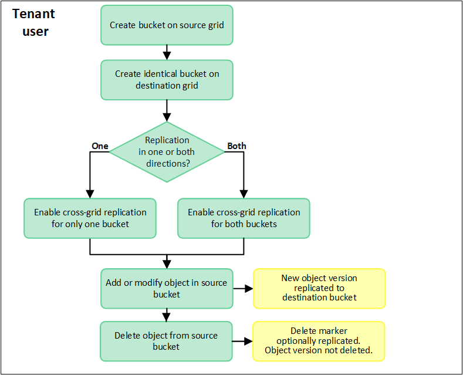
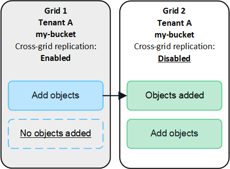
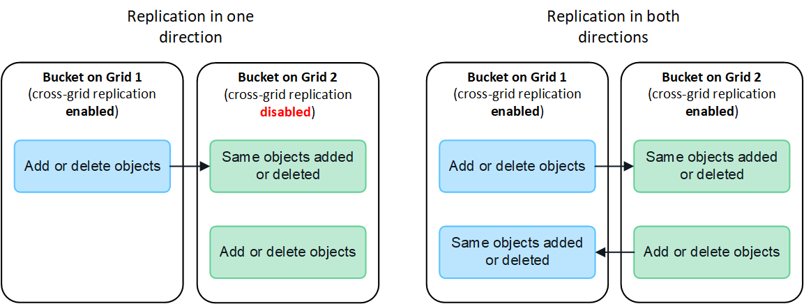
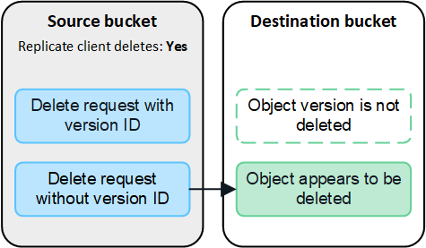

= What is cross-grid replication?
:icons: font
:imagesdir: ../media/

[.lead]
Cross-grid replication is the automatic replication of objects between selected S3 buckets in two StorageGRID systems that are connected in a xref:grid-federation-overview.adoc[grid federation connection]. xref:grid-federation-what-is-account-clone.adoc[Account clone] is required for cross-grid replication.

== Workflow for cross-grid replication

The workflow diagram summarize the steps for configuring cross-grid replication between buckets on two grids. 

== Requirements for cross-grid replication

If a tenant account has the *Use grid federation connection* permission to use one or more link:grid-federation-overview.html[grid federation connections], a tenant user with Root access permission can create identical buckets in the corresponding tenant accounts on each grid. These buckets:

* Must have the same name and region
* Must have versioning enabled
* Must have S3 Object Lock disabled
* Must be empty

After both buckets have been created, cross-grid replication can be configured for either or both buckets.

.Learn more

xref:../tenant/grid-federation-manage-cross-grid-replication.adoc[Manage cross-grid replication]

== How cross-grid replication works

Cross-grid replication can be configured to occur in one direction or in both directions.

=== Replication in one direction

If you enable cross-grid replication for a bucket on only one grid, objects added to the source bucket are replicated to the destination bucket, but objects added to the destination bucket are not replicated back to the source. In the figure, cross-grid replication is enabled for `my-bucket` from Grid 1 to Grid 2, but it is not enabled in the other direction. 

=== Replication in both directions
If you enable cross-grid replication for the same bucket on both grids, objects added to either bucket are replicated to the other grid. In the figure, cross-grid replication is enabled for `my-bucket` in both directions. 

=== What happens when objects are ingested?

When an S3 client adds an object to a bucket that has cross-grid replication enabled, the following happens:

. StorageGRID automatically replicates the object from the source bucket to the destination bucket. The time to perform this background replication operation depends on a number of factors, including the size of the replication queue.
+
The S3 client can verify an object's replication status by issuing a GET Object or HEAD Object request. The response includes a StorageGRID-specific `x-ntap-sg-cgr-replication-status` response header, which will have one of the following values:
+
[cols="1a,2a" options="header"]
|===
| Grid| Replication status 

| Source
| * *SUCCESS*: The replication was successful.
* *PENDING*: The object hasn't been replicated yet.
* *FAILURE*: The replication failed with a permanent failure. A user must resolve the error.

| Destination
| *REPLICA*: The object was replicated from the source grid.

|===
+
NOTE: StorageGRID does not support the `x-amz-replication-status` header.

. StorageGRID places and stores the object according to the matching ILM rule in each grid's active ILM policy. For example, Object A on Grid 1 might be stored as two replicated copies and retained forever, while the copy of Object A that was replicated to Grid 2 might be stored using 2+1 erasure coding and deleted after three years. 

=== What happens when objects are deleted?

As described in link:../primer/delete-data-flow.html[Delete data flow], StorageGRID can delete an object for any of these reasons: 

* The S3 client issues a delete request.
* A Tenant Manager user selects the link:../tenant/deleting-s3-bucket-objects.html[Delete objects in bucket] option to remove all objects from a bucket.
* The bucket has a lifecycle configuration, which expires.
* The last time period in the ILM rule for the object ends, and there are no further placements specified.

When StorageGRID deletes an object because of a *Delete objects in bucket* operation, bucket lifecycle expiration, or ILM placement expiration, the replicated object is never deleted from the other grid in a grid federation connection. However, S3 client deletes can optionally be replicated between grids.

To understand what happens when an S3 client deletes objects from a bucket that has cross-grid replication enabled, review how S3 clients delete objects from buckets that have versioning enabled, as follows:

* If an S3 client issues a delete request that includes a version ID, that version of the object is permanently removed. No delete marker is added to the bucket. 

* If an S3 client issues a delete request that does not include a version ID, StorageGRID does not delete any object versions. Instead, it adds a delete marker to the bucket. The delete marker causes StorageGRID to act as if the object was deleted:

** A GET request without a version ID will fail with `404 No Object Found`
** A GET request with a valid version ID will succeed and return the requested object version.

When an S3 client deletes an object from a bucket that has cross-grid replication enabled, StorageGRID determines whether to replicate the delete request to the destination, as follows:

* If the delete request includes a version ID, that object version is permanently removed from the source grid. However, StorageGRID does not replicate delete requests that include a version ID, so the same object version is not deleted from the destination.

* If the delete request does not include a version ID, StorageGRID can optionally replicate the delete marker, based on how cross-grid replication is configured for the bucket:

** If you choose to replicate delete markers, a delete marker is added to the source bucket and replicated to the destination bucket. In effect, the object appears to be deleted on both grids.

**  If you choose not to replicate delete markers, a delete marker is added to the source bucket but is not replicated to the destination bucket. In effect, objects that are deleted on the source grid are not deleted on the destination grid.

In the figure, *Replicate client deletes* was set to *Yes* when xref:../tenant/grid-federation-manage-cross-grid-replication.adoc[cross-grid replication was enabled]. Delete requests for the source bucket that include a version ID will not delete objects from the destination bucket. Delete requests for the source bucket that do not include a version ID will appear to delete objects in the destination bucket.

=== How encrypted objects are replicated
When you use cross-grid replication to replicate objects between grids, you can encrypt individual objects, use default bucket encryption, or configure grid-wide encryption. You can add, modify, or remove default bucket or grid-wide encryption settings before or after you enable cross-grid replication for a bucket.

To encrypt individual objects, you can use SSE (server-side encryption with StorageGRID-managed keys) when adding the objects to the source bucket. Use the `x-amz-server-side-encryption` request header and specify `AES256`. See xref:../s3/using-server-side-encryption.adoc[Use server-side encryption]. 

NOTE: Using SSE-C (server-side encryption with customer-provided keys) is not supported for cross-grid replication. The ingest operation will fail.

To use default encryption for a bucket, use a PUT bucket encryption request and set the `SSEAlgorithm` parameter to `AES256`. Bucket-level encryption applies to any objects ingested without the `x-amz-server-side-encryption` request header. See xref:../s3/operations-on-buckets.adoc[Operations on buckets]. 

To use grid-level encryption, set the *Stored object encryption* option to *AES-256*. Grid-level encryption applies to any objects that are not encrypted at the bucket level or that are ingested without the `x-amz-server-side-encryption` request header. See xref:../admin/changing-network-options-object-encryption.adoc[Configure network and object options].

NOTE: SSE does not support AES-128. If the *Stored object encryption* option is enabled for the source grid using the *AES-128* option, the use of the AES-128 algorithm will not be propagated to the replicated object. Instead, the replicated object will use the destination's default bucket or grid-level encryption setting, if available. 

When determining how to encrypt source objects, StorageGRID applies these rules:

. Use the `x-amz-server-side-encryption` ingest header, if present.
. If an ingest header is not present, use the bucket default encryption setting, if configured.
. If a bucket setting is not configured, use the grid-wide encryption setting, if configured.
. If a grid-wide setting is not present, do not encrypt the source object.

When determining how to encrypt replicated objects, StorageGRID applies these rules in this order:

. Use the same encryption as the source object, unless that object uses AES-128 encryption.
. If the source object is not encrypted or it uses AES-128, use the destination bucket's default encryption setting, if configured.
. If the destination bucket does not have an encryption setting, use the destination's grid-wide encryption setting, if configured.
. If a grid-wide setting is not present, do not encrypt the destination object.

=== PUT Object tagging and DELETE Object tagging are not supported

PUT Object tagging and DELETE Object tagging requests are not supported for objects in buckets that have cross-grid replication enabled.

If an S3 client issues a PUT Object tagging or DELETE Object tagging request, `501 Not Implemented` is returned. The message is `Put(Delete) ObjectTagging is not available for buckets that have cross-grid replication configured`.

=== How segmented objects are replicated

The source grid's maximum segment size applies to objects replicated to the destination grid. When objects are replicated to another grid, the *Maximum Segment Size* setting (*Configuration* > *System* > *Storage options*) of the source grid will be used on both grids. For example, suppose the maximum segment size for the source grid is 1 GB, while the maximum segment size of the destination grid is 50 MB. If you ingest a 2-GB object on the source grid, that object is saved as two 1-GB segments. It will also be replicated to the destination grid as two 1-GB segments, even though that grid's maximum segment size is 50 MB. 

