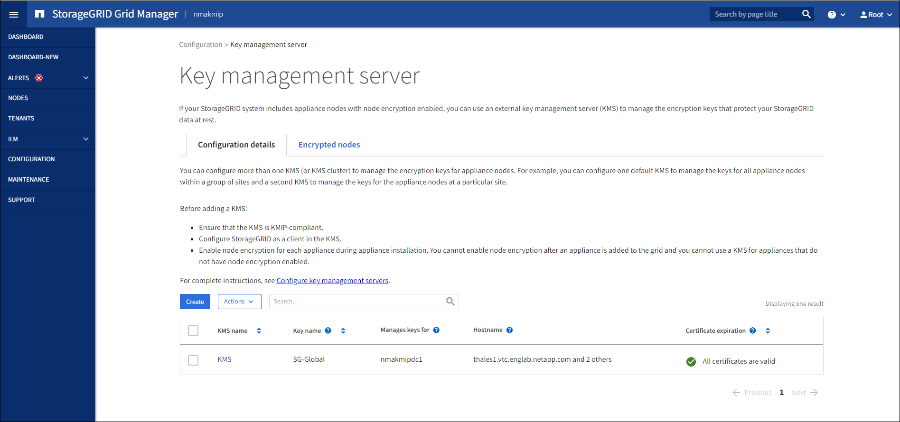
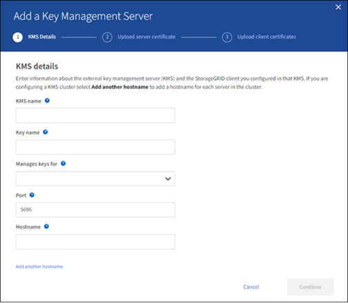
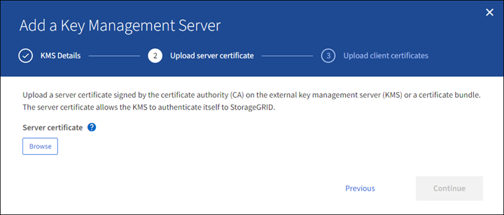
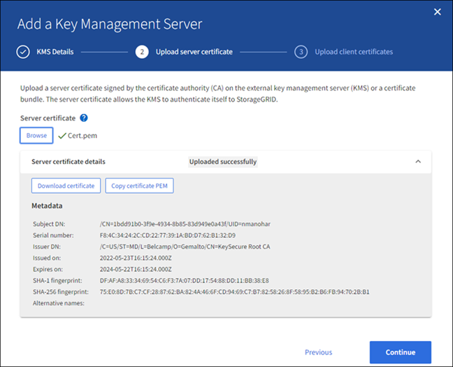
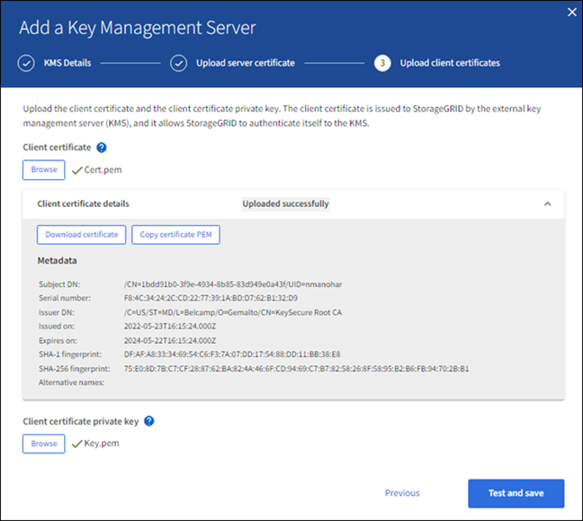

= Add a key management server (KMS)
:icons: font
:imagesdir: ../media/

[.lead]
You use the StorageGRID Key Management Server wizard to add each KMS or KMS cluster.

.What you'll need

* You have reviewed the link:kms-considerations-and-requirements.html[considerations and requirements for using a key management server].

* You have link:kms-configuring-storagegrid-as-client.html[configured StorageGRID as a client in the KMS], and you have the required information for each KMS or KMS cluster.

* You are signed in to the Grid Manager using a link:../admin/web-browser-requirements.html[supported web browser].
* You have the Root access permission.

.About this task

If possible, configure any site-specific key management servers before configuring a default KMS that applies to all sites not managed by another KMS. If you create the default KMS first, all node-encrypted appliances in the grid will be encrypted by the default KMS. If you want to create a site-specific KMS later, you must first copy the current version of the encryption key from the default KMS to the new KMS. See link:kms-considerations-for-changing-for-site.html[Considerations for changing the KMS for a site] for details.

== Step 1: KMS details

In Step 1 (KMS details) of the Add a Key Management Server wizard, you provide details about the KMS or KMS cluster.

.Steps

. Select *CONFIGURATION* > *Security* > *Key management server*.
+
The Key management server page appears with the Configuration details tab selected.
+

. Select *Create*.
+
Step 1 (KMS details) of the Add a Key Management Server wizard appears.
+

. Enter the following information for the KMS and the StorageGRID client you configured in that KMS.
+
[cols="1a,2a" options="header"]
|===
| Field| Description
a|
KMS name
a|
A descriptive name to help you identify this KMS. Must be between 1 and 64 characters.
a|
Key name
a|
The exact key alias for the StorageGRID client in the KMS. Must be between 1 and 255 characters.
a|
Manages keys for
a|
The StorageGRID site that will be associated with this KMS. If possible, you should configure any site-specific key management servers before configuring a default KMS that applies to all sites not managed by another KMS.

 ** Select a site if this KMS will manage encryption keys for the appliance nodes at a specific site.
 ** Select *Sites not managed by another KMS (default KMS)* to configure a default KMS that will apply to any sites that do not have a dedicated KMS and to any sites you add in subsequent expansions.
+
*Note:* A validation error will occur when you save the KMS configuration if you select a site that was previously encrypted by the default KMS but you did not provide the current version of original encryption key to the new KMS.

a|
Port
a|
The port the KMS server uses for Key Management Interoperability Protocol (KMIP) communications. Defaults to 5696, which is the KMIP standard port.
a|
Hostname
a|
The fully qualified domain name or IP address for the KMS.

*Note:* The Subject Alternative Name (SAN) field of the server certificate must include the FQDN or IP address you enter here. Otherwise, StorageGRID will not be able to connect to the KMS or to all servers in a KMS cluster.

|===

. If you are configuring a KMS cluster, select *Add another hostname* to add a hostname for each server in the cluster.
. Select *Continue*.

== Step 2: Upload server certificate

In Step 2 (Upload server certificate) of the Add a Key Management Server wizard, you upload the server certificate (or certificate bundle) for the KMS. The server certificate allows the external KMS to authenticate itself to StorageGRID.

.Steps

. From *Step 2 (Upload server certificate)*, browse to the location of the saved server certificate or certificate bundle.
+

. Upload the certificate file.
+
The server certificate metadata appears.
+

+
NOTE: If you uploaded a certificate bundle, the metadata for each certificate appears on its own tab.

. Select *Continue*.

== Step 3: Upload client certificates

In Step 3 (Upload client certificates) of the Add a Key Management Server wizard, you upload the client certificate and the client certificate private key. The client certificate allows StorageGRID to authenticate itself to the KMS.

.Steps

. From *Step 3 (Upload client certificates)*, browse to the location of the client certificate.
+

. Upload the client certificate file.
+
The client certificate metadata appears.

. Browse to the location of the private key for the client certificate.
. Upload the private key file.
+

. Select *Test and save*.
+
The connections between the key management server and the appliance nodes are tested. If all connections are valid and the correct key is found on the KMS, the new key management server is added to the table on the Key Management Server page.
+
NOTE: Immediately after you add a KMS, the certificate status on the Key Management Server page appears as Unknown. It might take StorageGRID as long as 30 minutes to get the actual status of each certificate. You must refresh your web browser to see the current status.

. If an error message appears when you select *Test and save*, review the message details and then select *OK*.
+
For example, you might receive a 422: Unprocessable Entity error if a connection test failed.

. If you need to save the current configuration without testing the external connection, select *Force save*.
+
WARNING: Selecting *Force save* saves the KMS configuration, but it does not test the external connection from each appliance to that KMS. If there is an issue with the configuration, you might not be able to reboot appliance nodes that have node encryption enabled at the affected site. You might lose access to your data until the issues are resolved.

. Review the confirmation warning, and select *OK* if you are sure you want to force save the configuration.
+
The KMS configuration is saved but the connection to the KMS is not tested.
