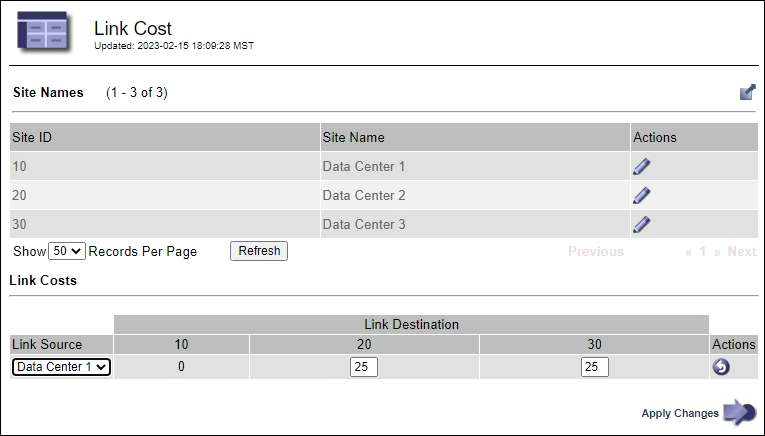

= Manage link costs
:icons: font
:imagesdir: ../media/

[.lead]
Link costs let you prioritize which data center site provides a requested service when two or more data center sites exist. You can adjust link costs to reflect latency between sites.

== What are link costs?

* Link costs are used to prioritize which object copy is used to fulfill object retrievals.
* Link costs are used by the Grid Management API and the Tenant Management API to determine which internal StorageGRID services to use.
* Link costs are used by the Load Balancer service on Admin Nodes and Gateway Nodes to direct client connections. See link:../admin/managing-load-balancing.html[Considerations for load balancing].

The diagram shows a three site grid that has link costs configured between sites:

image::../media/link_costs.gif[Conceptual diagram for link costs between data centers]

* The Load Balancer service on Admin Nodes and Gateway Nodes equally distributes client connections to all Storage Nodes at the same data center site and to any data center sites with a link cost of 0.
+
In the example, a Gateway Node at data center site 1 (DC1) equally distributes client connections to Storage Nodes at DC1 and to Storage Nodes at DC2. A Gateway Node at DC3 sends client connections only to Storage Nodes at DC3.

* When retrieving an object that exists as multiple replicated copies, StorageGRID retrieves the copy at the data center that has the lowest link cost.
+
In the example, if a client application at DC2 retrieves an object that is stored both at DC1 and DC3, the object is retrieved from DC1, because the link cost from DC1 to DC2 is 0, which is lower than the link cost from DC3 to DC2 (25).

Link costs are arbitrary relative numbers with no specific unit of measure. For example, a link cost of 50 is used less preferentially than a link cost of 25. The table shows commonly used link costs.

[cols="1a,1a,2a" options="header"]
|===
| Link
| Link cost
| Notes

| Between physical data center sites
| 25 (default)
| Data centers connected by a WAN link.

| Between logical data center sites at the same physical location
| 0
| Logical data centers in the same physical building or campus connected by a LAN.
|===

== Update link costs

You can update the link costs between data center sites to reflect latency between sites.

.Before you begin

* You are signed in to the Grid Manager using a link:../admin/web-browser-requirements.html[supported web browser].
* You have the link:admin-group-permissions.html[Grid topology page configuration permission].

.Steps

. Select *SUPPORT* > *Other* > *Link cost*.
+

. Select a site under *Link Source* and enter a cost value between 0 and 100 under *Link Destination*.
+
You can't change the link cost if the source is the same as the destination.
+
To cancel changes, select image:../media/nms_revert.gif[undo icon]*Revert*.

. Select *Apply Changes*.

