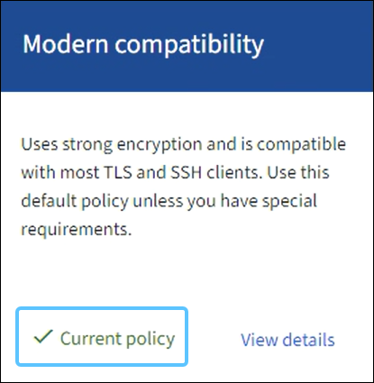

= Manage the TLS and SSH policy
:icons: font
:imagesdir: ../media/

[.lead]
The TLS and SSH policy determines which protocols and ciphers are used to establish secure TLS connections with client applications and secure SSH connections to internal StorageGRID services.

The security policy controls how TLS and SSH encrypt data in motion. In general, use the Modern compatibility (default) policy, unless your system needs to be Common Criteria-compliant or you need to use other ciphers.

.What you'll need

* You are signed in to the Grid Manager using a link:../admin/web-browser-requirements.html[supported web browser].
* You have the link:admin-group-permissions.html[Root access permission].

[[select-a-security-policy]]
== Select a security policy

.Steps
. Select *CONFIGURATION* > *Security settings* > *TLS and SSH policies*.
+ 
The TLS and SSH policies tab shows the available policies. The currently active policy is noted by a green checkmark on the policy tile.
+

+
NOTE: Some StorageGRID services have not been updated to use the ciphers in these policies.
+
[cols="1a,2a" options="header"]
|===
| Policy
| Description

| Modern compatibility (default)
| Use the default policy if you need strong encryption. This policy is compatible with most TLS and SSH clients. You can use this policy unless you have special requirements.

| Legacy compatibility
| Use this policy if you need additional compatibility options to support older clients. The additional options in Legacy policy can be less secure than the Modern compatibility policy.

| Common Criteria
| Matches the test configuration used for Common Criteria certification.

| FIPS strict
| The same as the Common Criteria policy, but removes the transitional ciphers and enables use of the NetApp Cryptographic Security Module 3.0.0 for external client connections to load balancer endpoints, Tenant Manager, and Grid Manager. Using this policy might reduce performance. 

| Custom
| You can create a custom policy to apply your own ciphers. You can edit or modify the existing policy ciphers to create your own custom policy. You must use caution and validate the policy you provide.

|===

. To review a policy, select *View details*. 

. To change the current policy, select *Use policy*.
+
A green checkmark appears next to *Current policy* on the policy tile.

== Create a custom security policy

.Steps

. Select *View details* for one of the provided policies.
. Select *Copy to clipboard* and *Cancel*.
. Select *Configure and use* from the *Custom policy*. 
. Paste the JSON you copied and make required changes to create a custom policy.
. Select *Use policy*.
+
A green checkmark appears next to *Current policy* on the Custom policy tile.
. Optionally, select *Edit configuration* to make more changes to the new custom policy.

[[temporarily-revert-to-default-security-policy]]
== Temporarily revert to the default security policy

If you configured a custom security policy, you might not be able to sign in to the Grid Manager if the configured TLS policy is incompatible with the link:global-certificate-types.html[configured server certificate].

You can temporarily revert to the default security policy.

.Steps

. Log in to an Admin Node:
.. Enter the following command: `ssh admin@_Admin_Node_IP_`
.. Enter the password listed in the `Passwords.txt` file.
.. Enter the following command to switch to root: `su -`
.. Enter the password listed in the `Passwords.txt` file.
+
When you are logged in as root, the prompt changes from `$` to `#`.

. Run the following command:
+
`restore-default-cipher-configurations`
. From a web browser, access the Grid Manager on the same Admin Node.
. Follow the steps in <<select-a-security-policy,Select a security policy>> to configure the policy again.