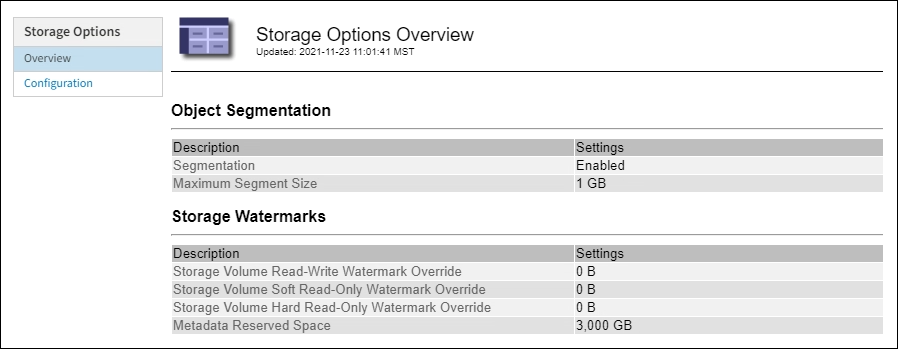

= Manage Storage options
:icons: font
:imagesdir: ../media/

[.lead]
Storage options include the object segmentation settings, the current values for storage volume watermarks, and the Metadata Reserved Space setting.

