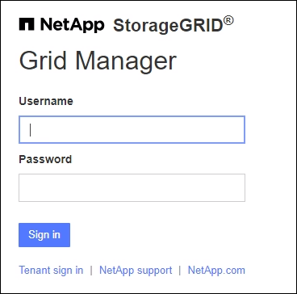
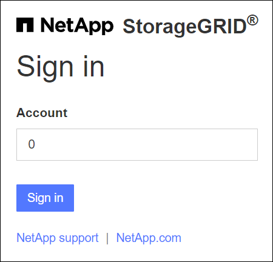
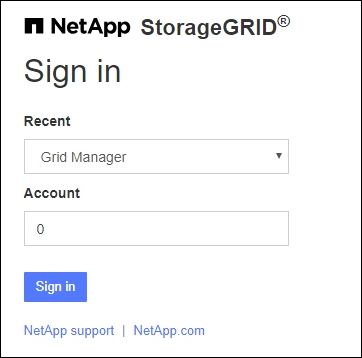

= Sign in to the Grid Manager
:icons: font
:imagesdir: ../media/

[.lead]
You access the Grid Manager sign-in page by entering the fully qualified domain name (FQDN) or IP address of an Admin Node into the address bar of a supported web browser.

== Overview
Each StorageGRID system includes one primary Admin Node and any number of non-primary Admin Nodes. You can sign in to the Grid Manager on any Admin Node to manage the StorageGRID system. However, the Admin Nodes are not exactly the same:

* Alarm acknowledgments (legacy system) made on one Admin Node are not copied to other Admin Nodes. For this reason, the information displayed for alarms might not look the same on each Admin Node.
* Some maintenance procedures can only be performed from the primary Admin Node.

=== Connect to HA group

If Admin Nodes are included in a high availability (HA) group, you connect using the virtual IP address of the HA group or a fully qualified domain name that maps to the virtual IP address. The primary Admin Node should be selected as the group's primary interface, so that when you access the Grid Manager, you access it on the primary Admin Node unless the primary Admin Node is not available. See  xref:managing-high-availability-groups.adoc[Manage high availability groups].

=== Use SSO

The sign-in steps are slightly different if xref:configuring-sso.adoc[single sign-on (SSO) has been configured].

== Sign in to Grid Manager on first Admin Node

.What you'll need
* You have your login credentials.
* You are using a xref:../admin/web-browser-requirements.adoc[supported web browser].
* Cookies are enabled in your web browser.
* You belong to a user group that has at least one permission.
* You have the URL for the Grid Manager:
+
`https://_FQDN_or_Admin_Node_IP_/`
+
You can use the fully qualified domain name, the IP address of an Admin Node,  or the virtual IP address of an HA group of Admin Nodes.
+
To access the Grid Manager on a port other than the default port for HTTPS (443), include the port number in the URL:
+
`https://_FQDN_or_Admin_Node_IP:port_/`
+
NOTE: SSO is not available on the restricted Grid Manager port. You must use port 443.

.Steps
. Launch a supported web browser.
. In the browser's address bar, enter the URL for the Grid Manager.

. If you are prompted with a security alert, install the certificate using the browser's installation wizard. See xref:using-storagegrid-security-certificates.adoc[About security certificates].

. Sign in to the Grid Manager.
+
The sign-in screen that appears depends on whether single sign-on (SSO) has been configured for StorageGRID.

[role="tabbed-block"]
====

.Not using SSO
--
If StorageGRID is not using SSO:

.. Enter your username and password for the Grid Manager.
.. Select *Sign In*.
+

--

.Using SSO
--

* If StorageGRID is using SSO and this is the first time you have accessed the URL on this browser:
.. Select *Sign in*. You can leave the 0 in the Account field.
+

.. Enter your standard SSO credentials on your organization's SSO sign-in page. For example:
+
image::../media/sso_organization_page.gif[example organization sign in page for SSO]

* If StorageGRID is using SSO and you have previously accessed the Grid Manager or a tenant account:

.. Enter *0* (the account ID for the Grid Manager) or select *Grid Manager* if it appears in the list of recent accounts.
+

.. Select *Sign in*.

.. Sign in with your standard SSO credentials on your organization's SSO sign-in page.
--

====

// end tabbed area

When you are signed in, the home page of the Grid Manager appears, which includes the Dashboard. To learn what information is provided, see xref:../monitor/viewing-dashboard.adoc[View and configure the Dashboard].

image::../media/grid_manager_dashboard.png[dashboard]

== Sign into another Admin Node
Follow these steps to sign in to another Admin Node.

[role="tabbed-block"]
====

.Not using SSO
--
If StorageGRID is not using SSO:

.. In the browser's address bar, enter the fully qualified domain name or IP address of the other Admin Node. Include the port number as required.
 .. Enter your username and password for the Grid Manager.
 .. Select *Sign In*.

--

.Using SSO
--
If StorageGRID is using SSO and you have signed in to one Admin Node, you can access other Admin Nodes without having to sign in again. Enter the fully qualified domain name or IP address of the other Admin Node in the browser's address bar.

If your SSO session expires, you are prompted for your credentials again.

--
====
