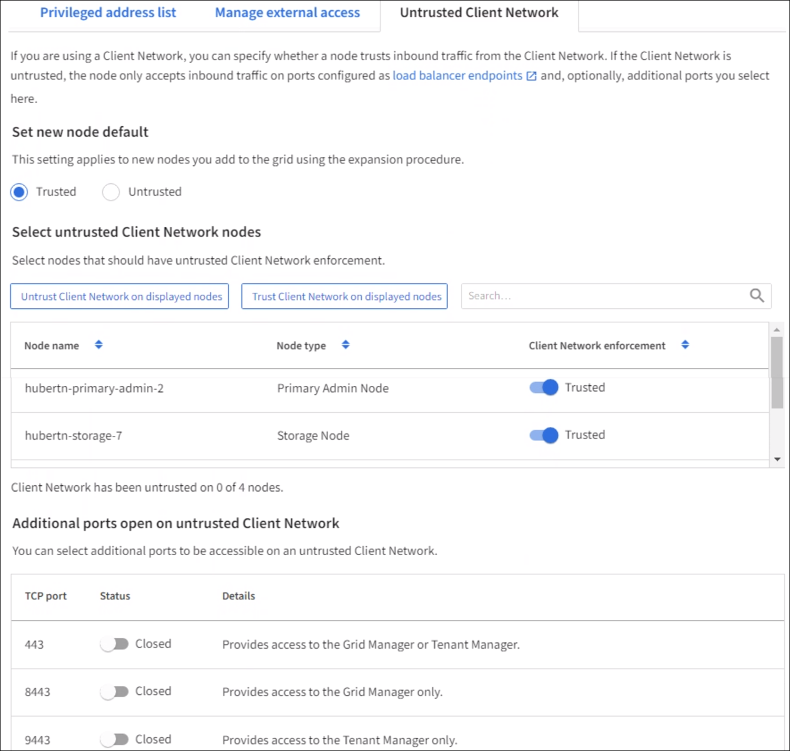

= Specify node's Client Network is untrusted
:icons: font
:imagesdir: ../media/

[.lead]
If you are using a Client Network, you can specify whether each node's Client Network is trusted or untrusted. You can also specify the default setting for new nodes added in an expansion.

.What you'll need

* You are signed in to the Grid Manager using a xref:../admin/web-browser-requirements.adoc[supported web browser].
* You have the Root access permission.
* If you want an Admin Node or Gateway Node to accept inbound traffic only on explicitly configured endpoints, you have defined the load balancer endpoints or created a list of privileged IP addresses in the Privileged IP addresses tab on the xref:../admin/configure-firewall-controls.adoc[Firewall control page].
+
NOTE: Existing client connections might fail if load balancer endpoints have not been configured.

.Steps

. Select *CONFIGURATION* > *Security* > *Firewall control*.
+
. Select the Untrusted Client Network tab.
+ 

The Untrusted Client Network page lists all nodes in your StorageGRID system. You can use this table to select whether Client Network enforcement is used. You can also use this page to configure whether new nodes added during an expansion will be part of the trusted or untrusted Client network. 

The Unavailable Reason column includes an entry if the Client Network on the node must be trusted.
+

. In the *Set New Node Default* section, specify what the default setting should be when new nodes are added to the grid in an expansion procedure.
 ** *Trusted*: When a node is added in an expansion, its Client Network is trusted.
 ** *Untrusted*: When a node is added in an expansion, its Client Network is untrusted.
As required, you can return to this page to change the setting for a specific new node.

+
NOTE: This setting does not affect the existing nodes in your StorageGRID system.
. In the *Select Untrusted Client Network Nodes* section, select the nodes that should allow client connections only on explicitly configured load balancer endpoints.
+
You can select or unselect the check box in the title to select or unselect all nodes.

. Select *Save*.
+
The new firewall rules are immediately added and enforced. Existing client connections might fail if load balancer endpoints have not been configured.

