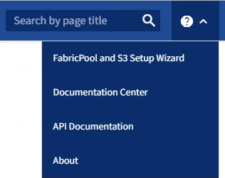

= Access and complete the S3 setup wizard
:icons: font
:imagesdir: ../media/

[.lead]
You can use the S3 setup wizard to configure StorageGRID for use with an S3 application. The setup wizard provides the values the application needs to access a StorageGRID bucket and to save objects.

.What you'll need

* You have the link:admin-group-permissions.html[Root access permission].
* You have reviewed the link:use-s3-setup-wizard.html[considerations and requirements] for using the wizard. 

== Access the wizard

.Steps

. Sign in to the Grid Manager using a link:web-browser-requirements.html[supported web browser].

. If the *FabricPool and S3 setup wizard* banner appears on the dashboard, select the link in the banner. If the banner no longer appears, select the help icon from the header bar in the Grid Manager and select *FabricPool and S3 setup wizard*.
+

. In the S3 application section of the FabricPool and S3 setup wizard page, select *Configure now*.

== Step 1 of 6: Configure HA group
An HA group is a collection of nodes that each contain the StorageGRID Load Balancer service. An HA group can contain Gateway Nodes, Admin Nodes, or both.

You can use an HA group to help keep the S3 data connections available. If the active interface in the HA group fails, a backup interface can manage the workload with little impact to S3 operations.

For details about this task, see link:managing-high-availability-groups.html[Manage high availability groups].

.Steps

. If you plan to use an external load balancer, you don't need to create an HA group. Select *Skip this step* and go to <<Step 2 of 6: Configure load balancer endpoint>>.

. To use the StorageGRID load balancer, you can create a new HA group or use an existing HA group.
+
[role="tabbed-block"]
====

.Create HA group
--

.. To create a new HA group, select *Create HA group*.

.. For the *Enter details* step, complete the following fields.
+
[cols="1a,2a" options="header"]
|===
| Field| Description

| HA group name
| A unique display name for this HA group.

| Description (optional)
| The description of this HA group.

|===

.. For the *Add interfaces* step, select the node interfaces you want to use in this HA group.
+
Use the column headers to sort the rows, or enter a search term to locate interfaces more quickly.
+ 
You can select one or more nodes, but you can select only one interface for each node.

.. For the *Prioritize interfaces* step, determine the Primary interface and any backup interfaces for this HA group.
+
Drag rows to change the values in the *Priority order* column.
+
The first interface in the list is the Primary interface. The Primary interface is the active interface unless a failure occurs.
+
If the HA group includes more than one interface and the active interface fails, the virtual IP (VIP) addresses move to the first backup interface in the priority order. If that interface fails, the VIP addresses move to the next backup interface, and so on. When failures are resolved, the VIP addresses move back to the highest priority interface available.

.. For the *Enter IP addresses* step, complete the following fields.
+
[cols="1a,2a" options="header"]
|===
| Field| Description

| Subnet CIDR
| The address of the VIP subnet in CIDR notation &#8212; an IPv4 address followed by a slash and the subnet length (0-32). 

The network address must not have any host bits set. For example, `192.16.0.0/22`.

| Gateway IP address (optional)
| If the S3 IP addresses used to access StorageGRID are not on the same subnet as the StorageGRID VIP addresses, enter the StorageGRID VIP local gateway IP address. The local gateway IP address must be within the VIP subnet.

| Virtual IP address
| Enter at least one and no more than ten VIP addresses for the active interface in the HA group. All VIP addresses must be within the VIP subnet.

At least one address must be IPv4. Optionally, you can specify additional IPv4 and IPv6 addresses.

|===

.. Select *Create HA group* and then select *Finish* to return to the S3 setup wizard.
.. Select *Continue* to go to the load balancer step.
--

.Use existing HA group
--
.. To use an existing HA group, select the HA group name from the *Select an HA group*.
.. Select *Continue* to go to the load balancer step. 
--
====

// end tabbed area

== Step 2 of 6: Configure load balancer endpoint

StorageGRID uses a load balancer to manage the workload from client applications. Load balancing maximizes speed and connection capacity across multiple Storage Nodes.

You can use the StorageGRID Load Balancer service, which exists on all Gateway and Admin Nodes, or you can connect to an external (third-party) load balancer. Using the StorageGRID load balancer is recommended.

For details about this task, see link:managing-load-balancing.html[Considerations for load balancing].

To use the StorageGRID Load Balancer service, select the *StorageGRID load balancer* tab and then create or select the load balancer endpoint you want to use. To use an external load balancer, select the *External load balancer* tab and provide details about the system you have already configured. 

[role="tabbed-block"]
====

.Create endpoint
--

.Steps
. To create a load balancer endpoint, select *Create endpoint*.
. For the *Enter endpoint details* step, complete the following fields.
+
[cols="1a,2a" options="header"]
|===
|Field| Description

| Name
| A descriptive name for the endpoint.

| Port
| The StorageGRID port you want to use for load balancing. This field defaults to 10433 for the first endpoint you create, but you can enter any unused external port. If you enter 80 or 443, the endpoint is configured only on Gateway Nodes, since these ports are reserved on Admin Nodes.

*Note:* Ports used by other grid services are not permitted. See the 
link:../network/network-port-reference.html[Network port reference].

| Client type
| Must be *S3*.

| Network protocol
| Select *HTTPS*.

*Note*: Communicating with StorageGRID without TLS encryption is supported but not recommended.

|===

. For the *Select binding mode* step, specify the binding mode. The binding mode controls how the endpoint is accessed&#8212;using any IP address or using specific IP addresses and network interfaces.
+
include::../_include/load-balancer-endpoint-binding-mode.adoc[]

. For the Tenant access step, select one of the following:
+
[cols="1a,2a" options="header"]
|===
| Field	
| Description

| Allow all tenants (default)
| All tenant accounts can use this endpoint to access their buckets.

| Allow selected tenants
| Only the selected tenant accounts can use this endpoint to access their buckets.

| Block selected tenants
| The selected tenant accounts can't use this endpoint to access their buckets. All other tenants can use this endpoint.

|===

. For the *Attach certificate* step, select one of the following:
+
[cols="1a,2a" options="header"]
|===
| Field| Description

| Upload certificate (recommended)
| Use this option to upload a CA-signed server certificate, certificate private key, and optional CA bundle.

| Generate certificate
| Use this option to generate a self-signed certificate. See link:configuring-load-balancer-endpoints.html[Configure load balancer endpoints] for details of what to enter.

| Use StorageGRID S3 and Swift certificate
| Use this option only if you have already uploaded or generated a custom version of the StorageGRID global certificate. See link:configuring-custom-server-certificate-for-storage-node.html[Configure S3 and Swift API certificates] for details. 

|===

. Select *Finish* to return to the S3 setup wizard.

. Select *Continue* to go to the tenant and bucket step. 

NOTE: Changes to an endpoint certificate can take up to 15 minutes to be applied to all nodes.
--

.Use existing load balancer endpoint
--

.Steps
. To use an existing endpoint, select its name from the *Select a load balancer endpoint*. 
. Select *Continue* to go to the tenant and bucket step. 
--

.Use external load balancer
--

.Steps
. To use an external load balancer, complete the following fields.
+
[cols="1a,2a" options="header"]
|===
| Field| Description

| FQDN
| The fully qualified domain name (FQDN) of the external load balancer.

| Port
| The port number that the S3 application will use to connect to the external load balancer.

| Certificate
| Copy the server certificate for the external load balancer and paste it into this field.

|===

. Select *Continue* to go to the tenant and bucket step. 

--
====

// end tabbed area

== Step 3 of 6: Create tenant and bucket

A tenant is an entity that can use S3 applications to store and retrieve objects in StorageGRID. Each tenant has its own users, access keys, buckets, objects, and a specific set of capabilities. You must create the tenant before you can create the bucket that the S3 application will use to store its objects. 

A bucket is a container used to store a tenant's objects and object metadata. Although some tenants might have many buckets, the wizard helps you to create a  tenant and a bucket in the quickest and easiest way. You can use the Tenant Manager later to add any additional buckets you need.

You can create a new tenant for this S3 application to use. Optionally, you can also create a bucket for the new tenant. Finally, you can allow the wizard to create the S3 access keys for the tenant's root user.

For details about this task, see link:creating-tenant-account.html[Create tenant account] and 
link:../tenant/creating-s3-bucket.html[Create S3 bucket].

.Steps

. Select *Create tenant*.

. For the Enter details steps, enter the following information.
+
[cols="1a,3a" options="header"]
|===
| Field | Description

| Name
| A name for the tenant account. Tenant names don't need to be unique. When the tenant account is created, it receives a unique, numeric account ID.

| Description (optional)
| A description to help identify the tenant.

| Client type
| The type of client protocol this tenant will use. For the S3 setup wizard,  *S3* is selected and the field is disabled.

| Storage quota (optional)
| If you want this tenant to have a storage quota, a numerical value for the quota and the units.

|===

. Select *Continue*.

. Optionally, select any permissions you want this tenant to have.
+
[NOTE]
Some of these permissions have additional requirements. For details, select the help icon for each permission.
+
include::../_include/tenant-account-permissions.adoc[]

. If you selected *Use grid federation connection*, select one of the available grid federation connections.

. Define root access for the tenant account, based on whether your StorageGRID system uses link:using-identity-federation.html[identity federation], link:configuring-sso.html[single sign-on (SSO)], or both. 
+
[cols="1a,2a" options="header"]
|===
| Option 
| Do this

| If identity federation is not enabled 
| Specify the password to use when signing into the tenant as the local root user.

| If identity federation is enabled
| . Select an existing federated group to have Root access permission for the tenant.

. Optionally, specify the password to use when signing in to the tenant as the local root user.

| If both identity federation and single sign-on (SSO) are enabled
| Select an existing federated group to have Root access permission for the tenant. No local users can sign in.

|===

. If you want the wizard to create the access key ID and secret access key for the root user, select *Create root user S3 access key automatically*. 
+
TIP: Select this option if the only user for the tenant will be the root user. If other users will use this tenant, use Tenant Manager to configure keys and permissions.

. Select *Continue*.

. For the Create bucket step, optionally create a bucket for the tenant's objects. Otherwise, select *Create tenant without bucket* to go to the <<download-data,download data step>>.
+
TIP: If S3 Object Lock is enabled for the grid, the bucket created in this step won't have S3 Object Lock enabled. If you need to use an S3 Object Lock bucket for this S3 application, select *Create tenant without bucket*. Then, use Tenant Manager to link:../tenant/creating-s3-bucket.html[create the bucket] instead.

.. Enter the name of the bucket that the S3 application will use. For example, `S3-bucket`.
+
TIP: You can't change the bucket name after creating the bucket.

.. Select the *Region* for this bucket.
+
Use the default region (us-east-1) unless you expect to use ILM in the future to filter objects based on the bucket's region.

.. Select *Enable object versioning* if you want to store each version of each object in this bucket. 

.. Select *Create tenant and bucket* and go to the download data step.

== [[download-data]]Step 4 of 6: Download data

In the download data step, you can download one or two files to save the details of what you just configured.

.Steps

. If you selected *Create root user S3 access key automatically*, do one or both of the following:

** Select *Download access keys* to download a `.csv` file containing the tenant account name, access key ID, and secret access key.

** Select the copy icon (image:../media/icon_tenant_copy_url.png[copy icon]) to copy the access key ID and secret access key to the clipboard.

. Select *Download configuration values* to download a `.txt` file containing the settings for the load balancer endpoint, tenant, bucket, and the root user.

. Save this information to a secure location.
+
CAUTION: Don't close this page until you have copied both access keys. The keys will not be available after you close this page. Make sure to save this information in a secure location because it can be used to obtain data from your StorageGRID system.

. If prompted, select the check box to confirm that you have downloaded or copied the keys.

. Select *Continue* to go to the ILM rule and policy step.

== Step 5 of 6: Review ILM rule and ILM policy for S3

Information lifecycle management (ILM) rules control the placement, duration, and ingest behavior of all objects in your StorageGRID system. The ILM policy included with StorageGRID makes two replicated copies of all objects. This policy is in effect until you create a new proposed policy and activate it.

.Steps

. Review the information provided on the page.

. If you want to add specific instructions for the objects belonging to the new tenant or bucket, create a new rule and a new policy. See link:../ilm/access-create-ilm-rule-wizard.html[Create ILM rule] and link:../ilm/creating-ilm-policy.html[Create ILM policy: Overview].

. Select *I have reviewed these steps and understand what I need to do*.

. Select the check box to indicate that you understand what to do next.

. Select *Continue* to go to *Summary*.

== Step 6 of 6: Review summary 

.Steps
. Review the summary.
. Make note of the details in the next steps, which describe the additional configuration that might be needed before you connect to the S3 client. For example, selecting *Sign in as root* takes you to the Tenant Manager, where you can add tenant users, create additional buckets, and update bucket settings.
. Select *Finish*.

. Configure the application using the file you downloaded from StorageGRID or the values you obtained manually.