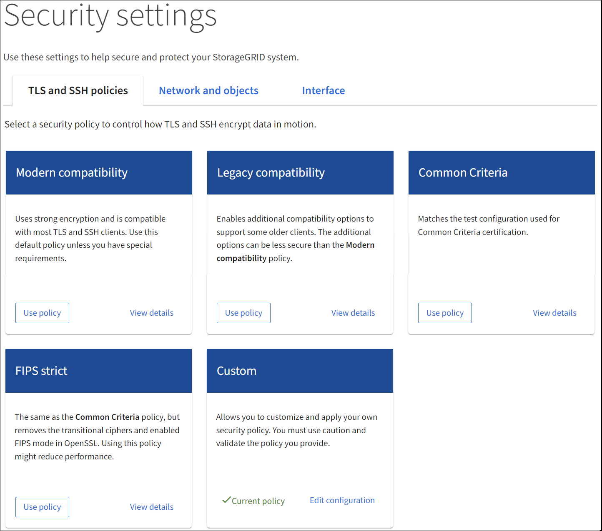

= Use TLS and SSH policies
:icons: font
:imagesdir: ../media/

[.lead]
You can use TLS and SSH policies tab to configure TLS and SSH policies and establish secure connections while still maintaining compatibility with client applications. It is recommended to use the Modern policy, unless the system needs to be FIPS compliant or need to support other policies.

.What you'll need

* You are signed in to the Grid Manager using a xref:../admin/web-browser-requirements.adoc[supported web browser].
* You have specific access permissions.

.About this task

Select a security policy to control how TLS and SSH encrypt data in motion.

.Steps
. Select *CONFIGURATION* > *Security settings* > *TLS and SSH policies*.  

Select a security policy from on the grid to control how TLS and SSH encrypt data in motion.

[cols="2,2a" options="header"]
|===
// header row
|Policy
|
|

// first body row
|
|
|

// table end
|===