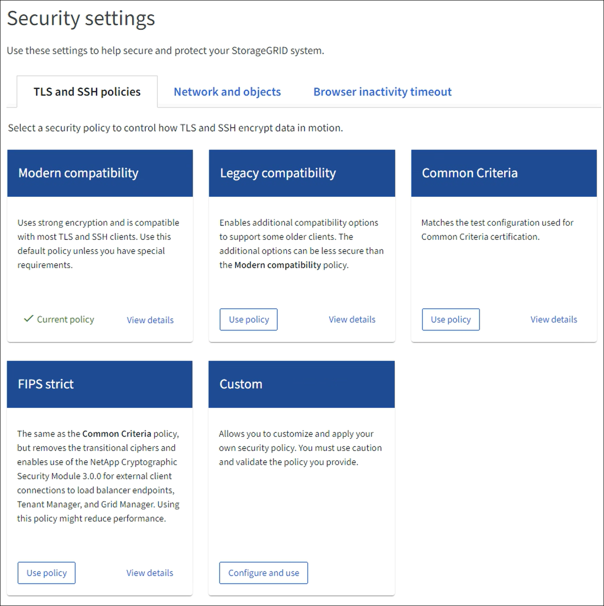

= Manage the TLS and SSH policy
:icons: font
:imagesdir: ../media/

[.lead]
You can use TLS and SSH policy to configure ciphers to establish secure connections while still maintaining compatibility with the client applications. You can use the Modern policy, unless the system needs to be FIPS compliant or need to support other ciphers.

.What you'll need

* You are signed in to the Grid Manager using a xref:../admin/web-browser-requirements.adoc[supported web browser].
* You have the Root access permission.

.About this task

Select a security policy to control how TLS and SSH encrypt data in motion.

.Steps
. Select *CONFIGURATION* > *Security settings* > *TLS and SSH policies*.
+

+

NOTE: Some StorageGRID services have not been updated to use the ciphers in these policies.
+
. Select *View details* and review the available policies.
+

[cols="1,2a" options="header"]
|===
|Policy
|Description

|Modern compatibility
|Use this policy if you need a strong encryption. This policy is compatible with most TLS and SSH clients.
You can use this default policy unless you have special requirements.

|Legacy compatibility
|Use this policy if you have additional compatibility options to support older clients. The additional options in Legacy policy can be less secure than the Modern compatibility policy.

|Common Criteria
|Matches the test configuration used for Common Criteria certification.

|FIPS strict
|The same as the Common Criteria policy, but removes the transitional ciphers and enables FIPS mode in OpenSSL. Using this policy might reduce performance.

|Custom
|Use this policy if you want to create your own custom policy. Custom policy helps you to customize and apply your own security policy. You must use caution and validate the policy you provide.

You can also edit an existing policy and create your own custom policy. Use *Copy to clipboard* option, edit, and create a custom policy.

To create a new Custom policy, select *Configure and use* from the Custom policy grid.
|===
+

. Select *Use policy* to apply one of the provided policies, or create a custom policy, as follows:

.. Select *View details* for one of the provided policies.
.. Select *Copy to clipboard* and *Cancel*.
.. For the Custom policy, select *Configure and use*. 
.. Paste the JSON you copied and make any required changes to create a custom policy that meets your requirements.
.. Select *Use policy*.
