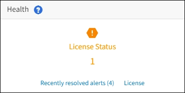

= View StorageGRID license information
:icons: font
:imagesdir: ../media/

[.lead]
You can view the license information for your StorageGRID system, such as the maximum storage capacity of your grid, whenever necessary.

.What you'll need

* You are signed in to the Grid Manager using a xref:../admin/web-browser-requirements.adoc[supported web browser].

.About this task
If there is an issue with the software license for this StorageGRID system, the Health status card on the Dashboard includes a License status icon and a *License* link. The number indicates the number of license-related issues.

.Steps

. Access the License page by doing one of the following:

* From the Health status card on the dashboard, select the License status icon or the *License* link. This link appears only if there is an issue with the license.
* Select *MAINTENANCE* > *System* > *License*.

. View the read-only details for the current license:
+
* StorageGRID system ID, which is the unique identification number for this StorageGRID installation
* License serial number
* License type, either *Perpetual* or *Subscription*
* Licensed storage capacity of the grid
* Supported storage capacity
* License end date. *N/A* appears for a perpetual license.
* Support service contract end date
* Contents of the license text file
+
NOTE: For licenses issued before StorageGRID 10.3, the licensed storage capacity is not included in the license file, and a "See License Agreement" message is displayed instead of a value.

. If needed, xref:updating-storagegrid-license-information.adoc[update StorageGRID license information].
