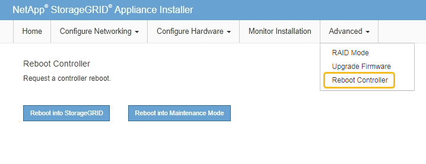

= Monitor node encryption in maintenance mode
:icons: font
:imagesdir: ../media/

[.lead]
If you enabled node encryption for the appliance during installation, you can monitor the node-encryption status of each appliance node, including the node-encryption state and key management server (KMS) details.

See link:../admin/kms-configuring.html[Configure key management servers] for information about implementing KMS for StorageGRID appliances.

.What you'll need

* You enabled node encryption for the appliance during installation. You cannot enable node encryption after the appliance is installed.
* You have link:../commonhardware/placing-appliance-into-maintenance-mode.html[placed the appliance into maintenance mode].

.Steps

. From the StorageGRID Appliance Installer, select *Configure Hardware* > *Node Encryption*.
+
image::../media/fde_monitor_in_maint_mode.png[KMS clear configuration]
+
The Node Encryption page includes three sections:

 ** Encryption Status shows whether node encryption is enabled or disabled for the appliance.
 ** Key Management Server Details shows information about the KMS being used to encrypt the appliance. You can expand the server and client certificate sections to view certificate details and status.
  *** To address issues with the certificates themselves, such as renewing expired certificates, see the link:../admin/kms-configuring.html[instructions for configuring KMS].
  *** If there are unexpected problems connecting to KMS hosts, verify that the link:../commonhardware/checking-dns-server-configuration.html[DNS servers are correct] and that link:../installconfig/configuring-network-links.html[appliance networking is correctly configured].
  *** If you are unable to resolve your certificate issues, contact technical support.
 ** Clear KMS Key disables node encryption for the appliance, removes the association between the appliance and the key management server that was configured for the StorageGRID site, and deletes all data from the appliance. You must <<Clear key management server configuration,clear the KMS key>> before you can install the appliance into another StorageGRID system.
+
IMPORTANT: Clearing the KMS configuration deletes data from the appliance, rendering it permanently inaccessible. This data is not recoverable.

. When you are done checking node-encryption status, reboot the node. From the StorageGRID Appliance Installer, select *Advanced* > *Reboot Controller*, and then select one of these options:
 ** Select *Reboot into StorageGRID* to reboot the controller with the node rejoining the grid. Select this option if you are done working in maintenance mode and are ready to return the node to normal operation.
 ** Select *Reboot into Maintenance Mode* to reboot the controller with the node remaining in maintenance mode. (This option is available only when the controller is in maintenance mode.) Select this option if there are additional maintenance operations you need to perform on the node before rejoining the grid.
+

+
It can take up to 20 minutes for the appliance to reboot and rejoin the grid. To confirm that the reboot is complete and that the node has rejoined the grid, go back to the Grid Manager. The *NODES* page should display a normal status (no icon) for the appliance node, indicating that no alerts are active and the node is connected to the grid.
+
image::../media/nodes_menu.png[Appliance node rejoined grid]

== Clear key management server configuration

Clearing the key management server (KMS) configuration disables node encryption on your appliance. After clearing the KMS configuration, the data on your appliance is permanently deleted and is no longer accessible. This data is not recoverable.

.What you'll need

If you need to preserve data on the appliance, you must either perform a node decommission procedure or clone the node before you clear the KMS configuration. 

IMPORTANT: When KMS is cleared, data on the appliance will be permanently deleted and no longer accessible. This data is not recoverable.

link:../maintain/grid-node-decommissioning.html[Decommission the node] to move any data it contains to other nodes in StorageGRID.

.About this task

Clearing the appliance KMS configuration disables node encryption, removing the association between the appliance node and the KMS configuration for the StorageGRID site. Data on the appliance is then deleted and the appliance is left in a pre-install state. This process cannot be reversed.

You must clear the KMS configuration:

* Before you can install the appliance into another StorageGRID system, that does not use a KMS or that uses a different KMS.
+
IMPORTANT: Do not clear the KMS configuration if you plan to reinstall an appliance node in a StorageGRID system that uses the same KMS key.

* Before you can recover and reinstall a node where the KMS configuration was lost and the KMS key is not recoverable.
* Before returning any appliance that was previously in use at your site.
* After decommissioning a appliance that had node encryption enabled.

IMPORTANT: Decommission the appliance before clearing KMS to move its data to other nodes in your StorageGRID system. Clearing KMS before decommissioning the appliance will result in data loss and might render the appliance inoperable.

.Steps

. Open a browser, and enter one of the IP addresses for the appliance's compute controller.
+
`*https://_Controller_IP_:8443*`
+
`_Controller_IP_` is the IP address of the compute controller (not the storage controller) on any of the three StorageGRID networks.
+
The StorageGRID Appliance Installer Home page appears.

. Select *Configure Hardware* > *Node Encryption*.
+
image::../media/clear_kms.png[KMS clear configuration]
+
IMPORTANT: If the KMS configuration is cleared, data on the appliance will be permanently deleted. This data is not recoverable.

. At the bottom of the window, select *Clear KMS Key and Delete Data*.
. If you are sure that you want to clear the KMS configuration, type +
`*clear*` +
and select *Clear KMS Key and Delete Data*.
+
image::../media/fde_disable_confirmation.png[KMS clear confirmation]
+
The KMS encryption key and all data are deleted from the node, and the appliance reboots. This can take up to 20 minutes.

. Open a browser, and enter one of the IP addresses for the appliance's compute controller. +
`*https://_Controller_IP_:8443*`
+
`_Controller_IP_` is the IP address of the compute controller (not the storage controller) on any of the three StorageGRID networks.
+
The StorageGRID Appliance Installer Home page appears.

. Select *Configure Hardware* > *Node Encryption*.
. Verify that node encryption is disabled and that the key and certificate information in *Key Management Server Details* and the *Clear KMS Key and Delete Data* control are removed from the window.
+
Node encryption cannot be reenabled on the appliance until it is reinstalled in a grid.

.After you finish

After the appliance reboots and you have verified that KMS has been cleared and that the appliance is in a pre-install state, you can physically remove the appliance from your StorageGRID system. See the link:../maintain/preparing-appliance-for-reinstallation-platform-replacement-only.html[instructions for preparing the appliance for reinstallation].
