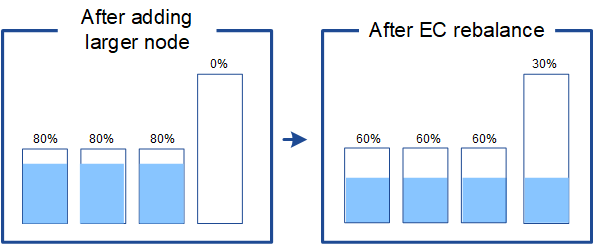

= Considerations for rebalancing erasure-coded data
:icons: font
:imagesdir: ../media/

[.lead]
If you are performing an expansion to add Storage Nodes and you use ILM rules to erasure code data, you might need to perform the EC rebalance procedure if you cannot add enough Storage Nodes for the erasure-coding scheme you are using.

After reviewing these considerations, perform the expansion, and then go to link:rebalancing-erasure-coded-data-after-adding-storage-nodes.html[Rebalance erasure-coded data after adding Storage Nodes] to run the procedure. 

== What is EC rebalancing?

EC rebalancing is a StorageGRID procedure that might be required after a Storage Node expansion. The procedure is run as a command-line script from the primary Admin Node. When you run the EC rebalance procedure, StorageGRID redistributes erasure-coded fragments among the existing and the newly added Storage Nodes at a site.

The EC rebalance procedure:

* Only moves erasure-coded object data. It does not move replicated object data.
* Redistributes the data within a site. It does not move data between sites.
* Redistributes data among all Storage Nodes at a site. It does not redistribute data within storage volumes.
* Does not consider the replicated data usage on each Storage Node when determining where to move erasure-coded data.
* Redistributes erasure-coded data evenly between Storage Nodes without considering the relative capacities of each node.
* Will not distribute erasure-coded data to Storage Nodes that are more than 70% full.
* Might decrease the performance of ILM operations and S3 and Swift client operations when it runs&#8212;additional resources are required to redistribute the erasure-coding fragments. 
* Might need to be run more than once for systems with very large numbers of erasure-coded objects. To limit resource usage, the maximum number of moves is capped for each job.

When the EC rebalance procedure is complete:

* Erasure-coded data will have moved from Storage Nodes with less available space to Storage Nodes with more available space.
* The data protection of erasure-coded objects will be unchanged.
* Used (%) values might be different between Storage Nodes for two reasons:

** Replicated object copies will continue to consume space on the existing nodes&#8212;the EC rebalance procedure does not move replicated data.

** Larger-capacity nodes will be relatively less full than smaller-capacity nodes, even though all nodes will end up with approximately the same amount of erasure-coded data.
+
For example, suppose three 200-TB nodes are each filled to 80% (200 &#215; 0.8 = 160 TB on each node, or 480 TB for the site). If you add a 400-TB node and run the rebalance procedure, all nodes will now have approximately the same amount of erasure-code data (480/4 = 120 TB). However, the Used (%) for the larger node will be less than the Used (%) for the smaller nodes.
+

== When to rebalance erasure-coded data

Consider the following scenario:

* StorageGRID is running at a single site, which contains three Storage Nodes.
* The ILM policy uses a 2+1 erasure-coding rule for all objects larger than 1.0 MB and a 2-copy replication rule for smaller objects.
* All Storage Nodes have become completely full. The *Low Object Storage* alert has been triggered at the major severity level.
+
image::../media/used_space_before_expansion.png[Used space before expansion]

=== Rebalance is not required if you add enough nodes

To understand when EC rebalance is not required, suppose you added three (or more) new Storage Nodes. In this case, you don't need to perform EC rebalance. The original Storage Nodes will remain full, but new objects will now use the three new nodes for 2+1 erasure coding&#8212;the two data fragments and the one parity fragment can each be stored on a different node.

image::../media/used_space_after_3_node_expansion.png[Used space after 3-node expansion]

CAUTION: While you can run the EC rebalance procedure in this case, moving the existing erasure-coded data will temporarily decrease the grid's performance, which might impact client operations.

=== Rebalance is required if you can't add enough nodes

To understand when EC rebalance is required, suppose you can only add two Storage Nodes, instead of three. Because the 2+1 scheme requires at least three Storage Nodes to have space available, the empty nodes can't be used for new erasure-coded data.

image::../media/used_space_after_2_node_expansion.png[Used space after 2-node expansion]

To make use of the new Storage Nodes, you should run the EC rebalance procedure. When this procedure runs, StorageGRID redistributes existing erasure-coded data and parity fragments among all Storage Nodes at the site. In this example, when the EC rebalance procedure is complete, all five nodes are now only 60% full, and objects can continue to be ingested into the 2+1 erasure coding scheme on all Storage Nodes.

image::../media/used_space_after_ec_rebalance.png[Used space aAfter EC rebalance]

== Recommendations for EC rebalancing

NetApp requires EC rebalancing if _all_ of the following statements are true:

* You use erasure coding for your object data.
* The *Low Object Storage* alert has been triggered for one or more Storage Nodes at a site, indicating that the nodes are 80% or more full.
* You are unable to add enough new Storage Nodes for the erasure-coding scheme in use. See link:adding-storage-capacity-for-erasure-coded-objects.html[Add storage capacity for erasure-coded objects].

* Your S3 and Swift clients can tolerate lower performance for their write and read operations while the EC rebalance procedure is running.

You can optionally run the EC rebalance procedure if you prefer Storage Nodes to be filled to similar levels and your S3 and Swift clients can tolerate lower performance for their write and read operations while the EC rebalance procedure is running.

== How EC rebalance procedure interacts with other maintenance tasks

You cannot perform certain maintenance procedures at the same time you are running the EC rebalance procedure.

[cols="1a,2a" options="header"]

|===
| Procedure| Allowed during EC rebalance procedure?

| Additional EC rebalance procedures
| No.

You can only run one EC rebalance procedure at a time.

| Decommission procedure

EC data repair job

|No.

* You are prevented from starting a decommission procedure or an EC data repair while the EC rebalance procedure is running.
* You are prevented from starting the EC rebalance procedure while a Storage Node decommission procedure or an EC data repair is running.

| Expansion procedure
| No.

If you need to add new Storage Nodes in an expansion, run the EC rebalance procedure after adding all new nodes.

| Upgrade procedure
| No.

If you need to upgrade StorageGRID software, perform the upgrade procedure before or after running the EC rebalance procedure. As required, you can terminate the EC rebalance procedure to perform a software upgrade.

| Appliance node clone procedure
| No.

If you need to clone an appliance Storage Node, run the EC rebalance procedure after adding the new node.

| Hotfix procedure
| Yes.

You can apply a StorageGRID hotfix while the EC rebalance procedure is running.

| Other maintenance procedures
| No.

You must terminate the EC rebalance procedure before running other maintenance procedures.

|===

== How EC rebalance procedure interacts with ILM

While the EC rebalance procedure is running, avoid making ILM changes that might change the location of existing erasure-coded objects. For example, don't start using an ILM rule that has a different erasure coding profile. If you need to make such ILM changes, you should terminate the EC rebalance procedure.

