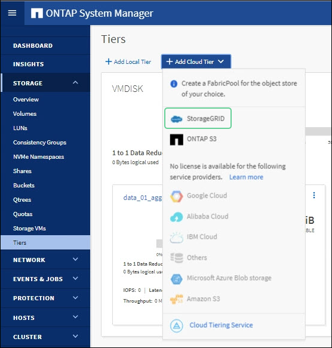
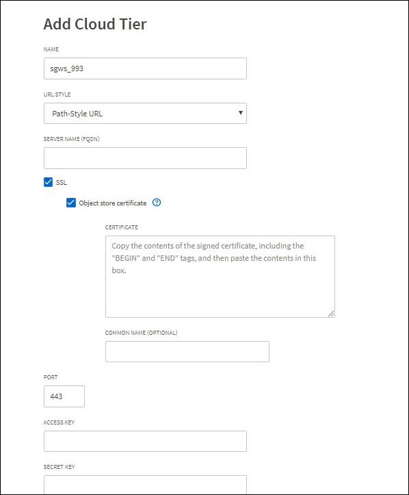

= Configure ONTAP System Manager
:icons: font
:imagesdir: ../media/

[.lead]
After you have obtained the required StorageGRID information, you can go to ONTAP to add StorageGRID as a cloud tier, attach the cloud tier to a local tier to create a FabricPool, and set volume tiering policies.

NOTE: These instructions describe how to use ONTAP System Manager to add StorageGRID as a cloud tier. You can complete the same configuration using the ONTAP CLI. For instructions, go to https://docs.netapp.com/us-en/ontap/fabricpool/index.html[ONTAP 9: FabricPool tier management with the CLI^].

== Access ONTAP System Manager

. Access System Manager for the ONTAP cluster you want to tier to StorageGRID.
. Sign in as an administrator for the cluster.
. Navigate to *STORAGE* > *Tiers* > *Add Cloud Tier*.

. Select *StorageGRID* from the list of object store providers.
+

== Enter StorageGRID values

Complete the Add Cloud Tier form, using the `ONTAP_FabricPool_settings___bucketname__.txt` file you downloaded from StorageGRID or the values you obtained manually.

The following table describes these fields in more detail. 

[cols="1a,2a" options="header"]
|===
| Field| Description

|Name
|Enter a unique name for this cloud tier. You can accept the default value.

|URL style
|If you  xref:../admin/configuring-s3-api-endpoint-domain-names.adoc[configured S3 API endpoint domain names], select *Virtual Hosted-Style URL*.
 
*Path-Style URL* is the default for ONTAP, but using virtual hosted-style requests is recommended for StorageGRID. You must use *Path-Style URL* if you provide an IP address instead of a domain name for the *Server name (FQDN)* field.

|Server name (FQDN)
|Enter the virtual IP (VIP) address for the StorageGRID HA group or the fully qualified domain name (FQDN) you are using for StorageGRID. For example, `s3.storagegrid.company.com`.

Note the following:

* The IP address or domain name that you specify here must match the certificate you uploaded or generated for the StorageGRID load balancer endpoint.
* If you provide a domain name, the DNS record must map to each IP address you will use to connect to StorageGRID. See xref:configure-dns-server.adoc[Configure the DNS server].

|SSL
|Enabled (default).

|Object store certificate
|Paste the certificate PEM you are using for the StorageGRID load balancer endpoint, including:
`-----BEGIN CERTIFICATE-----` and `-----END CERTIFICATE-----`.

*Note:* If an intermediate CA issued the StorageGRID certificate, you must provide the intermediate CA certificate. If the StorageGRID certificate was issued directly by the Root CA, you must provide the Root CA certificate.

|Port
|Enter the port used by the StorageGRID load balancer endpoint. ONTAP will use this port when it connects to StorageGRID. For example, 10433.

|Access key 
|Enter the access key ID for the StorageGRID tenant account.

*Important*: If you create a new access key ID and secret access key for the StorageGRID tenant in the future, you must update these entries in ONTAP immediately to ensure that ONTAP can store and retrieve data in StorageGRID without interruption.

|Secret key
|Enter the secret access key for the StorageGRID tenant account.

|Container name
|Enter the name of the StorageGRID bucket you will use with this ONTAP tier. For example, `fabricpool-bucket`. 

Note the following:

* The bucket name cannot be changed once the configuration is created.
* The bucket cannot have versioning enabled.

|===

== After you finish

After you have added StorageGRID as a cloud tier, you can complete the final FabricPool configuration in ONTAP, as follows:

. Attach one or more aggregates to the cloud tier.
. Optionally, create a volume tiering policy.

See https://docs.netapp.com/us-en/ontap/concept_cloud_overview.html[ONTAP 9: FabricPool tier management overview with System Manager^] for more information.

