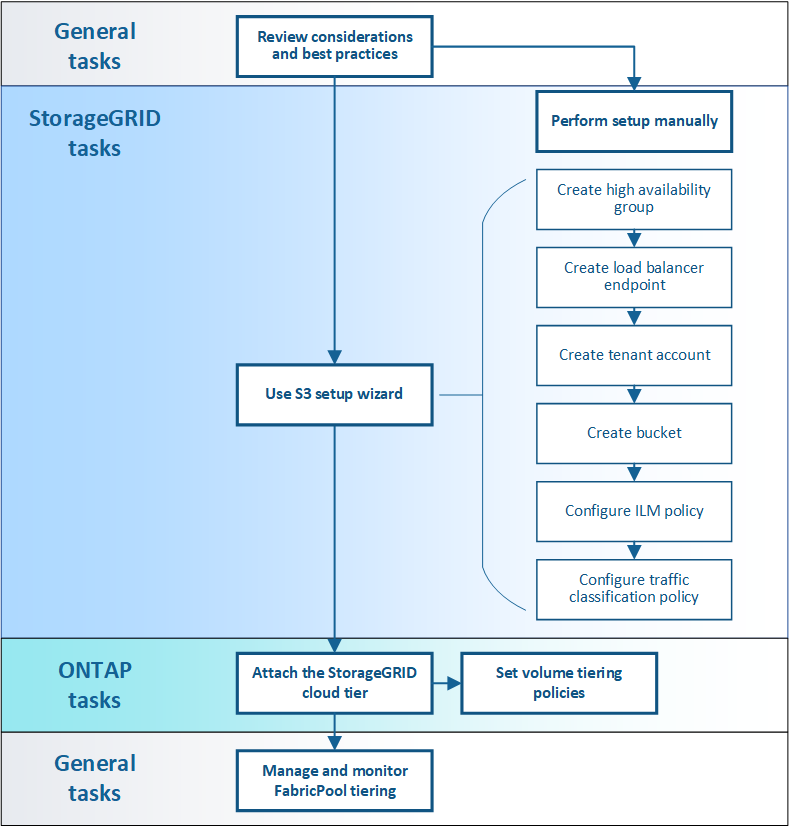

=  Configure StorageGRID for FabricPool: Overview
:icons: font
:imagesdir: ../media/

[.lead]
If you use NetApp ONTAP software, you can use NetApp FabricPool to tier inactive data to a NetApp StorageGRID object storage system.

== About these instructions

Use these instructions to:

* Learn the considerations and best practices for configuring StorageGRID for a FabricPool workload.
* Learn how to configure a StorageGRID object storage system for use with FabricPool.
* Learn how to provide the required values to ONTAP when attaching StorageGRID as a FabricPool cloud tier. 

== Configuration workflow

== Before you start
* Decide which FabricPool volume tiering policy you will use to tier inactive ONTAP data to StorageGRID.
* Plan and install a StorageGRID system to meet your storage capacity and performance needs.
* Become familiar with StorageGRID system software, including the Grid Manager and the Tenant Manager.
* Review these additional resources, which provide details about using and configuring ONTAP and FabricPool:

** https://www.netapp.com/pdf.html?item=/media/17239-tr4598pdf.pdf[TR-4598: FabricPool Best Practices in ONTAP^]
** https://docs.netapp.com/us-en/ontap/concept_cloud_overview.html[ONTAP 9: FabricPool tier management overview with System Manager^]

== What is FabricPool?

FabricPool is an ONTAP hybrid storage solution that uses a high-performance flash aggregate as the performance tier and an object store as the cloud tier. Using FabricPool-enabled aggregates helps you reduce storage cost without compromising performance, efficiency, or protection.

FabricPool works by associating a cloud tier (an external object store) with a local tier (storage aggregate) in ONTAP, creating a composite collection of discs: a _FabricPool_. Volumes inside the FabricPool can then take advantage of the tiering by keeping active (hot) data on high-performance storage (the local tier) and tiering inactivate (cold) data to the external object store (the cloud tier).

No architectural changes are required, and you can continue managing your data and application environment from the central ONTAP storage system.

== What is StorageGRID?

StorageGRID is a storage architecture that manages data as objects, as opposed to other storage architectures such as file or block storage. Objects are kept inside a single container (such as a bucket) and are not nested as files inside a directory inside other directories. Although object storage generally provides lower performance than file or block storage, it is significantly more scalable. StorageGRID buckets can hold petabytes of data and billions of objects.

== Why use StorageGRID as a FabricPool cloud tier?
FabricPool can tier ONTAP data to a number of object storage providers, including StorageGRID. Unlike public clouds that might set a maximum number of supported input/output operations per second (IOPS) at the bucket or container level, StorageGRID performance scales with the number of nodes in a system. Using StorageGRID as a FabricPool cloud tier allows you to keep your cold data in your own private cloud for highest performance and complete control over your data.

In addition, a FabricPool license is not required when you use StorageGRID as the cloud tier.

== How many StorageGRID tenants and buckets do I need?

These instructions describe how to connect StorageGRID as a single cloud tier to a single local tier using one StorageGRID bucket. However, you might want to connect the same StorageGRID system to multiple local tiers. Attaching a single cloud tier to multiple local tiers in a cluster is the general best practice. 

NetApp does not recommend attaching a single cloud tier to local tiers in multiple clusters.

Here are the requirements for attaching StorageGRID to multiple local tiers: 

* *If you use more than one local tier, you must use a different S3 bucket for each tier.* You can reuse the high availability (HA) group, load balancer endpoint, and tenant. Follow these general steps:

.. Complete the FabricPool setup wizard for the first cloud tier.
.. From ONTAP, add a cloud tier and use the file you downloaded from StorageGRID to provide the required values.  
.. From StorageGRID Tenant Manager, create a second bucket for the FabricPool tenant that was created by the wizard.
.. Complete the FabricPool wizard again. Select the existing HA group, load balancer endpoint, and tenant. Then, select the new bucket you created manually. Create a new ILM rule for the new bucket and activate an ILM policy to include that rule.
.. From ONTAP, add a second cloud tier but use the new bucket name.

* *Optionally, you can configure a separate tenant and S3 access keys for each cloud tier.* Using separate tenants and keys provides additional isolation between the tiers, but is somewhat more complex to configure and manage. Follow these general steps:

.. Complete the FabricPool setup wizard for the first cloud tier.
.. From ONTAP, add a cloud tier and use the file you downloaded from StorageGRID to provide the required values. 
.. Complete the FabricPool wizard again. Select the existing HA group and load balancer endpoint. Create a new tenant and bucket. Create a new ILM rule for the new bucket and activate an ILM policy to include that rule. 
.. From ONTAP, add a second cloud tier but use the new access key, secret key, and bucket name.

* *If you are using FabricPool with NetApp MetroCluster™, you must use a separate tenant, user, and S3 access keys for each ONTAP cluster.* See https://www.netapp.com/pdf.html?item=/media/17239-tr4598pdf.pdf[TR-4598: FabricPool Best Practices in ONTAP^] for the best practices for using StorageGRID with MetroCluster and FabricPool Mirror.

