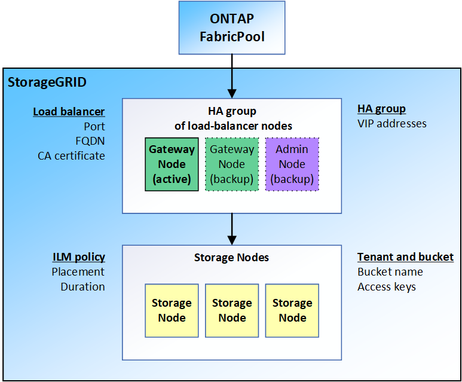

= Information needed to attach StorageGRID as a cloud tier
:icons: font
:imagesdir: ../media/

[.lead]
Before you can attach StorageGRID as a cloud tier for FabricPool, you must perform some configuration steps in StorageGRID and obtain certain values.

The following figure illustrates the items you must configure before you can use StorageGRID as a FabricPool cloud tier for your ONTAP data.

Depending on your requirements, you can do either of the following to obtain the information you need:

* Configure all items using the xref:use-s3-setup-wizard.adoc[StorageGRID S3 setup wizard] and upload the values to ONTAP System Manager as a single file.
* Configure each item manually in StorageGRID and manually enter the values into ONTAP System Manager. Start by xref:creating-ha-group-for-fabricpool.adoc[creating an HA group].

Use the S3 setup wizard unless you know you have special requirements that require significant customization.

The following table lists the information that ONTAP requires to use StorageGRID as a cloud tier for FabricPool. This table assumes you use ONTAP System Manager to configure the cloud tier (*Storage* > *Aggregates & Disks* > *Cloud Tier*) and not the ONTAP CLI.

[cols="1a,2a" options="header"]
|===
| ONTAP field| Description

|Object store name
|Any unique and descriptive name. For example, StorageGRID Cloud Tier.

|Provider type
|StorageGRID

|Port
|The port that FabricPool will use when it connects to StorageGRID. The port number here matches the port you specify for the StorageGRID load balancer endpoint. For example, 10433.

|Server name
|The fully qualified domain name (FQDN) for the StorageGRID load balancer endpoint. For example, s3.storagegrid.company.com.

Note the following:

* The domain name that you specify here must match the domain name on the CA certificate you upload for the StorageGRID load balancer endpoint.
* The DNS record for this domain name in ONTAP must map to each IP address you will use to connect to StorageGRID.

|Container name
|The name of the StorageGRID bucket you will use with this ONTAP cluster. For example, fabricpool-bucket. 

You can create this bucket in StorageGRID or, starting with ONTAP 9.10 System Manager, you can create the bucket with the FabricPool setup wizard.

Note the following:

* The bucket name cannot be changed once the configuration is created.
* The bucket cannot have versioning enabled.
* You must use a different bucket for each ONTAP cluster that will tier data to StorageGRID.

|Access key and secret password
|The access key and secret access key for the StorageGRID tenant account.

|SSL
|Must be enabled.

|Object store certificate
|The CA certificate you uploaded when you created the StorageGRID load balancer endpoint.

*Note:* If an intermediate CA issued the StorageGRID certificate, you must provide the intermediate CA certificate. If the StorageGRID certificate was issued directly by the Root CA, you must provide the Root CA certificate.

|===

