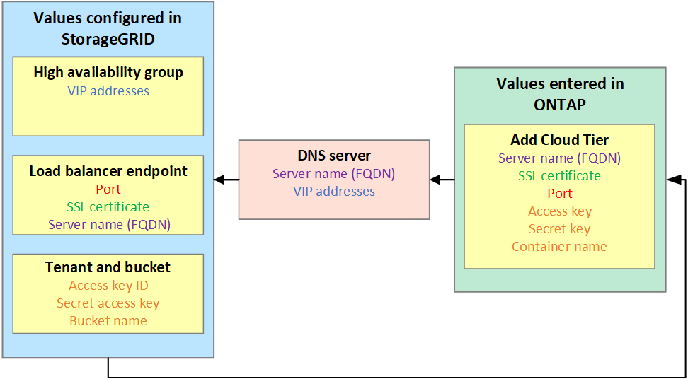

= Information needed to attach StorageGRID as a cloud tier
:icons: font
:imagesdir: ../media/

[.lead]
Before you can attach StorageGRID as a cloud tier for FabricPool, you must perform configuration steps in StorageGRID and obtain certain values for use in ONTAP.

== What values do I need?

The following figure shows the values you must configure in StorageGRID and how those values are used by ONTAP and the DNS server. 

== How do I get these values?
Depending on your requirements, you can do either of the following to obtain the information you need:

* Recommended. Use the link:use-fabricpool-setup-wizard.html[FabricPool setup wizard] to quickly configure all required values and to create a file that you can use in ONTAP System Manager. The wizard guides you through the required steps and helps to make sure your settings conform to StorageGRID and FabricPool best practices.

* Configure each item manually in StorageGRID and manually enter the values into ONTAP System Manager or the ONTAP CLI. 

Use the wizard unless you know you have special requirements or your implementation will require significant customization. 

=== How do I get these values?
Depending on your requirements, you can do either of the following to obtain the information you need:

* *Use the link:use-fabricpool-setup-wizard.html[FabricPool setup wizard]*. The FabricPool setup wizard helps you to quickly configure the required values in StorageGRID and outputs a file that you can use to configure ONTAP System Manager. The wizard guides you through the required steps and helps to make sure your settings conform to StorageGRID and FabricPool best practices.
+
NOTE: Use the FabricPool setup wizard unless you know you have special requirements or your implementation will require significant customization. 

* *Configure each item manually*. Then, enter the values into into ONTAP System Manager or the ONTAP CLI. Follow these steps:
+
. Configure the high availability group you want to use for FabricPool. See link:creating-ha-group-for-fabricpool.html[Create a high availability (HA) group for FabricPool].
. Create the load balancer endpoint that FabricPool will use. See link:creating-load-balancer-endpoint-for-fabricpool.html[Create a load balancer endpoint for FabricPool].
. Create the tenant account that the FabricPool will use. See link:creating-tenant-account-for-fabricpool.html[Create a tenant account for FabricPool].
. Sign in to the tenant account, and create the bucket and access keys for the root user. See link:creating-s3-bucket-and-access-key.html[Create an S3 bucket and obtain access keys].
. Create a new ILM rule for the FabricPool bucket, and add it to your active ILM policy. See link:using-storagegrid-ilm-with-fabricpool-data.html[Create ILM policy for FabricPool data].
. Optionally, create a traffic classification policy to monitor traffic related to the FabricPool bucket. See link:creating-traffic-classification-policy-for-fabricpool.html[Create a traffic classification policy for FabricPool].

