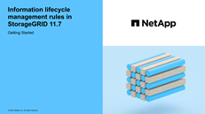

= Access the Create an ILM rule wizard
:icons: font
:imagesdir: ../media/

[.lead]
ILM rules allow you to manage the placement of object data over time. To create an ILM rule, you use the Create an ILM rule wizard.

NOTE: If you want to create the default ILM rule for a policy, follow the link:creating-default-ilm-rule.html[instructions for creating a default ILM rule] instead.

.What you'll need

* You are signed in to the Grid Manager using a link:../admin/web-browser-requirements.html[supported web browser].
* You have specific access permissions.
* If you want to specify which tenant accounts this rule applies to, you have the Tenant accounts permission or you know the account ID for each account.
* If you want the rule to filter objects on last access time metadata, Last access time updates must be enabled by bucket for S3 or by container for Swift.
* You have configured any Cloud Storage Pools you plan to use. See link:creating-cloud-storage-pool.html[Create Cloud Storage Pool].
* You are familiar with the link:data-protection-options-for-ingest.html[ingest options].
* If you need to create a compliant rule for use with S3 Object Lock, you are familiar with the link:requirements-for-s3-object-lock.html[requirements for S3 Object Lock].
* Optionally, you have watched the video: https://netapp.hosted.panopto.com/Panopto/Pages/Viewer.aspx?id=6baa2e69-95b7-4bcf-a0ff-afbd0092231c[Video: Information lifecycle management rules in StorageGRID 11.7^].
+

.About this task

When creating ILM rules:

* Consider the StorageGRID system's topology and storage configurations.
* Consider what types of object copies you want to make (replicated or erasure coded) and the number of copies of each object that are required.
* Determine what types of object metadata are used in the applications that connect to the StorageGRID system. ILM rules filter objects based on their metadata.
* Consider where you want object copies to be placed over time.
* Decide which ingest option to use (Balanced, Strict, or Dual commit).

.Steps

. Select *ILM* > *Rules*.
+
Based on the number of sites in the grid, the Make 2 Copies rule or the 1 Copy Per Site rule is shown in the list of rules.
+
NOTE: If the global S3 Object Lock setting has been enabled for the StorageGRID system, the summary table includes a *Compliant* column, and the details for the selected rule include a *Compliant* field.

. Select *Create*. link:create-ilm-rule-enter-details.html[Step 1 (Enter details)] of the Create an ILM rule wizard appears.