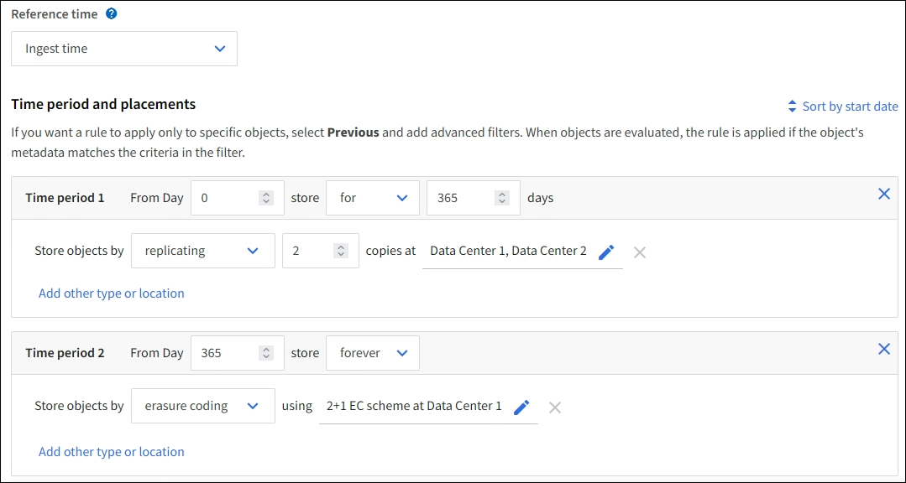
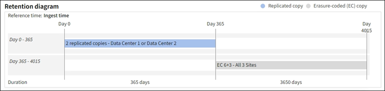

= Step 2 of 3: Define placements
:icons: font
:imagesdir: ../media/

[.lead]
The *Define placements* step of the Create ILM Rule wizard allows you to define the placement instructions that determine how long objects are stored, the type of copies (replicated or erasure coded), the storage location, and the number of copies.

.About this task

An ILM rule can include one or more placement instructions. Each placement instruction applies to a single period of time. When you use more than one instruction, the time periods must be contiguous, and at least one instruction must start on day 0. The instructions can continue either forever, or until you no longer require any object copies.

Each placement instruction can have multiple lines if you want to create different types of copies or use different locations during that time period.

In this example, the ILM rule stores one replicated copy in Site 1 and one replicated copy in Site 2 for the first year. After one year, a 2+1 erasure-coded copy is made and saved at only one site.

The Rule analysis section of the Retention diagram states:

* StorageGRID site-loss protection will not apply fom Day 365 - 4015.
+
NOTE: See xref:using-multiple-storage-pools-for-cross-site-replication.adoc[Enable site-loss protection.]
* Objects processed by this rule will be deleted after Day 4015.

.Steps

. For *Reference time*, select the type of time to use when calculating the start time for a placement instruction.
+
[cols="1a,2a" options="header"]
|===
| Option| Description

|Ingest time
|The time when the object was ingested.

|Last access time
|The time when the object was last retrieved (read or viewed).

*Note:* To use this option, updates to Last access time must be enabled for the S3 bucket or Swift container. See xref:using-last-access-time-in-ilm-rules.adoc[Use Last access time in ILM rules].

|User defined creation time
|A time specified in user-defined metadata.

|Noncurrent time
|"`Noncurrent time`" is automatically selected if you selected *Yes* for the question, "`Apply this rule to older object versions only (in S3 buckets with versioning enabled)?`" in xref:create-ilm-rule-enter-details.adoc[Step 1 of the Create an ILM rule wizard].
|===
+
NOTE: If you want to create a compliant rule, you must select *Ingest time*.
+
. In the *Time period and placements* section, enter a starting time and a duration for the first time period.
+
For example, you might want to specify where to store objects for the first year ("`day 0 for 365 days`"). At least one instruction must start at day 0.

. If you want to create replicated copies:
.. From the *Store objects by* drop-down list, select *replicating*.
.. Select the number of copies you want to make.
+
A warning appears if you change the number of copies to 1. An ILM rule that creates only one replicated copy for any time period puts data at risk of permanent loss. See xref:why-you-should-not-use-single-copy-replication.adoc[Why you should not use single-copy replication].
+
To avoid the risk, do one or more of the following:

* Increase the number of copies for the time period.
* Select more than one storage pool or Cloud Storage Pool.
* Select *erasure coded* instead of *replicating*.
+
You can safely ignore this warning if this rule already creates multiple copies for all time periods.

.. In the *copies at* field, select the storage pools you want to add.
+
*If you specify only one storage pool*, be aware that StorageGRID can store only one replicated copy of an object on any given Storage Node. If your grid includes three Storage Nodes and you select 4 as the number of copies, only three copies will be made&#8212;one copy for each Storage Node.
+
NOTE: The *ILM placement unachievable* alert is triggered to indicate that the ILM rule could not be completely applied.
+
*If you specify more than one storage pool*, keep these rules in mind:

  *** The number of copies cannot be greater than the number of storage pools.
  *** If the number of copies equals the number of storage pools, one copy of the object is stored in each storage pool.
  *** If the number of copies is less than the number of storage pools, the system distributes the copies to keep disk usage among the pools balanced, while ensuring that no site gets more than one copy of an object.
  *** If the storage pools overlap (contain the same Storage Nodes), all copies of the object might be saved at only one site. For this reason, do not specify the default All Storage Nodes storage pool and another storage pool.

. If you want to create an erasure-coded copy:
 .. From the *Store objects by* drop-down list, select *erasure coding*.
+
A warning appears if the rule does not have an advanced filter to ignore objects that are 200 KB or smaller.
+
IMPORTANT: Erasure coding is best suited for objects greater than 1 MB. Do not use erasure coding for objects smaller than 200 KB to avoid the overhead of managing very small erasure-coded fragments.
+
.. If the object size warning appeared, select *Previous* to return to Step 1. Then, select *Add an advanced filter* and set an *Object size* filter to any value greater than 0.2 MB.

.. Select the storage pool you want to add and the erasure-coding scheme you want to use.
+
The storage location for an erasure-coded copy includes the name of the storage pool, followed by the name of the erasure coding profile.

. Optionally:
.. Select *Add other type or location* to create additional copies at different locations.
.. Select *Add another time period* to add different time periods.
+
NOTE: Objects are automatically deleted at the end of the final time period unless the final time period ends with *forever*.

. If you want to store objects in a Cloud Storage Pool:
 .. In the *Store objects by* drop-down list, select *replicating*.
 .. Select the *copies at* field, then select a Cloud Storage Pool.
+
When using Cloud Storage Pools, keep these rules in mind:

  *** You cannot select more than one Cloud Storage Pool in a single placement instruction. Similarly, you cannot select a Cloud Storage Pool and a storage pool in the same placement instruction.

  *** You can store only one copy of an object in any given Cloud Storage Pool. An error message appears if you set *Copies* to 2 or more.

  *** You cannot store more than one object copy in any Cloud Storage Pool at the same time. An error message appears if multiple placements that use a Cloud Storage Pool have overlapping dates or if multiple lines in the same placement use a Cloud Storage Pool.

  *** You can store an object in a Cloud Storage Pool at the same time that object is being stored as replicated or erasure coded copies in StorageGRID. However, as this example shows, you must include more than one line in the placement instruction for the time period, so you can specify the number and types of copies for each location.

. In the Retention diagram, confirm your placement instructions.
+
Each line in the diagram shows where and when object copies will be placed. The color of a line represents the type of copy:
+
[cols="1a,4a"]
|===
|
|Replicated copy

|
|Erasure-coded copy

|
|Cloud Storage Pool copy
|===
+
In this example, two replicated copies will be saved to two storage pools (Data Center 1 and Data Center 2) for one year. Then, an erasure-coded copy will be saved for an additional 10 years, using a 6+3 erasure-coding scheme at three sites. After 11 years, the objects will be deleted from StorageGRID.

//In this example, the ILM rule stores one replicated copy in Site 1 and one replicated copy in Site 2 for the first year. After one year, a 2+1 erasure-coded copy will be saved at only one site.

. Select *Continue*. xref:create-ilm-rule-select-ingest-behavior.adoc[Step 3 (Select ingest behavior)] of the Create an ILM rule wizard appears.