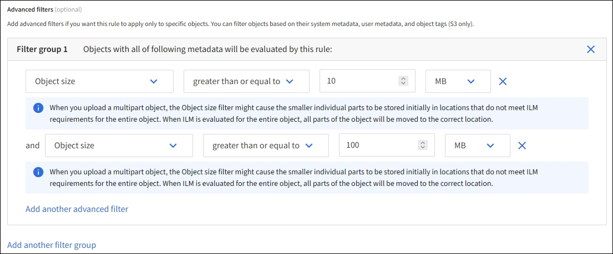
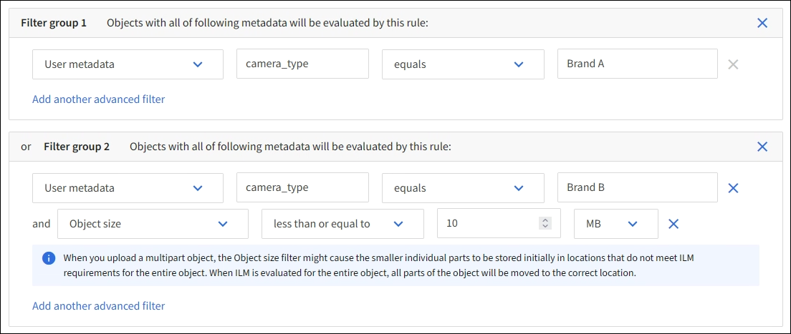

= Step 1 of 3: Enter details
:icons: font
:imagesdir: ../media/

[.lead]
The *Enter details* step of the Create an ILM rule wizard allows you to enter a name and description for the rule and to define filters for the rule.

Entering a description and defining filters for the rule are optional.

.About this task

When evaluating an object against an xref:what-ilm-rule-is.adoc[ILM rule], StorageGRID compares the object metadata to the rule's filters. If the object metadata matches all filters, StorageGRID uses the rule to place the object. You can design a rule to apply to all objects, or you can specify basic filters, such as one or more tenant accounts or bucket names, or advanced filters, such as the object's size or user metadata.

.Steps

. Enter a unique name for the rule in the *Name* field.
+
You must enter at least 1 and no more than 64 characters.

. Optionally, enter a short description for the rule in the *Description* field.
+
You should describe the rule's purpose or function so you can recognize the rule later.

. Optionally, select one or more S3 or Swift tenant accounts to which this rule applies. If this rule applies to all tenants, leave this field blank.
+
If you do not have either the Root access permission or the Tenant accounts permission, you cannot select tenants from the list. Instead, enter the tenant ID or enter multiple IDs as a comma-delimited string.

. Optionally, specify the S3 buckets or Swift containers to which this rule applies.
+
If *matches all* is selected (default), the rule applies to all S3 buckets or Swift containers.

. For S3 tenants, optionally select *Yes* to apply the rule only to older object versions in S3 buckets that have versioning enabled.

NOTE: Noncurrent Time applies only to S3 objects in versioning-enabled buckets. See xref:../s3/operations-on-buckets.adoc[Operations on buckets, PUT Bucket versioning] and xref:managing-objects-with-s3-object-lock.adoc[Manage objects with S3 Object Lock].

You can use this option to reduce the storage impact of versioned objects by filtering for noncurrent object versions. See xref:example-4-ilm-rules-and-policy-for-s3-versioned-objects.adoc[Example 4: ILM rules and policy for S3 versioned objects].

. Optionally, select *Add an advanced filter* to specify additional filters.
+
If you do not configure advanced filtering, the rule applies to all objects that match the basic filters. For more information about advanced filtering, see <<Use advanced filters in ILM rules>> and <<Specify multiple metadata types and values>>.

. Select *Continue*. xref:create-ilm-rule-define-placements.adoc[Step 2 (Define placements)] of the Create an ILM rule wizard appears.

== Use advanced filters in ILM rules

Advanced filtering allows you to create ILM rules that apply only to specific objects based on their metadata. When you set up advanced filtering for a rule, you select the type of metadata you want to match, select an operator, and specify a metadata value. When objects are evaluated, the ILM rule is applied only to those objects that have metadata matching the advanced filter.

The table shows the types of metadata you can specify in advanced filters, the operators you can use for each type of metadata, and the metadata values expected.

[cols="1a,1a,2a" options="header"]
|===
| Metadata type| Supported operators| Metadata value

|Ingest time (microseconds)
|
* equals
* does not equal
* less than
* less than or equal to
* greater than
* greater than or equal to

|Time and date the object was ingested.

*Note:* To avoid resource issues when activating an new ILM policy, you can use the Ingest time advanced filter in any rule that might change the location of large numbers of existing objects. Set Ingest time to be greater than or equal to the approximate time when the new policy will go into effect to ensure that existing objects are not moved unnecessarily.

|Key

|
* equals
* does not equal
* contains
* does not contain
* starts with
* does not start with
* ends with
* does not end with
|All or part of a unique S3 or Swift object key.

For example, you might want to match objects that end with `.txt` or start with `test-object/`.

|Last access time (microseconds)
|
* equals
* does not equal
* less than
* less than or equal to
* greater than
* greater than or equal to
* exists
* does not exist
|Time and date the object was last retrieved (read or viewed).

*Note:* If you plan to xref:using-last-access-time-in-ilm-rules.adoc[use last access time] as an advanced filter, Last access time updates must be enabled for the S3 bucket or Swift container.

|Location Constraint (S3 only)
|
* equals
* does not equal
|The region where an S3 bucket was created. Use *ILM* > *Regions* to define the regions that are shown.

*Note:* A value of us-east-1 will match objects in buckets created in the us-east-1 region as well as objects in buckets that have no region specified. See xref:configuring-regions-optional-and-s3-only.adoc[Configure regions (optional and S3 only)].

|Object Size
|
* equals
* does not equal
* less than
* less than or equal to
* greater than
* greater than or equal to
|The object's size.

Erasure coding is best suited for objects greater than 1 MB. Do not use erasure coding for objects smaller than 200 KB to avoid the overhead of managing very small erasure-coded fragments.

*Note:* To filter on object sizes smaller than 1 MB, type in a decimal value.  Your browser type and locale settings control whether you need to use a period or a comma as the decimal separator.

|User Metadata
|
* contains
* ends with
* equals
* exists
* does not contain
* does not end with
* does not equal
* does not exist
* does not start with
* starts with
|Key-value pair, where *User Metadata Name* is the key and *User Metadata Value* is the value.

For example, to filter on objects that have user metadata of `color=blue`, specify `color` for *User Metadata Name*, `equals` for the operator, and `blue` for *User Metadata Value*.

*Note:* User-metadata names are not case sensitive; user-metadata values are case sensitive.

|Object Tag (S3 only)
|
* contains
* ends with
* equals
* exists
* does not contain
* does not end with
* does not equal
* does not exist
* does not start with
* starts with
|Key-value pair, where *Object Tag Name* is the key and *Object Tag Value* is the value.

For example, to filter on objects that have an object tag of `Image=True`, specify `Image` for *Object Tag Name*, `equals` for the operator, and `True` for *Object Tag Value*.

*Note:* Object tag names and object tag values are case sensitive. You must enter these items exactly as they were defined for the object.

|===

== Specify multiple metadata types and values

When you define advanced filtering, you can specify multiple types of metadata and multiple metadata values. For example, if you want a rule to match objects between 10 MB and 100 MB in size, you would select the *Object Size* metadata type and specify two metadata values.

* The first metadata value specifies objects greater than or equal to 10 MB.
* The second metadata value specifies objects less than or equal to 100 MB.

Using multiple entries allows you to have precise control over which objects are matched. In the following example, the rule applies to objects that have a Brand A or Brand B as the value of the camera_type user metadata. However, the rule only applies to those Brand B objects that are smaller than 10 MB.

