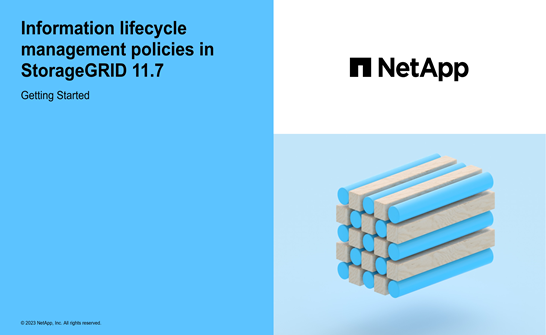

= Create a proposed ILM policy
:icons: font
:imagesdir: ../media/

[.lead]
You can create a proposed ILM policy from scratch, or you can clone the current active policy if you want to start with the same set of rules.

Before creating your own policy, verify that the link:creating-ilm-policy.html#default-ilm-policy[default ILM policy] does not meet your storage requirements.

NOTE: If the link:enabling-s3-object-lock-globally.html[global S3 Object Lock setting has been enabled], you must ensure that the ILM policy is compliant with the requirements of buckets that have S3 Object Lock enabled. In this section, follow the instructions that mention having S3 Object Lock enabled.

.What you'll need

* You are signed in to the Grid Manager using a link:../admin/web-browser-requirements.html[supported web browser].
* You have the link:../admin/admin-group-permissions.html[required access permissions].
* You have link:access-create-ilm-rule-wizard.html[created ILM rules] based on whether S3 Object Lock is enabled.

//tabbed blocks start here

[role="tabbed-block"]
====

.S3 Object Lock not enabled
--
 ** You have link:what-ilm-rule-is.html[created the ILM rules] you want to add to the proposed policy. As required, you can save a proposed policy, create additional rules, and then edit the proposed policy to add the new rules.
 ** You have link:creating-default-ilm-rule.html[created a default ILM rule] that does not contain any filters.

//end No S3 Obj Lock, begin Yes S3 Obj Lock
--
.S3 Object Lock enabled
--
 ** The link:enabling-s3-object-lock-globally.html[global S3 Object Lock setting is already enabled] for the StorageGRID system.

 ** You have link:what-ilm-rule-is.html[created the compliant and non-compliant ILM rules] you want to add to the proposed policy. As required, you can save a proposed policy, create additional rules, and then edit the proposed policy to add the new rules.

 ** You have link:creating-default-ilm-rule.html[created a default ILM rule] for the policy that is compliant.

--

====
//end tabbed block

* Optionally, you have watched the video: https://netapp.hosted.panopto.com/Panopto/Pages/Viewer.aspx?id=0009ebe1-3665-4cdc-a101-afbd009a0466[Video: Information lifecycle management policies in StorageGRID 11.7^]
+

See also link:creating-ilm-policy.html[Create an ILM policy: Overview].

.About this task

Typical reasons for creating a proposed ILM policy include:

* You added a new site and need to use new ILM rules to place objects at that site.
* You are decommissioning a site and you need to remove all ILM rules that refer to the site.
* You added a new tenant that has special data protection requirements.
* You started to use a Cloud Storage Pool.

IMPORTANT: Only use the system-provided policy, Baseline 2 copies policy, in test systems. For StorageGRID 11.6 and earlier, the default rule in this policy uses the All Storage Nodes storage pool, which contains all sites. If your StorageGRID system has more than one site, two copies of an object might be placed on the same site.

.Steps
. Select *ILM* > *Policies*.
+
If the global S3 Object Lock setting is enabled, the ILM policies page indicates which ILM rules are compliant.

. Determine how you want to create the proposed ILM policy. +
//tabbed block starts here

[role="tabbed-block"]
====

.Start from scratch
--

.. If a proposed ILM policy currently exists, select *Proposed policy* > *Actions* > *Remove*.
+
You can't create a new proposed policy if a proposed policy already exists.

.. Select *Create proposed policy* > *Create new policy*.

--
//end no rules selected, begin Based on active policy

.Start with rules from active policy
--

.. If a proposed ILM policy currently exists, select *Proposed policy* > *Actions* > *Remove*.
+
You can't clone the active policy if a proposed policy already exists.

.. Select *Create proposed policy* > *Clone active policy*.

--
//end Based on active, begin Edit existing

.Edit existing proposed policy

 .. Select *Proposed policy* > *Actions* > *Edit*.

====
//end tabbed blocks

[start=3]
. In the *Proposed policy name* field, enter a unique name for the proposed policy.

. In the *Reason for change* field, enter the reason you are creating a new proposed policy.

. To add rules to the policy, select *Select rules*. Select a rule name to view the settings for that rule.
+
NOTE: Periodically, the list of rules is automatically updated to reflect additions or removals. If a rule is removed after you select it, an error message appears.
+
If you are cloning a policy:

** The rules used by the policy you are cloning are selected.
** If the policy you are cloning used any rules with no filters that were not the default rule, you are prompted to remove all but one of those rules.
** If the default rule used a filter, you are prompted to select a new default rule.
** If the default rule was not the last rule, you can move the rule to the end of the new policy.

//tabbed block for Add rules
[role="tabbed-block"]
====

.S3 Object Lock not enabled
--

.. Select one default rule for the proposed policy. To create a new default rule, select *ILM rules page* image:../media/icon_nms_more_details.gif[more details icon].
+
The default rule applies to any objects that don't match another rule in the policy. The default rule can't use any filters and is always evaluated last.
+
IMPORTANT: Don't use the Make 2 Copies rule as the default rule for a policy. The Make 2 Copies rule uses a single storage pool, All Storage Nodes, which contains all sites. If your StorageGRID system has more than one site, two copies of an object might be placed on the same site.

--
.S3 Object Lock enabled
--
.. Select one default rule for the proposed policy. To create a new default rule, select *ILM rules page* image:../media/icon_nms_more_details.gif[more details icon].
+
The list of rules contains only the rules that are compliant and don't use any filters.
+
IMPORTANT: Don't use the Make 2 Copies rule as the default rule for a policy. The Make 2 Copies rule uses a single storage pool, All Storage Nodes, which contains all sites. If you use this rule, multiple copies of an object might be placed on the same site.

.. If you need a different "`default`" rule for objects in non-compliant S3 buckets, select *Include a rule without filters for non-compliant S3 buckets*, and select one non-compliant rule that does not use a filter.
+
For example, you might want to use a Cloud Storage Pool to store objects in buckets that don't have S3 Object Lock enabled.
+
NOTE: You can only select one non-compliant rule that does not use a filter.

See also link:example-7-compliant-ilm-policy-for-s3-object-lock.html[Example 7: Compliant ILM policy for S3 Object Lock].
--
====

//end tabbed blocks

[start=6]
. When you are done selecting the default rule, select *Continue*.

. For the Other rules step, select any other rules you want to add to the policy. These rules use at least one filter (tenant account, bucket name, advanced filter, or the Noncurrent reference time). Then select *Select*.
+
The Create a proposed policy window now lists the rules you selected. The default rule is at the end, with the other rules above it.
+
If S3 Object Lock is enabled and you also selected a non-compliant "`default`" rule, that rule is added as the second-to-last rule in the policy.
+
NOTE: A warning appears if any rule does not retain objects forever. When you activate this policy, you must confirm that you want StorageGRID to delete objects when the placement instructions for the default rule elapse (unless a bucket lifecycle keeps the objects for a longer time period).

. Drag the rows for the non-default rules to determine the order in which these rules will be evaluated.
+
You can't move the default rule. If S3 Object Lock is enabled, you also can't move the non-compliant "`default`" rule if one was selected.
+
IMPORTANT: You must confirm that the ILM rules are in the correct order. When the policy is activated, new and existing objects are evaluated by the rules in the order listed, starting at the top.

. As required, select *Select rules* to add or remove rules.

. When you are done, select *Save*.

. Go to link:simulating-ilm-policy.html[Simulate an ILM policy]. You should always simulate a proposed policy before activating it to ensure it works as expected.