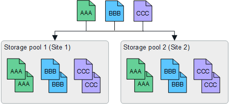
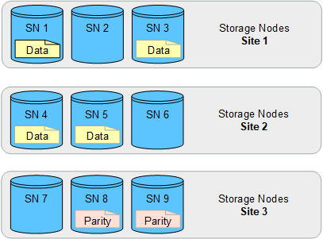
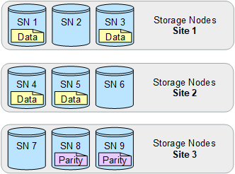

= Enable site-loss protection
:icons: font
:imagesdir: ../media/

[.lead]
If your StorageGRID deployment includes more than one site, you can use replication and erasure coding with appropriately configured storage pools to enable site-loss protection.

Replication and erasure coding require different storage pool configurations:

* To use replication for site-loss protection, use the site-specific storage pools that are automatically created during StorageGRID installation. Then create ILM rules with link:create-ilm-rule-define-placements.html[placement instructions] that specify multiple storage pools so that one copy of each object will be placed at each site.

* To use erasure coding for site-loss protection, link:guidelines-for-creating-storage-pools.html#guidelines-for-storage-pools-used-for-erasure-coded-copies[create storage pools that consist of multiple sites]. Then create ILM rules that use one storage pool consisting of multiple sites and any available erasure-coding schema.

//The following example illustrates what can happen if an ILM rule places replicated object copies to a single storage pool containing Storage Nodes from two sites. Because the system uses any available nodes in the storage pool when it places the replicated copies, it might place all copies of some objects within only one of the sites. In this example, the system stored two copies of object AAA on Storage Nodes at Site 1, and two copies of object CCC on Storage Nodes at Site 2. Only object BBB is protected if one of the sites fails or becomes inaccessible.

//image::../media/ilm_replication_make_2_copies_1_pool_2_sites.png[Make 2 Copies rule at two sites but only one storage pool]

== Replication example

By default, one storage pool is created for each site during StorageGRID installation. Having storage pools that consist of only one site enables you to configure ILM rules that use replication for site-loss protection. In this example:

* Storage pool 1 contains Site 1
* Storage pool 2 contains Site 2
* The ILM rule contains two placements:
** Store objects by replicating 1 copy at Site 1
** Store objects by replicating 1 copy at Site 2

ILM rule placements:

If one site is lost, copies of the objects are available at the other site.

== Erasure coding example

Having storage pools that consist of more than one site per storage pool enables you to configure ILM rules that use erasure coding for site-loss protection. In this example:

* Storage pool 1 contains Sites 1 through 3
* The ILM rule contains one placement: Store objects by erasure coding using a 4+2 EC scheme at Storage pool 1, which contains three sites

ILM rule placements:

In this example:

* The ILM rule uses a 4+2 erasure-coding scheme.
* Each object is sliced into four equal data fragments, and two parity fragments are computed from the object data.
* Each of the six fragments is stored on a different node across three data center sites to provide data protection for node failures or site loss.

NOTE: Erasure coding is allowed in storage pools containing any number of sites _except_ two sites.

ILM rule using 4+2 erasure-coding scheme:

If one site is lost, data can still be recovered:

