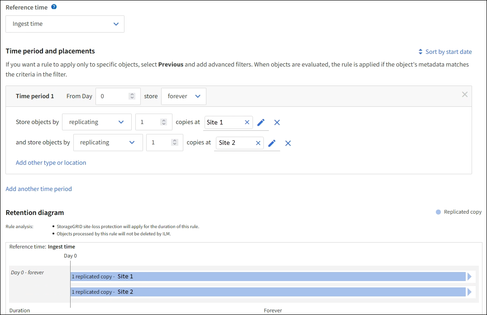

= Example 1: ILM rules and policy for object storage
:icons: font
:imagesdir: ../media/

[.lead]
You can use the following example rules and policy as a starting point when defining an ILM policy to meet your object protection and retention requirements.

CAUTION: The following ILM rules and policy are only examples. There are many ways to configure ILM rules. Before activating a new policy, simulate the proposed policy to confirm it will work as intended to protect content from loss.

== ILM rule 1 for example 1: Copy object data to two sites

This example ILM rule copies object data to storage pools in two sites.

[cols="1a,2a" options="header"]
|===
| Rule definition| Example value
a|
Storage Pools
a|
Two storage pools, each at different sites, named Storage Pool Site 1 and Storage Pool Site 2.
a|
Rule name
a|
Two Copies Two Sites
a|
Reference time
a|
Ingest time
a|
Content Placement
a|
On Day 0, keep two replicated copies forever--one in Storage Pool Site 1 and one in Storage Pool Site 2.
|===

== ILM rule 2 for example 1: erasure coding profile with bucket matching

This example ILM rule uses an erasure coding profile and an S3 bucket to determine where and how long the object is stored.

[cols="1a,2a" options="header"]
|===
| Rule definition| Example value
a|
Erasure Coding Profile
a|

* One storage pool across three sites (All 3 sites)
* Use 6+3 erasure-coding scheme

a|
Rule name
a|
EC for S3 bucket finance-records
a|
Reference time
a|
Ingest time
a|
Content Placement
a|
For objects in the S3 bucket named finance-records, create one erasure-coded copy in the pool specified by the erasure coding profile. Keep this copy forever.
|===
image:../media/ilm_rule_ec_for_s3_bucket_finance_records.png[ILM rule 2 for example 1: erasure coding profile with bucket matching]

== ILM policy for example 1

The StorageGRID system allows you to design sophisticated and complex ILM policies; however, in practice, most ILM policies are simple.

A typical ILM policy for a multi-site topology might include ILM rules such as the following:

* At ingest, use 6+3 erasure coding to store all objects belonging to the S3 bucket named `finance-records` across three sites.
* If an object does not match the first ILM rule, use the policy's default ILM rule, Two Copies Two Sites, to store a copy of that object in two sites, Site 1 and Site 2.
+
image::../media/policy_1_configured_policy.png[ILM policy for example 1]
