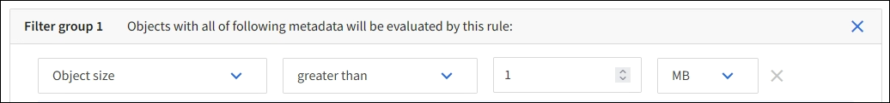

= Example 2: ILM rules and policy for EC object size filtering
:icons: font
:imagesdir: ../media/

[.lead]
You can use the following example rules and policy as starting points to define an ILM policy that filters by object size to meet recommended EC requirements.

CAUTION: The following ILM rules and policy are only examples. There are many ways to configure ILM rules. Before activating a new policy, simulate the proposed policy to confirm it will work as intended to protect content from loss.

== ILM rule 1 for example 2: Use EC for objects greater than 1 MB 

This example ILM rule erasure codes objects that are greater than 1 MB.

IMPORTANT: Erasure coding is best suited for objects greater than 1 MB. Do not use erasure coding for objects smaller than 200 KB to avoid the overhead of managing very small erasure-coded fragments.

[cols="2a,2a" options="header"]
|===
| Rule definition| Example value

|Rule name
|EC Only Objects > 1 MB

|Reference time
|Ingest time

|Advanced filter for Object size
|Object size greater than 1 MB

|Placements
|Create a 2+1 erasure-coded copy using three sites
|===

== ILM rule 2 for example 2: Two replicated copies

This example ILM rule creates two replicated copies and does not filter by object size. This rule is the default rule for the policy. Because the first rule filters out all objects greater than 1 MB, this rule only applies to objects that are 1 MB or smaller.

[cols="1a,2a" options="header"]
|===
| Rule definition| Example value

|Rule name
|Two Replicated Copies

|Reference time
|Ingest time

|Advanced filter for Object size
|None

|Placements
|On Day 0 to forever, keep one replicated copy at Site 1 and one replicated copy at Site 2.
|===

== ILM policy for example 2: Use EC for objects greater than 1 MB

This example ILM policy includes two ILM rules:

* The first rule erasure codes all objects that are greater than 1 MB.
* The second (default) ILM rule creates two replicated copies. Because objects greater than 1 MB have been filtered out by rule 1, rule 2 only applies to objects that are 1 MB or smaller.
+
//image::../media/policy_2_configured_policy.png[ILM policy for example 2: Use EC for objects greater than 1 MB]
