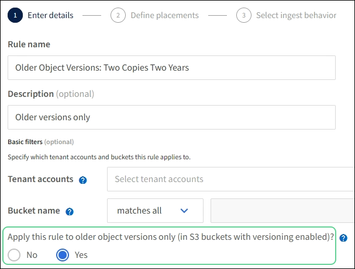

= Example 4: ILM rules and policy for S3 versioned objects
:icons: font
:imagesdir: ../media/

[.lead]
If you have an S3 bucket with versioning enabled, you can manage the noncurrent object versions by including rules in your ILM policy that use "`Noncurrent time`" as the reference time.

CAUTION: If you specify a limited retention time for objects, those objects will be deleted permanently after the time period is reached. Make sure you understand how long the objects will be retained.

As this example shows, you can control the amount of storage used by versioned objects by using different placement instructions for noncurrent object versions.

CAUTION: The following ILM rules and policy are only examples. There are many ways to configure ILM rules. Before activating a new policy, simulate the proposed policy to confirm it will work as intended to protect content from loss.

NOTE: To perform ILM policy simulation on a noncurrent version of an object, you must know the object version's UUID or CBID. To find the UUID and CBID, use link:verifying-ilm-policy-with-object-metadata-lookup.html[object metadata lookup] while the object is still current.

.Related information

* link:how-objects-are-deleted.html[How objects are deleted]

== ILM rule 1 for example 4: Save three copies for 10 years

This example ILM rule stores a copy of each object at three sites for 10 years.

This rule applies to all objects, whether or not they are versioned.

[cols="1a,2a" options="header"]
|===
| Rule definition| Example value

| Storage pools
| Three storage pools, each consisting of different data centers, named Site 1, Site 2, and Site 3.

| Rule name
| Three Copies Ten Years

| Reference time
| Ingest time

| Placements
| On Day 0, keep three replicated copies for 10 years (3,652 days), one in Site 1, one in Site 2, and one in Site 3. At the end of 10 years, delete all copies of the object.
|===

== ILM rule 2 for example 4: Save two copies of noncurrent versions for 2 years

This example ILM rule stores two copies of the noncurrent versions of an S3 versioned object for 2 years.

Because ILM rule 1 applies to all versions of the object, you must create another rule to filter out any noncurrent versions.

To create a rule that uses "`Noncurrent time`" as the reference time, select *Yes* for the question, "`Apply this rule to older object versions only (in S3 buckets with versioning enabled)?`" in Step 1 (Enter details) of the Create an ILM rule wizard. When you select *Yes*, _Noncurrent time_ is automatically selected for the reference time, and you cannot select a different reference time.

In this example, only two copies of the noncurrent versions are stored, and those copies will be stored for two years.

[cols="1a,2a" options="header"]
|===
| Rule definition| Example value

| Storage Pools
| Two storage pools, each at different data centers, Site 1 and Site 2.

| Rule name
| Noncurrent Versions: Two Copies Two Years

| Reference time
| Noncurrent time

Automatically selected when you select *Yes* for the question, "`Apply this rule to older object versions only (in S3 buckets with versioning enabled)?`" in the Create an ILM rule wizard.

| Placements
| On Day 0 relative to noncurrent time (that is, starting from the day the object version becomes the noncurrent version), keep two replicated copies of the noncurrent object versions for 2 years (730 days), one in Site 1 and one in Site 2. At the end of 2 years, delete the noncurrent versions.
|===

== ILM policy for example 4: S3 versioned objects

If you want to manage older versions of an object differently than the current version, rules that use "`Noncurrent time`" as the reference time must appear in the ILM policy before rules that apply to the current object version.

An ILM policy for S3 versioned objects might include ILM rules such as the following:

* Keep any older (noncurrent) versions of each object for 2 years, starting from the day the version became noncurrent.
+
NOTE: The "`Noncurrent time`" rules must appear in the policy before the rules that apply to the current object version. Otherwise, the noncurrent object versions will never be matched by the "`Noncurrent time`" rule.

* At ingest, create three replicated copies and store one copy at each of three sites. Keep copies of the current object version for 10 years.

When you simulate the example policy, you would expect test objects to be evaluated as follows:

* Any noncurrent object versions would be matched by the first rule. If a noncurrent object version is older than 2 years, it is permanently deleted by ILM (all copies of the noncurrent version removed from the grid).
+
NOTE: To simulate noncurrent object versions, you must use that version's UUID or CBID. While the object is still current, you can use link:verifying-ilm-policy-with-object-metadata-lookup.html[object metadata lookup] to find its UUID and CBID.

* The current object version would be matched by the second rule. When the current object version has been stored for 10 years, the ILM process adds a delete marker as the current version of the object, and it makes the previous object version "`noncurrent`". The next time ILM evaluation occurs, this noncurrent version is matched by the first rule. As a result, the copy at Site 3 is purged and the two copies at Site 1 and Site 2 are stored for 2 more years.
