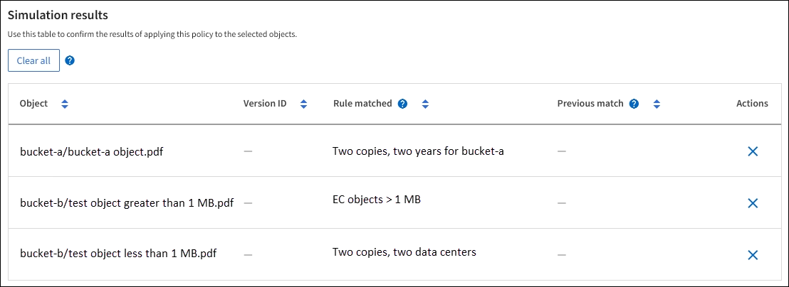

= Simulate an ILM policy
:icons: font
:imagesdir: ../media/

[.lead]
Simulate a proposed policy on test objects before activating the policy and applying it to your production data. The simulation window provides a standalone environment that is safe for testing policies before they are activated and applied to data in the production environment.

.What you'll need

* You are signed in to the Grid Manager using a link:../admin/web-browser-requirements.html[supported web browser].
* You have the link:../admin/admin-group-permissions.html[required access permissions].
* You know the S3 bucket/object-key or the Swift container/object-name for each object you want to test.

.About this task

Carefully select the objects you want the proposed policy to test. To simulate a policy thoroughly, you should test at least one object for each filter in each rule.

For example, if a policy includes one rule to match objects in bucket A and another rule to match objects in bucket B, you must select at least one object from bucket A and one object from bucket B to test the policy thoroughly. You must also select at least one object from another bucket to test the default rule.

When simulating a policy, the following considerations apply:

* After you make changes to a policy, save the proposed policy. Then, simulate the behavior of the saved proposed policy.
* When you simulate a policy, the ILM rules in the policy filter the test objects, so you can see which rule was applied to each object. However, no object copies are made and no objects are placed. Running a simulation does not modify your data, rules, or the policy in any way.
* The Simulate proposed policy window retains the objects you tested until you select either *Clear all* or the remove icon image:../media/icon-x-to-remove.png[Remove icon] for each object in the Simulation results list.
* Simulation returns the name of the matched rule. To determine which storage pool or erasure coding profile is in effect, select the name of the rule to go to the rule details page, where you can view the retention diagram and other details about the rule.
* If S3 versioning is enabled, you can enter the version ID for the version of the object you want to use for the simulation.

.Steps

. link:creating-proposed-ilm-policy.html[Create a proposed policy].

. Using an S3 or Swift client or the link:../tenant/use-s3-console.html[experimental S3 Console], which is available in Tenant Manager for each tenant, ingest the objects required to test each rule.
. On the ILM policy page, Proposed policy tab, select *Simulate*.
. In the *Object* field, enter the S3 `bucket/object-key` or the Swift `container/object-name` for a test object. For example, `bucket-01/filename.png`.
. Optionally, enter a version ID for the object in the *Version ID* field.
. Select *Simulate*.
. In the Simulation results section, confirm that each object was matched by the correct rule.

== Example 1: Verify rules when simulating a proposed ILM policy

This example describes how to verify rules when simulating a proposed policy.

In this example, the *Example ILM policy* is being simulated against the ingested objects in two buckets. The policy includes three rules, as follows:

* The first rule, *Two copies, two years for bucket-a*, applies only to objects in bucket-a.
* The second rule, *EC objects > 1 MB*, applies to all buckets but filters on objects greater than 1 MB.
* The third rule, *Two copies, two data centers*, is the default rule. It does not include any filters and does not use the Noncurrent reference time.

After simulating the policy, confirm that each object was matched by the correct rule.

In this example:

* `bucket-a/bucket-a object.pdf` correctly matched the first rule, which filters on objects in `bucket-a`.
* `bucket-b/test object greater than 1 MB.pdf` is in `bucket-b`, so it did not match the first rule. Instead, it was correctly matched by the second rule, which filters on objects greater than 1 MB.
* `bucket-b/test object less than 1 MB.pdf` did not match the filters in the first two rules, so it will be placed by the default rule, which includes no filters.

== Example 2: Reorder rules when simulating a proposed ILM policy

This example shows how you can reorder rules to change the results when simulating a policy.

In this example, the *Demo* policy is being simulated. This policy, which is intended to find objects that have series=x-men user metadata, includes three rules, as follows:

* The first rule, *PNGs*, filters for key names that end in `.png`.
* The second rule, *X-men*, applies only to objects for Tenant A and filters for `series=x-men` user metadata.
* The last rule, *Two copies two data centers*, is the default rule, which matches any objects that don't match the first two rules.

.Steps
. After adding the rules and saving the policy, select *Simulate*.
. In the *Object* field, enter the S3 bucket/object-key or the Swift container/object-name for a test object, and select *Simulate*.
+
The Simulation results appear, showing that the `Havok.png` object was matched by the *PNGs* rule.
+
image::../media/simulate_reorder_rules_pngs_result.png[Example 2: Reordering rules when simulating a proposed ILM policy]
+
However, `Havok.png` was meant to test the *X-men* rule.

. To resolve the issue, reorder the rules.
 .. Select *Finish* to close the Simulate ILM Policy window.
 .. Select *Actions* > *Edit* to edit the policy.
 .. Drag the *X-men* rule to the top of the list.
 .. Select *Save*.
. Select *Simulate*.
+
The objects you previously tested are re-evaluated against the updated policy, and the new simulation results are shown. In the example, the Rule matched column shows that the `Havok.png` object now matches the X-men metadata rule, as expected. The Previous match column shows that the PNGs rule matched the object in the previous simulation.
+
image::../media/simulate_reorder_rules_correct_result.png[Example 2: Reordering rules when simulating a proposed ILM policy]
+
NOTE: If you stay on the Proposed policy tab, you can re-simulate a policy after making changes without needing to re-enter the names of the test objects.

== Example 3: Correct a rule when simulating a proposed ILM policy

This example shows how to simulate a policy, correct a rule in the policy, and continue the simulation.

In this example, the *Demo* policy is being simulated. This policy is intended to find objects that have `series=x-men` user metadata. However, unexpected results occurred when simulating this policy against the `Beast.jpg` object. Instead of matching the X-men metadata rule, the object matched the default rule, Two copies two data centers.

image::../media/simulate_results_for_object_wrong_metadata.png[Example 3: Correcting a rule when simulating a proposed ILM policy]

When a test object is not matched by the expected rule in the policy, you must examine each rule in the policy and correct any errors.

.Steps

. Select *Finish* to close the Simulate policy dialog. On the Proposed policy tab, select *Retention diagram*. Then select *Expand all* or *View details* for each rule as needed.
. Review the rule's tenant account, reference time, and filtering criteria.
+
As an example, suppose the metadata for the X-men rule was entered as "`x-men01`" instead of "`x-men.`"

. To resolve the error, correct the rule as follows:
 ** If the rule is part of the proposed policy, you can either clone the rule or remove the rule from the policy and then edit it.
 ** If the rule is part of the active policy, you must clone the rule. You can't edit or remove a rule from the active policy.
+
[cols="1a,3a" options="header"]
|===
| Option| Steps

|Clone the rule
|
.. Select *ILM* > *Rules*.
.. Select the incorrect rule, and select *Clone*.
.. Enter a name for the new rule, then change the incorrect information and select *Create*.
.. Select *ILM* > *Policies* > *Proposed policy*.
.. Select *Actions* > *Edit*.
.. Select *Select rules*, then select *Continue* to accept the same default rule.
.. In the Select other rules step, select the checkbox for the new rule, clear the checkbox for the original rule, and select *Select*.
.. If necessary, reorder the rules by dragging the new rule to the correct location. 
.. Select *Save*.

|Edit the rule
|
.. Select *ILM* > *Policies* > *Proposed policy* and remove the rule you want to edit.
.. Select *ILM* > *Rules*.
.. Select the rule you want to edit and select *Edit*. Or select the checkbox for the rule and select *Actions* > *Edit*.
.. Change the incorrect information for each part of the wizard, then select *Update*.
.. Select *ILM* > *Policies* > *Proposed policy*.
.. Select *Actions* > *Edit*.
.. Select *Select rules*, then select *Continue* to accept the same default rule.
.. In the Select other rules dialog box, select the checkbox for the corrected rule, select *Select*, then select *Save*.
.. Drag the rows for the non-default rules to determine the order in which these rules will be evaluated.
|===

. Perform the simulation again.
+
In this example, the corrected X-men rule now matches the `Beast.jpg` object based on the `series=x-men` user metadata, as expected.
+
image::../media/simulate_results_for_object_corrected_metadata.png[Example 3: Correcting a rule when simulating a proposed ILM policy]
