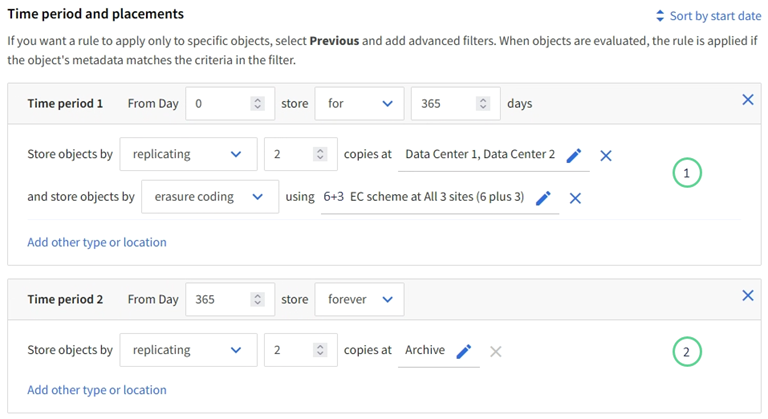

= Create an ILM rule: Overview
:icons: font
:imagesdir: ../media/

[.lead]
To manage objects, you create a set of information lifecycle management (ILM) rules and organize them into an ILM policy.

Every object ingested into the system is evaluated against the active policy. When a rule in the policy matches an object’s metadata, the instructions in the rule determine what actions StorageGRID takes to copy and store that object.

NOTE: Object metadata is not managed by ILM rules. Instead, object metadata is stored in a Cassandra database in what is known as a metadata store. Three copies of object metadata are automatically maintained at each site to protect the data from loss.

== Elements of an ILM rule

An ILM rule has three elements:

* *Filtering criteria*: A rule's basic and advanced filters define which objects the rule applies to. If an object matches all filters, StorageGRID applies the rule and creates the object copies specified in the rule's placement instructions.
* *Placement instructions*: A rule's placement instructions define the number, type, and location of object copies. Each rule can include a sequence of placement instructions to change the number, type, and location of object copies over time. When the time period for one placement expires, the instructions in the next placement are automatically applied by the next ILM evaluation.
* *Ingest behavior*: A rule's ingest behavior allows you to choose how the objects filtered by the rule are protected as they are ingested (when an S3 or Swift client saves an object to the grid).

== ILM rule filtering

When you create an ILM rule, you specify filters to identify which objects the rule applies to.

In the simplest case, a rule might not use any filters. Any rule that does not use filters applies to all objects, so it must be the last (default) rule in an ILM policy. The default rule provides storage instructions for objects that do not match the filters in another rule.

* Basic filters allow you to apply different rules to large, distinct groups of objects. These filters allow you to apply a rule to specific tenant accounts, specific S3 buckets or Swift containers, or both.
+
Basic filters give you a simple way to apply different rules to large numbers of objects. For example, your company's financial records might need to be stored to meet regulatory requirements, while data from the marketing department might need to be stored to facilitate daily operations. After creating separate tenant accounts for each department or after segregating data from the different departments into separate S3 buckets, you can easily create one rule that applies to all financial records and a second rule that applies to all marketing data.

* Advanced filters give you granular control. You can create filters to select objects based on the following object properties:

** Ingest time
** Last access time
** All or part of the object name (Key)
** Location constraint (S3 only)
** Object size
** User metadata
** Object tag (S3 only)

You can filter objects on very specific criteria. For example, objects stored by a hospital's imaging department might be used frequently when they are less than 30 days old and infrequently afterwards, while objects that contain patient visit information might need to be copied to the billing department at the health network's headquarters. You can create filters that identify each type of object based on object name, size, S3 object tags, or any other relevant criteria, and then create separate rules to store each set of objects appropriately.

You can combine filters as needed in a single rule. For example, the marketing department might want to store large image files differently than their vendor records, while the Human Resources department might need to store personnel records in a specific geography and policy information centrally. In this case you can create rules that filter by tenant account to segregate the records from each department, while using filters in each rule to identify the specific type of objects that the rule applies to.

== ILM rule placement instructions

Placement instructions determine where, when, and how object data is stored. An ILM rule can include one or more placement instructions. Each placement instruction applies to a single period of time.

When you create placement instructions:

* You start by specifying the reference time, which determines when the placement instructions start. The reference time might be when an object is ingested, when an object is accessed, when a versioned object becomes noncurrent, or a user-defined time. 

* Next, you specify when the placement will apply, relative to the reference time. For example, a placement  might start on day 0 and continue for 365 days, relative to when the object was ingested.

* Finally, you specify the type of copies (replication or erasure coding) and the location where the copies are stored. For example, you might want to store two replicated copies at two different sites.

Each rule can define multiple placements for a single time period and different placements for different time periods.

* To place  objects in multiple locations during a single time period, select *Add other type or location* to add more than one line for that time period.
* To place objects in different locations in different time periods, select *Add another time period* to add the next time period. Then, specify one or more lines within the time period.

The example shows two placement instructions on the Define placements page of the Create ILM rule wizard.

The first placement instruction  has two lines for the first year:

* The first line creates two replicated object copies at two data center sites.
* The second line creates a 6+3 erasure-coded copy using three data center sites.

The second placement instruction  creates two archived copies after one year and keeps those copies forever.

When you define the set of placement instructions for a rule, you must ensure that at least one placement instruction begins at day 0, that there are no gaps between the time periods you have defined, and that the final placement instruction continues either forever or until you no longer require any object copies.

As each time period in the rule expires, the content placement instructions for the next time period are applied. New object copies are created and any unneeded copies are deleted.

== ILM rule ingest behavior

Ingest behavior controls whether object copies are immediately placed according to the instructions in the rule, or if interim copies are made and the placement instructions are applied later. The following ingest behaviors are available for ILM rules:

* *Balanced*: StorageGRID attempts to make all copies specified in the ILM rule at ingest; if this is not possible, interim copies are made and success is returned to the client. The copies specified in the ILM rule are made when possible.
* *Strict*: All copies specified in the ILM rule must be made before success is returned to the client.
* *Dual commit*: StorageGRID immediately makes interim copies of the object and returns success to the client. Copies specified in the ILM rule are made when possible.

.Related information

* link:data-protection-options-for-ingest.html[Ingest options]
* link:advantages-disadvantages-of-ingest-options.html[Advantages, disadvantages, and limitations of the ingest options]
* link:../s3/consistency-controls.html#how-consistency-controls-and-ILM-rules-interact[How consistency controls and ILM rules interact to affect data protection]

== Example ILM rule

As an example, an ILM rule could specify the following:

* Apply only to the objects belonging to Tenant A.
* Make two replicated copies of those objects and store each copy at a different site.
* Retain the two copies "`forever,`" which means that StorageGRID will not automatically delete them. Instead, StorageGRID will retain these objects until they are deleted by a client delete request or by the expiration of a bucket lifecycle.
* Use the Balanced option for ingest behavior: the two-site placement instruction is applied as soon as Tenant A saves an object to StorageGRID, unless it is not possible to immediately make both required copies.
+
For example, if Site 2 is unreachable when Tenant A saves an object, StorageGRID will make two interim copies on Storage Nodes at Site 1. As soon as Site 2 becomes available, StorageGRID will make the required copy at that site.

.Related information

* link:what-storage-pool-is.html[What a storage pool is]
* link:what-cloud-storage-pool-is.html[What a Cloud Storage Pool is]