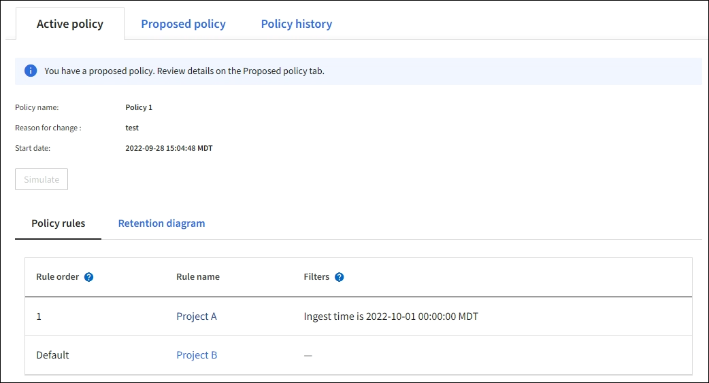
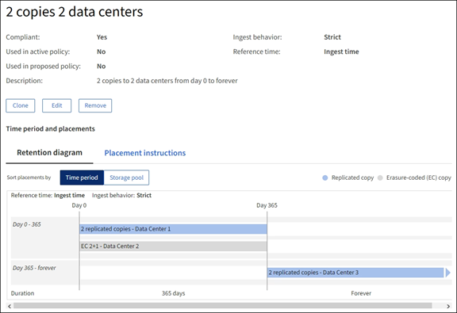
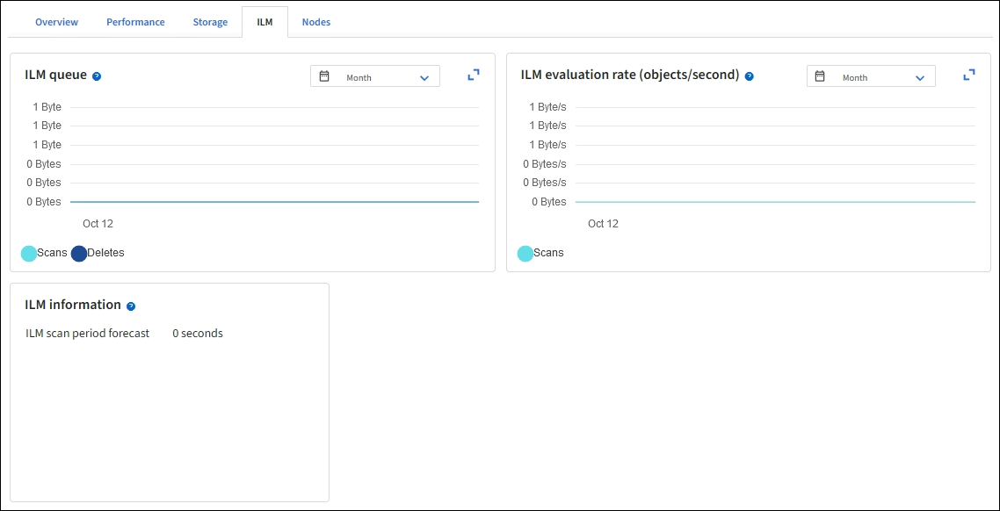

= Work with ILM policies and ILM rules
:icons: font
:imagesdir: ../media/

[.lead]
As your storage requirements change, you might need put a different policy in place or modify the ILM rules associated with the policy. You can view ILM metrics to determine system performance.

.What you'll need

* You are signed in to the Grid Manager using a link:../admin/web-browser-requirements.html[supported web browser].
* You have specific access permissions.

== View ILM policies

To view active, proposed, and historical ILM policies:

. Select *ILM* > *Policies*.

. As needed, select *Active policy*, *Proposed policy*, or *Policy history* to view the details for each. In each tab, you can select *Policy rules* and *Retention diagram*.

== Clone a historical ILM policy

To clone a historical ILM policy:

. Select *ILM* > *Policies* > *Policy history*.

. Remove the proposed policy if one exists.

. Select the radio button for the policy you want to clone, then select *Clone historical policy*.

. Complete the required details by following the instructions in link:creating-proposed-ilm-policy.html[Create proposed ILM policy].

CAUTION: An ILM policy that has been incorrectly configured can result in unrecoverable data loss. Before activating an ILM policy, carefully review the ILM policy and its ILM rules, and then simulate the ILM policy. Always confirm that the ILM policy will work as intended. 

== Remove the proposed ILM policy

To remove the proposed policy:

. Select *ILM* > *Policies* > *Proposed policy*.
. Select *Actions* > *Remove*.

The proposed policy and the Proposed policy tab are removed.

== View ILM rule details

To view the details for an ILM rule, including the retention diagram and placement instructions for the rule:

. Select *ILM* > *Rules*.
. Select the rule whose details you want to view. Example:
+

Additionally, you can use the details page to clone, edit, or remove a rule.

== Clone an ILM rule

You cannot edit a rule if it is being used in the proposed ILM policy or the active ILM policy. Instead, you can clone a rule and make any required changes to the cloned copy. Then, if required, you can remove the original rule from the proposed policy and replace it with the modified version. You cannot clone an ILM rule if it was created using StorageGRID version 10.2 or earlier.

Before adding a cloned rule to the active ILM policy, be aware that a change to an object's placement instructions might cause an increased load on the system.

.Steps

. Select *ILM* > *Rules*.
. Select the check box for the rule you want to clone, then select *Clone*. Alternatively, select the rule name, then select *Clone* from the rule details page. 
. Update the cloned rule by following the steps for <<Edit an ILM rule,editing an ILM rule>> and link:create-ilm-rule-enter-details.html#use-advanced-filters-in-ilm-rules[using advanced filters in ILM rules].
+
When cloning an ILM rule, you must enter a new name.

== Edit an ILM rule

You might need to edit an ILM rule to change a filter or placement instruction.

You cannot edit a rule if it is being used in the active ILM policy or the proposed ILM policy. Instead, you can clone these rules and make any required changes to the cloned copy. You also cannot edit the system-provided rule, Make 2 Copies.

NOTE: Before adding an edited rule to the active ILM policy, be aware that a change to an object's placement instructions might cause an increased load on the system.

.Steps
. Select *ILM* > *Rules*.
. Confirm that the rule you want to edit is not used in the active ILM policy or the proposed ILM policy.
. If the rule you want to edit is not in use, select the check box for the rule and select *Actions* > *Edit*. Alternatively, select the name of the rule, then select *Edit* on the rule details page. 
. Complete the pages of the Edit ILM rule wizard. As necessary, follow the steps for link:create-ilm-rule-enter-details.html[creating an ILM rule] and link:create-ilm-rule-enter-details.html#use-advanced-filters-in-ilm-rules[using advanced filters in ILM rules].
+
When editing an ILM rule, you cannot change its name.
+
NOTE: If you edit a rule that is used in a historical policy, the image:../media/icon_ilm_rule_historical.png[Icon ILM Rule Historical] icon appears for the rule when you view the policy, which indicates that the rule has become a historical rule.

== Remove an ILM rule

To keep the list of current ILM rules manageable, remove any ILM rules that you are not likely to use.

.Steps

To remove an ILM rule that is currently used in the active policy or in the proposed policy:

. Clone the active policy or edit the proposed policy.
. Remove the ILM rule from the policy.
. Save, simulate, and activate the new policy to make sure objects are protected as expected.

To remove an ILM rule that is not currently used:

. Select *ILM* > *Rules*.
. Confirm that the rule you want to remove is not used in the active policy or the proposed policy.
. If the rule you want to remove is not in use, select the rule and select *Remove*. You can select multiple rules and remove all of them at the same time.
. Select *Yes* to confirm that you want to remove the ILM rule.
+
The ILM rule is removed.
+
NOTE: If you remove a rule that is used in a historical policy, the image:../media/icon_ilm_rule_historical.png[Icon ILM Rule Historical] icon appears for the rule when you view the policy, which indicates that the rule has become a historical rule.

== View ILM metrics

You can view metrics for ILM, such as the number of objects in the queue and the evaluation rate. You can monitor these metrics to determine system performance. A large queue or evaluation rate might indicate that the system is not able to keep up with the ingest rate, the load from the client applications is excessive, or that some abnormal condition exists.

.Steps

. Select *Dashboard* > *ILM*.
+
NOTE: Since the dashboard can be customized, the ILM tab might not be available. 

. Monitor the metrics on the ILM tab.
+
You can select the question mark image:../media/icon_nms_question.png[question mark icon] to see a description of the items on the ILM tab.
+
