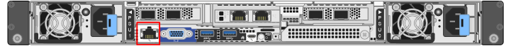

= Access BMC interface
:icons: font
:imagesdir: ../media/

[.lead]
You can access the BMC interface using the DHCP or static IP address for the BMC management port on the following appliance models: 

* SGF6112
* SG6000
* SG1000
* SG100

.Before you begin

* The management client is using a link:web-browser-requirements.html[supported web browser].

* The BMC management port on the appliance is connected to the management network you plan to use.
+
[role="tabbed-block"]
====

.SGF6112
--

--

.SG6000
--
image::../media/sg6000_cn_bmc_management_port.gif[SG6000-CN controller BMC management port]
--

.SG1000
--
image::../media/sg1000_bmc_management_port.png[SG1000 BMC Management Port]
--

.SG100
--
image::../media/sg100_bmc_management_port.png[SG100 BMC management port]
--

====

.Steps

. Enter the URL for the BMC interface: +
`*https://_BMC_Port_IP_*`
+
For `_BMC_Port_IP_`, use the DHCP or static IP address for the BMC management port.
+
The BMC sign-in page appears.

+
NOTE: If you haven't yet configured `BMC_Port_IP`, follow the instructions in link:configuring-bmc-interface.html[Configure BMC interface].  If you are unable to follow that procedure due to a hardware problem, and have not yet configured a BMC IP address, you might still be able to access the BMC. By default, the BMC obtains an IP address using DHCP. If DHCP is enabled on the BMC network, your network administrator can provide the IP address assigned to the BMC MAC, which is printed on the label on the front of the appliance. If DHCP is not enabled on the BMC network, the BMC will not respond after a few minutes and assign itself the default static IP `192.168.0.120`. You might need to connect your laptop directly to the BMC port, and change the networking setting to assign your laptop an IP such as `192.168.0.200/24`, in order to browse to `192.168.0.120`.

. Enter the root username and password, using the password you set when you link:changing-root-password-for-bmc-interface.html[changed the default root password]:
+
image::../media/bmc_signin_page.gif[BMC Sign In Page]

. Select *Sign me in*.
+
image::../media/bmc_dashboard.gif[BMC Dashboard]

. Optionally, create additional users by selecting *Settings* > *User Management* and clicking on any "`disabled`" user.
+
NOTE: When users sign in for the first time, they might be prompted to change their password for increased security.

