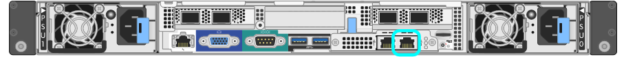
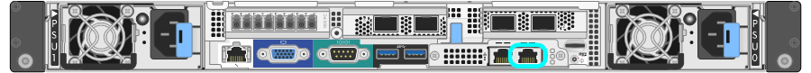
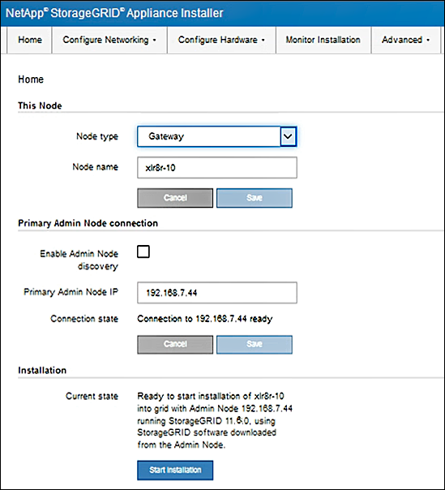

= Access StorageGRID Appliance Installer
:icons: font
:imagesdir: ../media/

[.lead]
You must access the StorageGRID Appliance Installer to verify the installer version and configure the connections between the appliance and the three StorageGRID networks: the Grid Network, the Admin Network (optional), and the Client Network (optional).

.What you'll need

* You are using any management client that can connect to the StorageGRID Admin Network, or you have a service laptop.
* The client or service laptop has a link:../admin/web-browser-requirements.html[supported web browser].
* The services appliance or storage appliance controller is connected to all of the StorageGRID networks you plan to use.
* You know the IP address, gateway, and subnet for the services appliance  or storage appliance controller on these networks.
* You have configured the network switches you plan to use.

.About this task

To initially access the StorageGRID Appliance Installer, you can use the DHCP-assigned IP address for the Admin Network port on the services appliance  or storage appliance controller (assuming it is connected to the Admin Network), or you can connect a service laptop directly to the services appliance  or storage appliance controller.
.Steps

. If possible, use the DHCP address for the Admin Network port on the services appliance or storage appliance controller to access the StorageGRID Appliance Installer. (Use the IP address on the Grid Network if the Admin Network is not connected.)
+
[role="tabbed-block"]
====
.SG100
--
image:../media/sg100_admin_network_port.png[Admin Network port on the SG100]
--

.SG1000
--
image::../media/sg1000_admin_network_port.png[Admin Network port on the SG1000]
--

.SG6000-CN
--
image::../media/sg6000_cn_admin_network_port.gif[Admin Network port on the SG6000-CN controller]
--

.E5700SG
--
You can do either of the following:

 ** Look at the seven-segment display on the E5700SG controller. If management port 1 and 10/25-GbE ports 2 and 4 on the E5700SG controller are connected to networks with DHCP servers, the controller attempts to obtain dynamically assigned IP addresses when you power on the enclosure. After the controller has completed the power-on process, its seven-segment display shows *HO*, followed by a repeating sequence of two numbers.
+
----
HO -- IP address for Admin Network -- IP address for Grid Network HO
----
+
In the sequence:

  *** The first set of numbers is the DHCP address for the appliance Storage Node on the Admin Network, if it is connected. This IP address is assigned to management port 1 on the E5700SG controller.
  *** The second set of numbers is the DHCP address for the appliance Storage Node on the Grid Network. This IP address is assigned to 10/25-GbE ports 2 and 4 when you first apply power to the appliance.
+
NOTE: If an IP address could not be assigned using DHCP, 0.0.0.0 is displayed.
--

--
====

 .. Locate the MAC address label on the front of the services appliance  or storage appliance controller, and determine the MAC address for the Admin Network port.
+
The MAC address label lists the MAC address for the BMC management port.
+
To determine the MAC address for the Admin Network port, you must add *2* to the hexadecimal number on the label. For example, if the MAC address on the label ends in *09*, the MAC address for the Admin Port would end in *0B*. If the MAC address on the label ends in *(_y_)FF*, the MAC address for the Admin Port would end in *(_y_+1)01*. You can easily make this calculation by opening Calculator in Windows, setting it to Programmer mode, selecting Hex, typing the MAC address, then typing *+ 2 =*.

 .. Provide the MAC address to your network administrator, so they can look up the DHCP address for the appliance on the Admin Network.
 .. From the client, enter this URL for the StorageGRID Appliance Installer: +
`*https://_Appliance_IP_:8443*`
+
For `_Appliance_IP_`, use the DHCP address (use the IP address for the Admin Network if you have it).

 .. If you are prompted with a security alert, view and install the certificate using the browser's installation wizard.
+
The alert will not appear the next time you access this URL.
+
The StorageGRID Appliance Installer Home page appears. The information and messages shown when you first access this page depend on how your appliance is currently connected to StorageGRID networks. Error messages might appear that will be resolved in later steps.
+
image::../media/appliance_installer_home_5700_5600.png[Screen shot of the top part of the StorageGRID Webscale Appliance Installer home page]

. If you cannot obtain an IP address using DHCP, you can use a link-local connection.
+
[role="tabbed-block"]
====
.SG100 and SG1000
--
Connect a service laptop directly to the rightmost RJ-45 port on the services appliance, using an Ethernet cable.

--

.SG1000
--
Connect a service laptop directly to the rightmost RJ-45 port on the services appliance, using an Ethernet cable.

image::../media/sg1000_link_local_port.png[SG1000 Link-Local Connection]
--

.SG6000-CN
--
Connect a service laptop directly to the rightmost RJ-45 port on the SG6000-CN controller, using an Ethernet cable.

--

.E5700SG
--
Connect the service laptop to management port 2 on the E5700SG controller, using an Ethernet cable.

image::../media/e5700sg_mgmt_port_2.gif[Location of Management Port 2 on the E5700SG controller]
--
====

.. Open a web browser on the service laptop.
 .. Enter this URL for the StorageGRID Appliance Installer: +
`*\https://169.254.0.1:8443*`
+
The StorageGRID Appliance Installer Home page appears. The information and messages shown when you first access this page depend on how your appliance is currently connected to StorageGRID networks. Error messages might appear that will be resolved in later steps.
+
NOTE: If you cannot access the Home page over a link-local connection, configure the service laptop IP address as `169.254.0.2`, and try again.

.After you finish

After accessing the StorageGRID Appliance Installer:

* Verify that the StorageGRID Appliance Installer version on the appliance matches the software version installed on your StorageGRID system. Upgrade StorageGRID Appliance Installer, if necessary.
+
link:verifying-and-upgrading-storagegrid-appliance-installer-version.html[Verify and upgrade StorageGRID Appliance Installer version]

* Review any messages displayed on the StorageGRID Appliance Installer Home page and configure the link configuration and the IP configuration, as required.
+

