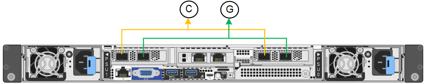

= Configure network links
:icons: font
:imagesdir: ../media/

[.lead]
You can configure network links for the ports used to connect the appliance to the Grid Network, the Client Network, and the Admin Network. You can set the link speed as well as the port and network bond modes.

TIP: If you are using ConfigBuilder to generate a JSON file, you can configure the network links automatically. See link:automating-appliance-installation-and-configuration.html[Automate appliance installation and configuration].

.What you'll need

* You have link:obtaining-additional-equipment-and-tools.html[obtained the additional equipment] required for your cable type and link speed. 
* You have installed the correct transceivers in the ports, based on the link speed you plan to use.
* You have connected the network ports to switches that support your chosen speed.

If you plan to use Aggregate port bond mode, LACP network bond mode, or VLAN tagging:

* You have connected the network ports on the appliance to switches that can support VLAN and LACP.
* If multiple switches are participating in the LACP bond, the switches support multi-chassis link aggregation groups (MLAG), or equivalent.
* You understand how to configure the switches to use VLAN, LACP, and MLAG or equivalent.
* You know the unique VLAN tag to use for each network. This VLAN tag will be added to each network packet to ensure that network traffic is routed to the correct network.

.About this task

You only need to configure the settings on the Link Configuration page if you want to use a non-default setting.

NOTE: The LACP transmit hash policy is layer2+3.

The figures and tables summarize the options for the port bond mode and network bond mode for each appliance. See the following for more information:

* link:port-bond-modes-for-sgf6112.html[Port bond modes (SGF6112)]
* link:port-bond-modes-for-sg6000-cn-controller.html[Port bond modes (SG6000-CN)]
* link:port-bond-modes-for-e5700sg-controller-ports.html[Port bond modes (E5700SG)]
* link:port-bond-modes-for-sg100-and-sg1000.html[Port bond modes (SG1000 and SG100)]

[role="tabbed-block"]
====

.SGF6112
--

Fixed port bond mode (default)::
+
The figure shows how the four network ports are bonded in fixed port bond mode (default configuration).
+

+
[cols="1a,3a" options="header"]
|===
| Callout| Which ports are bonded

| C
| Ports 1 and 3 are bonded together for the Client Network, if this network is used.

| G
| Ports 2 and 4 are bonded together for the Grid Network.
|===
+
The table summarizes the options for configuring the network ports. You only need to configure the settings on the Link Configuration page if you want to use a non-default setting.
+
[cols="1a,2a,2a" options="header"]
|===
| Network bond mode| Client Network disabled (default)| Client Network enabled
|Active-Backup (default)
|
 ** Ports 2 and 4 use an active-backup bond for the Grid Network.
 ** Ports 1 and 3 are not used.
 ** A VLAN tag is optional.

|
 ** Ports 2 and 4 use an active-backup bond for the Grid Network.
 ** Ports 1 and 3 use an active-backup bond for the Client Network.
 ** VLAN tags can be specified for both networks for the convenience of the network administrator.

|LACP (802.3ad)
|
 ** Ports 2 and 4 use an LACP bond for the Grid Network.
 ** Ports 1 and 3 are not used.
 ** A VLAN tag is optional.

|
 ** Ports 2 and 4 use an LACP bond for the Grid Network.
 ** Ports 1 and 3 use an LACP bond for the Client Network.
 ** VLAN tags can be specified for both networks for the convenience of the network administrator.

|===

Aggregate port bond mode::
+
The figure shows how the four network ports are bonded in aggregate port bond mode.
+
image::../media/sgf6112_aggregate_ports.png[SGF6112 Aggregate Port Bond Mode ]
+
[cols="1a,3a" options="header"]
|===
| Callout| Which ports are bonded

| 1
| All four ports are grouped in a single LACP bond, allowing all ports to be used for Grid Network and Client Network traffic.
|===
+
The table summarizes the options for configuring the network ports. You only need to configure the settings on the Link Configuration page if you want to use a non-default setting.
+
[cols="1a,2a,2a" options="header"]
|===
| Network bond mode| Client Network disabled (default)| Client Network enabled
|LACP (802.3ad) only
| ** Ports 1-4 use a single LACP bond for the Grid Network.
** A single VLAN tag identifies Grid Network packets.

| ** Ports 1-4 use a single LACP bond for the Grid Network and the Client Network.
** Two VLAN tags allow Grid Network packets to be segregated from Client Network packets.

|===

Active-Backup network bond mode for management ports::
+
This figure shows how the two 1-GbE management ports on the SGF6112 are bonded in Active-Backup network bond mode for the Admin Network.
+
image::../media/sgf6112_bonded_management_ports.png[Admin Network Ports Bonded SGF6112]

--

.SG6000
--

Fixed port bond mode (default):: 
+
This figure shows how the four network ports are bonded in fixed port bond mode (default configuration)
+
image::../media/sg6000_cn_fixed_port.gif[Image showing how the network ports on the SG6000-CN controller are bonded in fixed mode]
+
[cols="1a,3a" options="header"]
|===
| Callout| Which ports are bonded
|C
|Ports 1 and 3 are bonded together for the Client Network, if this network is used.

|G
|Ports 2 and 4 are bonded together for the Grid Network.
|===
+
The table summarizes the options for configuring the network ports. You only need to configure the settings on the Link Configuration page if you want to use a non-default setting.
+
[cols="1a,3a,3a" options="header"]
|===
| Network bond mode| Client Network disabled (default)| Client Network enabled

|Active-Backup (default)
|
 ** Ports 2 and 4 use an active-backup bond for the Grid Network.
 ** Ports 1 and 3 are not used.
 ** A VLAN tag is optional.

|
 ** Ports 2 and 4 use an active-backup bond for the Grid Network.
 ** Ports 1 and 3 use an active-backup bond for the Client Network.
 ** VLAN tags can be specified for both networks for the convenience of the network administrator.

|LACP (802.3ad)
|
 ** Ports 2 and 4 use an LACP bond for the Grid Network.
 ** Ports 1 and 3 are not used.
 ** A VLAN tag is optional.

|
 ** Ports 2 and 4 use an LACP bond for the Grid Network.
 ** Ports 1 and 3 use an LACP bond for the Client Network.
 ** VLAN tags can be specified for both networks for the convenience of the network administrator.
|===

Aggregate port bond mode::
+
This figure shows how the four network ports are bonded in aggregate port bond mode.
+
image::../media/sg6000_cn_aggregate_port.gif[Image showing how the network ports on the SG6000-CN controller are bonded in aggregate mode]
+
[cols="1a,3a" options="header"]
|===
| Callout| Which ports are bonded
|1
|All four ports are grouped in a single LACP bond, allowing all ports to be used for Grid Network and Client Network traffic.
|===
+
The table summarizes the options for configuring the network ports. You only need to configure the settings on the Link Configuration page if you want to use a non-default setting.
+
[cols="1a,3a,3a" options="header"]
|===
| Network bond mode| Client Network disabled (default)| Client Network enabled
|LACP (802.3ad) only
|
 ** Ports 1-4 use a single LACP bond for the Grid Network.
 ** A single VLAN tag identifies Grid Network packets.

|
 ** Ports 1-4 use a single LACP bond for the Grid Network and the Client Network.
 ** Two VLAN tags allow Grid Network packets to be segregated from Client Network packets.
|===

Active-Backup network bond mode for management ports::
+
This figure shows how the two 1-GbE management ports on the SG6000-CN controller are bonded in Active-Backup network bond mode for the Admin Network.
+
image::../media/sg6000_cn_bonded_managemente_ports.png[Admin Network Ports Bonded]

--

.SG5700
--

Fixed port bond mode (default):: 
+
This figure shows how the four 10/25-GbE ports are bonded in Fixed port bond mode (default configuration).
+
image::../media/e5700sg_fixed_port.gif[Image showing how the 10/25-GbE ports on the E5700SG controller are bonded in fixed mode]
+
[cols="1a,3a" options="header"]
|===
| Callout| Which ports are bonded
a|
C
a|
Ports 1 and 3 are bonded together for the Client Network, if this network is used.
a|
G
a|
Ports 2 and 4 are bonded together for the Grid Network.
|===
+
The table summarizes the options for configuring the four 10/25-GbE ports. You only need to configure the settings on the Link Configuration page if you want to use a non-default setting.
+
[cols="1a,2a,2a" options="header"]
|===
| Network bond mode| Client Network disabled (default)| Client Network enabled
a|
Active-Backup (default)
a|

 ** Ports 2 and 4 use an active-backup bond for the Grid Network.
 ** Ports 1 and 3 are not used.
 ** A VLAN tag is optional.

a|

 ** Ports 2 and 4 use an active-backup bond for the Grid Network.
 ** Ports 1 and 3 use an active-backup bond for the Client Network.
 ** VLAN tags can be specified for both networks for the convenience of the network administrator.

a|
LACP (802.3ad)
a|

 ** Ports 2 and 4 use an LACP bond for the Grid Network.
 ** Ports 1 and 3 are not used.
 ** A VLAN tag is optional.

a|

 ** Ports 2 and 4 use an LACP bond for the Grid Network.
 ** Ports 1 and 3 use an LACP bond for the Client Network.
 ** VLAN tags can be specified for both networks for the convenience of the network administrator.
|===

Aggregate port bond mode:: 
+
This figure shows how the four 10/25-GbE ports are bonded in Aggregate port bond mode.
+
image::../media/e5700sg_aggregate_port.gif[Image showing how the 10/25-GbE ports on the E5700SG controller are bonded in aggregate mode]
+
[cols="1a,3a" options="header"]
|===
| Callout| Which ports are bonded
a|
1
a|
All four ports are grouped in a single LACP bond, allowing all ports to be used for Grid Network and Client Network traffic.
|===
+
The table summarizes the options for configuring the four 10/25-GbE ports. You only need to configure the settings on the Link Configuration page if you want to use a non-default setting.
+
[cols="1a,2a,2a" options="header"]
|===
| Network bond mode| Client Network disabled (default)| Client Network enabled
a|
LACP (802.3ad) only
a|

 ** Ports 1-4 use a single LACP bond for the Grid Network.
 ** A single VLAN tag identifies Grid Network packets.

a|

 ** Ports 1-4 use a single LACP bond for the Grid Network and the Client Network.
 ** Two VLAN tags allow Grid Network packets to be segregated from Client Network packets.

|===

Active-Backup network bond mode for management ports:: 
+
This figure shows how the two 1-GbE management ports on the E5700SG controller are bonded in Active-Backup network bond mode for the Admin Network.
+
image::../media/e5700sg_bonded_management_ports.gif[E5700SG Bonded management Ports]

--

.SG100 and SG1000
--

Fixed port bond mode (default)::
+
The figures show how the four network ports on the SG1000 or SG100 are bonded in fixed port bond mode (default configuration).
+
SG1000:
+
image::../media/sg1000_fixed_port.png[SG1000 Fixed Port Bond Mode]
+
SG100:
+
image::../media/sg100_fixed_port_draft.png[SG100 Fixed Port Bond Mode]
+
[cols="1a,3a" options="header"]
|===
| Callout| Which ports are bonded
a|
C
a|
Ports 1 and 3 are bonded together for the Client Network, if this network is used.
a|
G
a|
Ports 2 and 4 are bonded together for the Grid Network.
|===
+
The table summarizes the options for configuring the four network ports. You only need to configure the settings on the Link Configuration page if you want to use a non-default setting.
+
[cols="1a,2a,2a" options="header"]
|===
| Network bond mode| Client Network disabled (default)| Client Network enabled

|Active-Backup (default)
|
 ** Ports 2 and 4 use an active-backup bond for the Grid Network.
 ** Ports 1 and 3 are not used.
 ** A VLAN tag is optional.

|
 ** Ports 2 and 4 use an active-backup bond for the Grid Network.
 ** Ports 1 and 3 use an active-backup bond for the Client Network.
 ** VLAN tags can be specified for both networks for the convenience of the network administrator.

|LACP (802.3ad)
|
 ** Ports 2 and 4 use an LACP bond for the Grid Network.
 ** Ports 1 and 3 are not used.
 ** A VLAN tag is optional.

|
 ** Ports 2 and 4 use an LACP bond for the Grid Network.
 ** Ports 1 and 3 use an LACP bond for the Client Network.
 ** VLAN tags can be specified for both networks for the convenience of the network administrator.

|===

Aggregate port bond mode::
+
These figures show how the four network ports are bonded in aggregate port bond mode.
+
SG1000:
+
image::../media/sg1000_aggregate_ports.png[Aggregate Port Bond Mode SG1000]
+
SG100:
+
image::../media/sg100_aggregate_ports.png[Aggregate Port Bond Mode SG100]
+
[cols="1a,3a" options="header"]
|===
| Callout| Which ports are bonded
a|
1
a|
All four ports are grouped in a single LACP bond, allowing all ports to be used for Grid Network and Client Network traffic.
|===
+
The table summarizes the options for configuring the four network ports. You only need to configure the settings on the Link Configuration page if you want to use a non-default setting.
+
[cols="1a,2a,2a" options="header"]
|===
| Network bond mode| Client Network disabled (default)| Client Network enabled
a|
LACP (802.3ad) only
a|

 ** Ports 1-4 use a single LACP bond for the Grid Network.
 ** A single VLAN tag identifies Grid Network packets.

a|

 ** Ports 1-4 use a single LACP bond for the Grid Network and the Client Network.
 ** Two VLAN tags allow Grid Network packets to be segregated from Client Network packets.

|===

Active-Backup network bond mode for management ports::
+
These figures shows how the two 1-GbE management ports on the appliances are bonded in Active-Backup network bond mode for the Admin Network.
+
SG1000:
+
image::../media/sg1000_bonded_management_ports.png[Admin Network Ports Bonded SG1000]
+
SG100:
+
image::../media/sg100_bonded_management_ports.png[Admin Network Ports Bonded SG100]

--

====

.Steps

. From the menu bar of the StorageGRID Appliance Installer, click *Configure Networking* > *Link Configuration*.
+
The Network Link Configuration page displays a diagram of your appliance with the network and management ports numbered.
//+
//image::../media/sgf6112_configuring_network_ports.png[SGF6112 rear connectors]
//image::../media/sg6060_configuring_network_ports.png[SG6060 Network Ports]
//image::../media/sg5712_configuring_network_ports.png[SG5712 Network and Management Ports]
//image::../media/sg100_configuring_network_ports.png[SG100 rear connectors]
//image::../media/sg1000_configuring_network_ports.png[SG1000 Ports]
+
The Link Status table lists the link state, link speed, and other statistics of the numbered ports.
//+
//image::../media/SGF6112_link_status_table.png[SGF6112 Link Status]
//image::../media/sg6060_configuring_network_linkstatus.png[Link Status Table]
//image::../media/sg5712_configuring_network_linkstatus.png[SG5712 Link Status]
//image::../media/sg1000_configuring_network_link_status.png[SG1000 Link Status]
+
The first time you access this page:

 ** *Link Speed* is set to *Auto*.
 ** *Port bond mode* is set to *Fixed*.
 ** *Network bond mode* is set to *Active-Backup* for the Grid Network.
 ** The *Admin Network* is enabled, and the network bond mode is set to *Independent*.
 ** The *Client Network* is disabled.
//+
//image::../media/sg1000_network_link_configuration_fixed.png[Network Link Configuration Fixed]
//image::../media/network_link_configuration_fixed.png[Network Link Configuration Fixed]

. Select the link speed for the network ports from the *Link speed* drop-down list.
+
The network switches you are using for the Grid Network and the Client Network must also support and be configured for this speed. You must use the appropriate adapters or transceivers for the configured link speed. Use Auto link speed when possible because this option negotiates both link speed and Forward Error Correction (FEC) mode with the link partner.
+
If you plan to use the 25-GbE link speed for the SG6000 or SG5700 network ports:

 ** Use SFP28 transceivers and SFP28 TwinAx cables or optical cables.
 ** For the SG6000, select *Auto* from the *Link speed* drop-down list.
 ** For the SG5700, select *25GbE* from the *Link speed* drop-down list.

. Enable or disable the StorageGRID networks you plan to use.
+
The Grid Network is required. You cannot disable this network.

 .. If the appliance is not connected to the Admin Network, unselect the *Enable network* check box for the Admin Network.
//+
//image::../media/admin_network_disabled.gif[Screenshot showing check box for enabling or disabling the Admin Network]

 .. If the appliance is connected to the Client Network, select the *Enable network* check box for the Client Network.
+
The Client Network settings for the data NIC ports are now shown.

. Refer to the table, and configure the port bond mode and the network bond mode.
+
This example shows:

 ** *Aggregate* and *LACP* selected for the Grid and the Client Networks. You must specify a unique VLAN tag for each network. You can select values between 0 and 4095.
 ** *Active-Backup* selected for the Admin Network.
+
image::../media/sg1000_network_link_configuration_aggregate.png[Network Link Configuration Aggregate]
//image::../media/network_link_configuration_aggregate.gif[Screen shot showing Link Configuration settings for Aggregate mode]

. When you are satisfied with your selections, click *Save*.
+
NOTE: You might lose your connection if you made changes to the network or link you are connected through. If you are not reconnected within 1 minute, re-enter the URL for the StorageGRID Appliance Installer using one of the other IP addresses assigned to the appliance: +
`*https://_appliance_IP_:8443*`