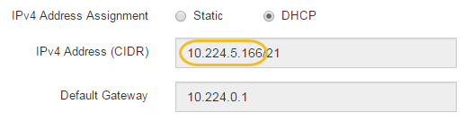

= Configure SANtricity Storage Manager (SG5600)
:icons: font
:imagesdir: ../media/

[.lead]
You can use SANtricity Storage Manager to monitor the status of the storage disks and hardware components in your StorageGRID appliance. To access this software, you must know the IP address of management port 1 on the E2700 controller (the storage controller in the appliance).

== Set IP address for E2700 controller

Management port 1 on the E2700 controller connects the appliance to the management network for SANtricity Storage Manager. You must set a static IP address for the E2700 controller to ensure that you do not lose your management connection to the hardware and the controller firmware in the StorageGRID appliance.

.What you'll need

You are using a link:../admin/web-browser-requirements.html[supported web browser].

.About this task

DHCP-assigned addresses could change at any time. Assign a static IP address to the controller to ensure consistent accessibility.

.Steps

. From the client, enter the URL for the StorageGRID Appliance Installer: +
`*https://_E5600SG_Controller_IP_:8443*`
+
For `_E5600SG_Controller_IP_`, use the IP address for the appliance on any StorageGRID network.
+
The StorageGRID Appliance Installer Home page appears.

. Select *Hardware Configuration* > *Storage Controller Network Configuration*.
+
The Storage Controller Network Configuration page appears.

. Depending on your network configuration, select *Enabled* for IPv4, IPv6, or both.
. Make a note of the IPv4 address that is automatically displayed.
+
DHCP is the default method for assigning an IP address to this port.
+
NOTE: It might take a few minutes for the DHCP values to appear.
+

. Optionally, set a static IP address for the E2700 controller management port.
+
NOTE: You should either assign a static IP for the management port or assign a permanent lease for the address on the DHCP server.

 .. Select *Static*.
 .. Enter the IPv4 address, using CIDR notation.
 .. Enter the default gateway.
+
image::../media/storage_controller_ipv4_and_def_gateway.gif[Storage Controller Network Config IPv4 and Default Gateway]

 .. Click *Save*.
+
It might take a few minutes for your changes to be applied.
+
When you connect to SANtricity Storage Manager, you will use the new static IP address as the URL: +
`*https://_E2700_Controller_IP_*`

== Add appliance to SANtricity Storage Manager

You connect the E2700 controller in the appliance to SANtricity Storage Manager and then add the appliance as a storage array.

.What you'll need

You are using a link:../admin/web-browser-requirements.html[supported web browser].

.About this task

For detailed instructions, see the SANtricity Storage Manager documentation.

.Steps

. Open a web browser, and enter the IP address as the URL for SANtricity Storage Manager: +
`*https://_E2700_Controller_IP_*`
+
The login page for SANtricity Storage Manager appears.

. On the *Select Addition Method* page, select *Manual*, and click *OK*.
. Select *Edit* > *Add Storage Array*.
+
The Add New Storage Array - Manual page appears.
+
image::../media/sanricity_add_new_storage_array_out_of_band.gif[SANtricity Add New Storage Array page]

. In the *Out-of-band management* box, enter one of the following values:
 ** *Using DHCP:* The IP address assigned by the DHCP server to management port 1 on the E2700 controller
 ** *Not using DHCP:* `192.168.128.101`
+
NOTE:  Only one of the appliance's controllers is connected to SANtricity Storage Manager, so you only need to enter one IP address.
. Click *Add*.

== Set up SANtricity Storage Manager

After accessing SANtricity Storage Manager, you can use it to configure hardware settings. Typically, you configure these settings before deploying the appliance as a Storage Node in a StorageGRID system.

=== Configure AutoSupport

The AutoSupport tool collects data in a customer support bundle from the appliance and automatically sends the data to technical support. Configuring AutoSupport assists technical support with remote troubleshooting and problem analysis.

.What you'll need

* The AutoSupport feature must be enabled and activated on the appliance.
+
The AutoSupport feature is activated and deactivated globally on a storage management station.

* The Storage Manager Event Monitor must be running on at least one machine with access to the appliance and, preferably, on no more than one machine.

.About this task

All of the data is compressed into a single compressed archive file format (.7z) at the location you specify.

AutoSupport provides the following types of messages:

[options="header"]
|===
| Message types| Description
a|
Event messages
a|

* Sent when a support event on the managed appliance occurs
* Include system configuration and diagnostic information

a|
Daily messages
a|

* Sent once every day during a user configurable time interval in the local time of the appliance
* Include the current system event logs and performance data

a|
Weekly messages
a|

* Sent once every week during a user configurable time interval in the local time of the appliance
* Include configuration and system state information

|===

.Steps

. From the Enterprise Management Window in SANtricity Storage Manager, select the *Devices* tab, and then select *Discovered Storage Arrays*.
. Select *Tools* > *AutoSupport* > *Configuration*.
. Use SANtricity Storage Manager online help, if needed, to complete the task.

=== Verify receipt of AutoSupport

You should verify that technical support is receiving your AutoSupport messages. You can find the status of AutoSupport for your systems on the Active IQ portal. Verifying receipt of these messages ensures that technical support has your information if you need assistance.

.About this task

AutoSupport can show one of the following statuses:

* *ON*
+
An ON status indicates that technical support is currently receiving AutoSupport messages from the system.

* *OFF*
+
An OFF status suggests that you might have disabled AutoSupport because technical support has not received a Weekly Log from the system in the last 15 calendar days or there might have been a change in your environment or configuration (as an example).

* *DECLINE*
+
A DECLINE status means that you have notified technical support that you will not enable AutoSupport.

After technical support receives a Weekly Log from the system, the AutoSupport status changes to ON.

.Steps

. Go to the NetApp Support Site at http://mysupport.netapp.com/[mysupport.netapp.com^], and sign in to the Active IQ portal.
. If the AutoSupport status is OFF, and you believe that is incorrect, complete the following:
 .. Check your system configuration to ensure that you have turned AutoSupport on.
 .. Check your network environment and configuration to ensure that the system can send messages to technical support.

=== Configure email and SNMP trap alert notifications

SANtricity Storage Manager can notify you when the status of the appliance or one of its components changes. This is called an alert notification. You can receive alert notifications by two different methods: email and SNMP traps. You must configure the alert notifications you want to receive.

.Steps

. From the Enterprise Management Window in SANtricity Storage Manager, select the *Devices* tab, and then select a node.
. Select *Edit* > *Configure Alerts*.
. Select the *Email* tab to configure email alert notifications.
. Select the *SNMP* tab to configure SNMP trap alert notifications.
. Use SANtricity Storage Manager online help, if needed, to complete the task.

=== Set passwords for SANtricity Storage Manager

You can set the passwords used for the appliance in SANtricity Storage Manager. Setting passwords maintains system security.

.Steps

. From the Enterprise Management Window in SANtricity Storage Manager, double-click the controller.
. From the Array Management Window, select the *Storage Array* menu, and select *Security* > *Set Password*.
. Configure the passwords.
. Use SANtricity Storage Manager online help, if needed, to complete the task.

.Related information

http://mysupport.netapp.com/documentation/productlibrary/index.html?productID=61197[NetApp Documentation: SANtricity Storage Manager^]
